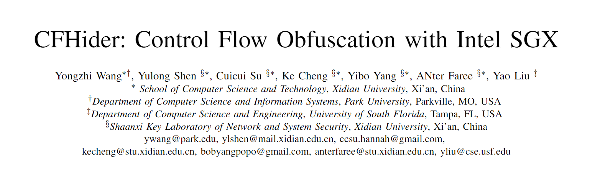
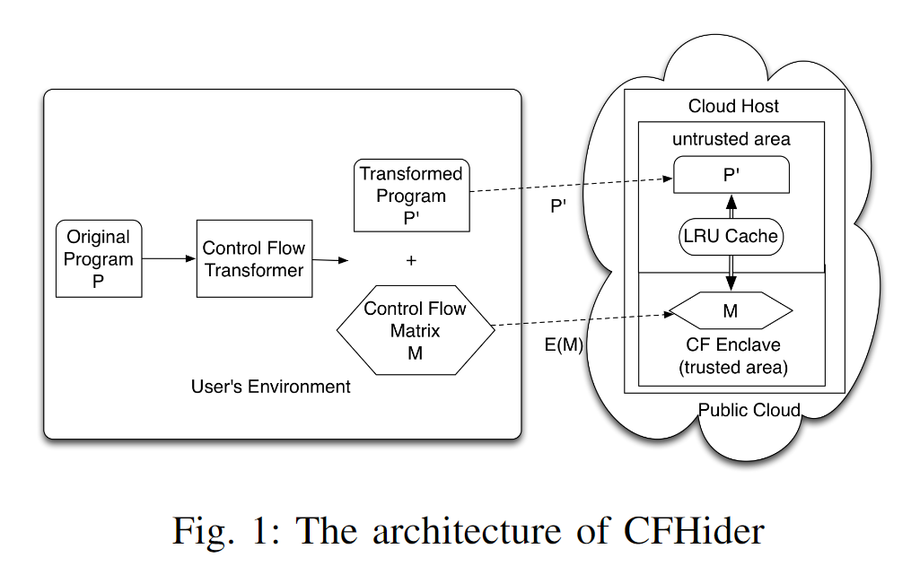
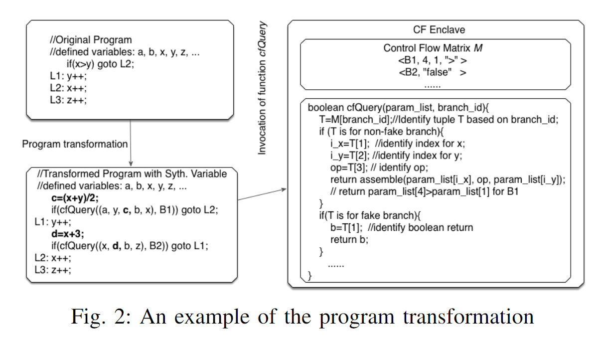
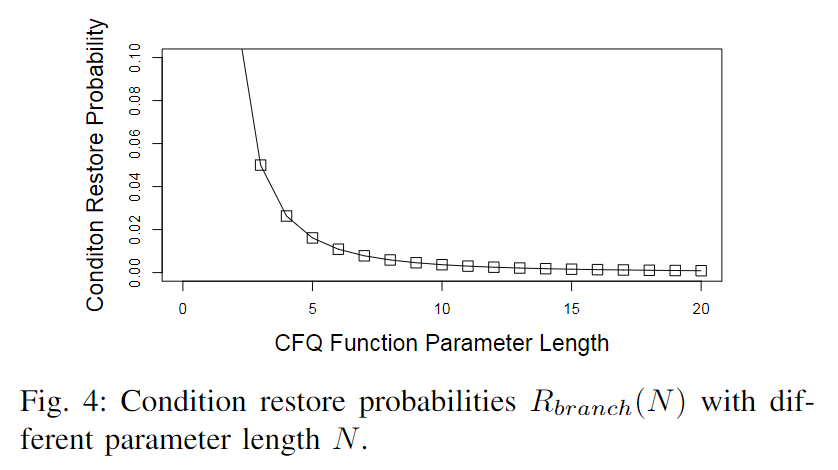
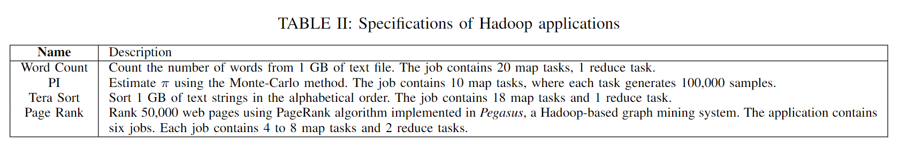
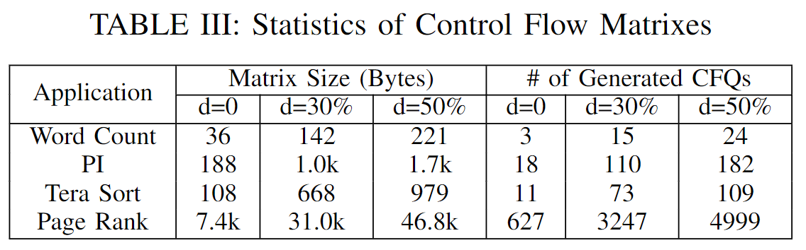
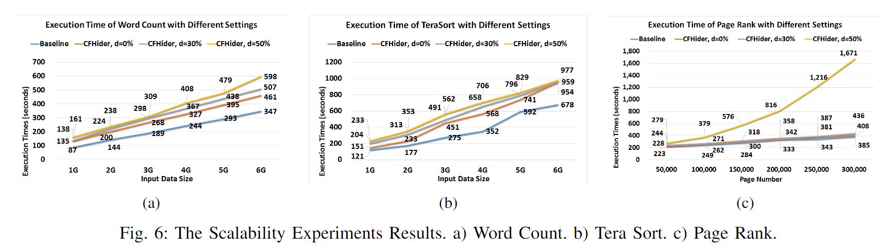
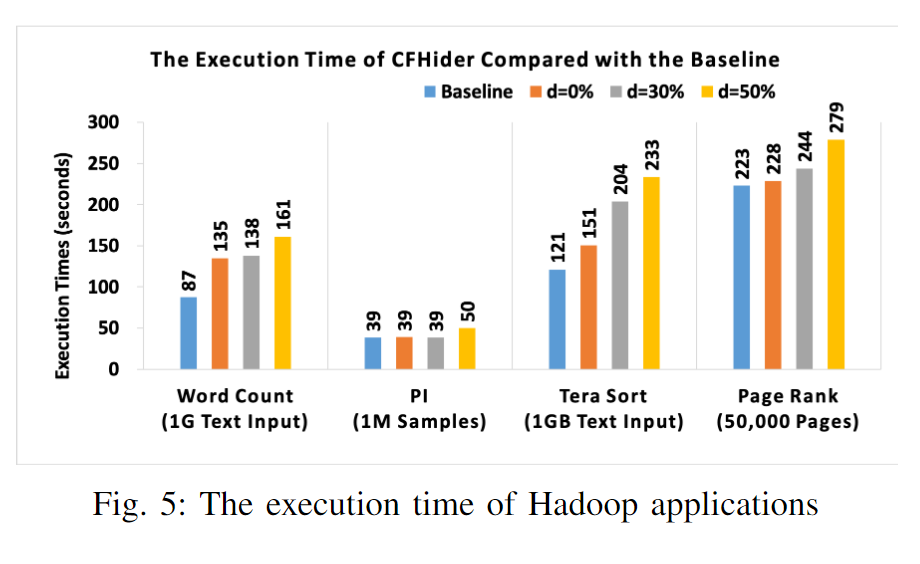
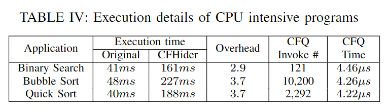

# 2020-12-23 论文推荐

今天给大家带来的论文是来自 IEEE Conference on Computer Communications 2019（INFOCOM2019）的论文《CFHider: Control Flow Obfuscation with Intel SGX》。

当程序在不受信任的云上运行的时候，需要保证程序逻辑的机密性。
这篇论文基于 SGX 提出了一种面向程序分支的新的混淆方法。

他们的方法将程序 $P$ 分割成两部分，一部分为 $P'$，在不可信的云上运行，一部分是控制流矩阵 $M$，在 SGX 创建的可信环境 enclave 中运行。为了加快程序的查询效率，他们还引入了 LRU 缓存。

在遇到条件分支指令的时候，程序会首先通过查询函数 `cfQuery` 向 enclave 查询并获得一个布尔结果。
这篇文章比较有意思的点就是混淆的设计。

## 混淆设计

对于原来的一条分支指令 $s$，可以将其写成如下所示的三地址代码：

$$
s: \mathrm{if}(x\enspace op\enspace y)\enspace
\mathrm{then} \{goto\enspace L\}
$$

然后他们设 $U(s) = \{x,y\}$，$V(s)$ 为执行到语句 $s$ 前已经被初始化的变量集合除去 $U(s)$ 得到的集合。

接下来取任意整数 $N$，从 $V(s)$ 中取 $N-2$ 个变量，组成集合 $V'(s)$。

将 $U(s),V'(s)$ 组合，随机排序产生 $L(s)$，$x,y$ 在 $L(s)$ 中的索引记为 $i_x(s),i_y(s)$。

为每一条分支语句 $s$ 分配一个惟一条件标识 ID，记为 $i(s)$。

则原始的比较 $x\enspace op\enspace y$ 会被修改为 `cfQuery` 函数：

$$
\mathrm{if}(\textmd{cfQuery}(L(s),i(s)))\enspace
\mathrm{then}\enspace
\{goto\enspace L\}
$$

上面这张图展示了一种实际转换的情况。

在查询的时候，位于 enclave 的矩阵 $M$ 会保存所有 $L(s)$ 的信息。
攻击者只可能知道 $x,y$ 在 $L(s)$ 中的位置和 $L(s)$ 的 ID。
由于不知道 enclave 的内存信息，攻击者也就无从得知相应的比较符号和 $x,y$ 的具体值了。

除此之外他们还引入了伪分支语句，可以进一步迷惑攻击者。
由于伪分支会在运行的时候产生时间开销，他们提出以一定的概率加入伪分支语句，定义了混淆度 $d$。

之后他们证明了自己的方法抵御静态分析、被动监听攻击和主动攻击的能力。
随着 $L(s)$ 长度的增加，被攻击者快速判断情况出现的概率会明显降低。

## 实现

他们用 Java 实现了该系统的原型，并使用 Hadoop 测试程序进行测试。

他们统计了在不同混淆度时的矩阵大小和 `cfQuery` 调用次数，并记录了混淆后的程序运行时间。

总的来说这篇文章提出了一种有趣的混淆思路。

原文链接：<https://ieeexplore.ieee.org/document/8737444>
