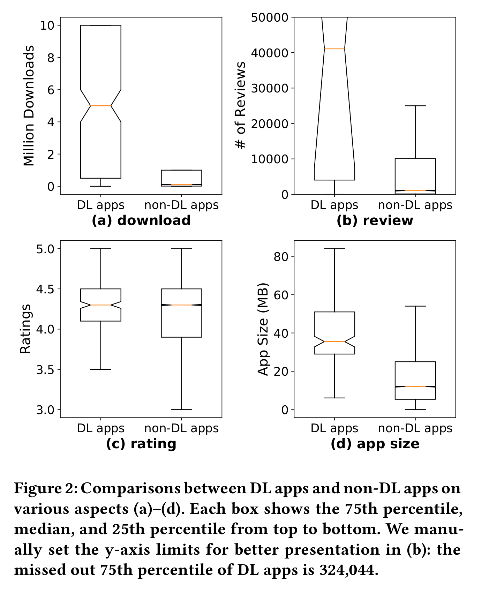

今天给大家带来的论文是来自 ACM Conference International World Wide Web Conference 2019 (WWW 2019) 的论文《A First Look at Deep Learning Apps on Smartphones》。

本篇文章实现了DL Sniffer来嗅探 app中的DL模型，并对移动端深度学习模型进行了调研。

github : [https://github.com/xumengwei/MobileDL.git](https://github.com/xumengwei/MobileDL.git)

## 文章回答了如下的问题

   1. 使用DL的app都有什么特性？
   2. 这类app使用DL干什么？
   3. 这类app使用了什么模型？

## 文章贡献

   1. 实现了一个自动分析器来分析app并提取深度学习的模型。
   2. 分析了Google Play 中 16500个app并，其结果对移动生态系统的关键利益相关者产生了有价值的启示，并为智能手机DL的发展提供了启示。
   3. 公开了工具和数据集。

## DL Sniffer 工作流程

   

   1. DL Sniffer使用两种方式嗅探DL 框架：

      1. 对于C++ API，首先提取.so文件并在rodata区域搜索特殊字符串。例如使用Tensor FLow平台的总会有"TF_AllocateTensor"在 rodata区域
      2. 对于java，首先使用dex2jar将DEX 文件转码为.class文件或者.smail文件，之后使用静态分析检查特定api
      3. 对于无框架DL，在.so文件中则查找一些定义好的字符串例如"neural network","convolution","lstm"等等

   2. 使用DL 模型的的app的特征

      1. 下载量最高的软件是最早在app内应用DL的
      2. 使用DL的app评分的中位数和不使用DL的app相同
      3. DL app的安装包大小均大于不使用DL的安装包

      

   3. 目前常用的深度学习框架

## 提取的模型架构

   1. 87.7%是CNN模型，7.8%是RNN模型。
   2. DL layer 类型

   

   3. 模型优化技术
      1. 数字化(Quantization):使用较低位的数据类型，例如16bit、8bit甚至1bit
      2. 稀疏性(Sparsity):它主要用于矩阵乘法和卷积层，以减少参数。

##  缺点：

1. 仅提取了例如TFlite,Tensorflow,ncnn,Caffe和Caffe2不能提取加密的模型
2. 仅能提取apk中自带的模型，无法获取安装完成之后从网络下载的模型
3. 可能会有误判，因为是通过字符串搜索来进行判断的，若代码中包含了相同字符串但并未使用DL则会出现误判。

