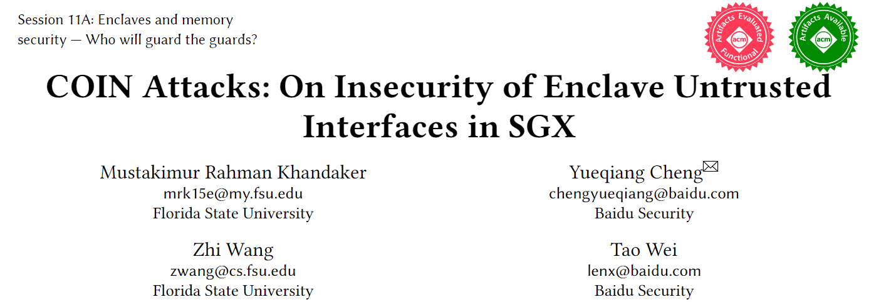
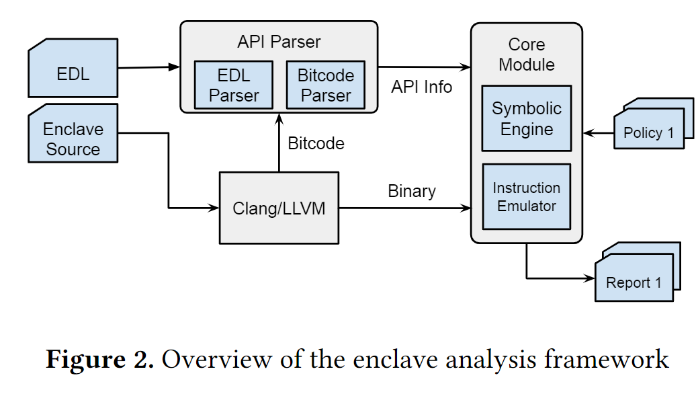
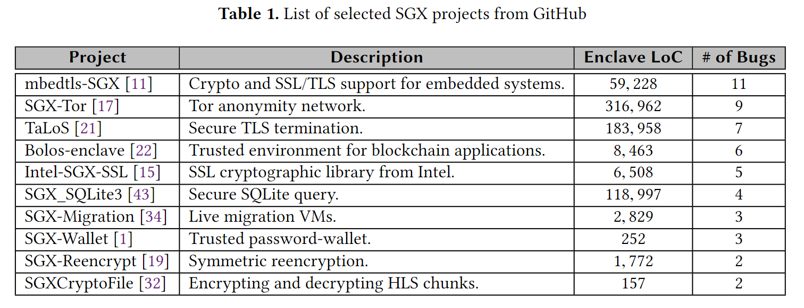
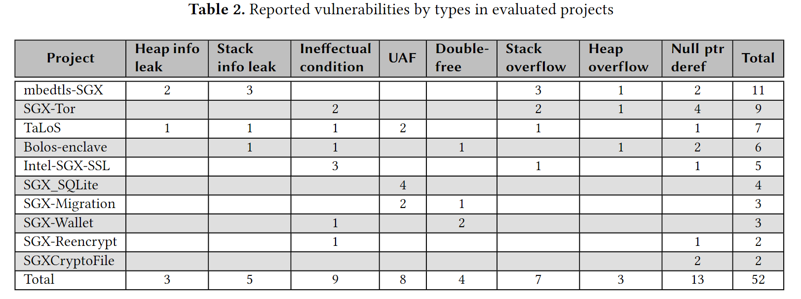
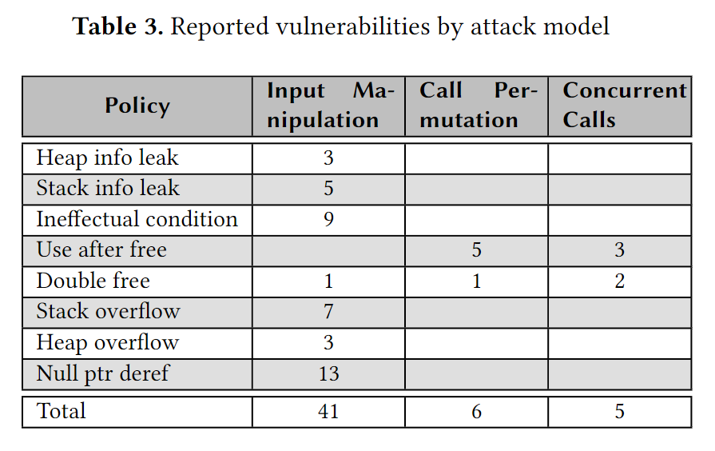

祝大家圣诞节快乐！

今天我给大家带来的论文题目是《COIN Attacks: On Insecurity of Enclave Untrusted Interfaces in SGX》，它被发表在了 2020 年的 ASPLOS 上。

这篇文章面向的是基于 SGX 的应用软件及框架设计中的缺陷。在 SGX 中，enclave 通过一个公开的，特定于 enclave 的双向接口与主机应用程序交互。在本文中作者指出了一种新的针对接口的攻击：COIN Attacks，并将安全接口问题分为四种类型：

- Concurrent calls (concurrency): 并发调用，攻击者试图从多个不可信线程并发调用 enclave 函数。enclave 不能假设每次只从单个线程调用它，或者外部同步原语将强制执行正确的锁语义（相反，它应该使用 enclave 内的自旋锁）。
- Call permutation (order): 调用序列，攻击者以任意顺序调用 enclave 函数（例如 ecall 函数）。这个模型之所以有效，是因为 enclave 通常会对各种 ecall 的顺序有隐含的假设。例如，SQLite 公开了三个 ecall：`opendb`, `execute_sql` 和 `close_db`。明显地，`opendb` 要先于其余两个调用。但是 enclave 不能假定调用 ecall 的任何顺序。这种攻击对从现有的库转换而来的 SGX 库尤其麻烦，因为大多数库几乎总是假定用户的响应是正确的调用顺序。
- Input manipulation (inputs): 输入控制，enclave 接受来自 ecall 的参数和 ocall 返回值的输入。尽管 Intel SGX SDK 为参数添加了简单的清除方法，但由于缺乏对 enclave 使用输入的知识，这种清除方法是不够的。尽管增加清除功能的主要目的是防止缓冲区溢出，但我们发现堆溢出和栈溢出可以证明这种攻击的有效性。
- Nested calls (nested): 嵌套调用。攻击者在一个（不可信的）ocall 处理程序中创建了新的 ecall，而这个处理程序已经由早期的 ecall（因此是嵌套调用的名称）初始化。再次以 SQLite 为例，攻击者首先调用 `opendb` 然后通过 `execute_sql` 查询数据库。enclave 会在 `execute_sql` 中进行一次 ocall，以读取数据库文件。在这个 ocall 的（不可信的）处理程序中，攻击者可以发出他想要的任何 ecall，例如 `closedb`。

这四种模型允许攻击者以任意输入（包括来自多线程的输入）任意顺序调用 enclave 接口。

作者还建立了一个框架，用指令模拟和 concolic 执行在 COIN attacks 存在的情况下测试 enclave。他们的框架目的在于在 enclave 代码发布之前发现漏洞，因此假设可以获得源代码。

不过在本文中他们只对前三种接口模型的问题进行了检测。他们使用了 8 种漏洞检测策略评估了 10 个流行的开源 SGX 项目，这些漏洞策略涵盖了信息泄露、控制流劫持和内存漏洞，他们发现了 52 个漏洞。

他们的实验显示了在部署 enclave 之前进行广泛测试的必要性。

- 论文 PDF：<http://ww2.cs.fsu.edu/~khandake/paper/coin_asplos_2020.pdf>
- 开源代码：<https://github.com/mustakcsecuet/COIN-Attacks>
- 演讲视频：<https://www.youtube.com/watch?v=oL6aACFCrLA>
