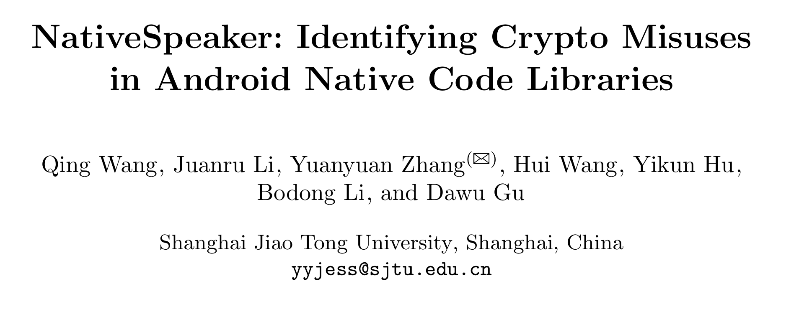
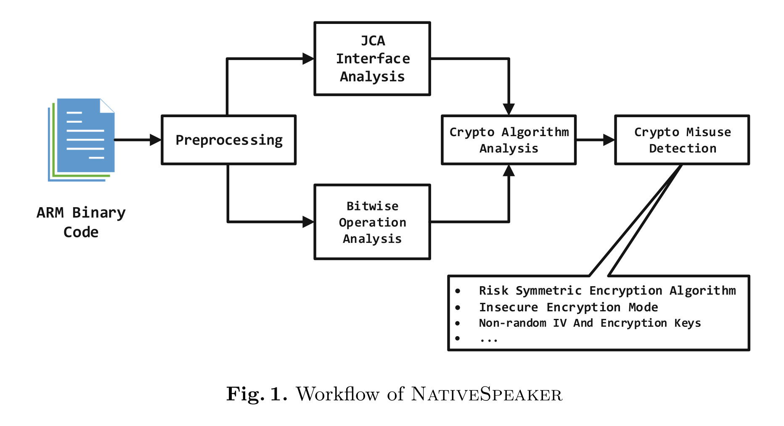
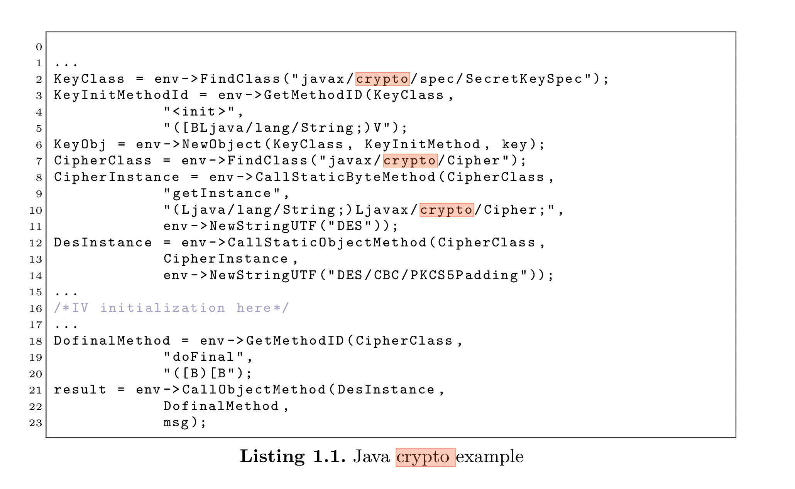
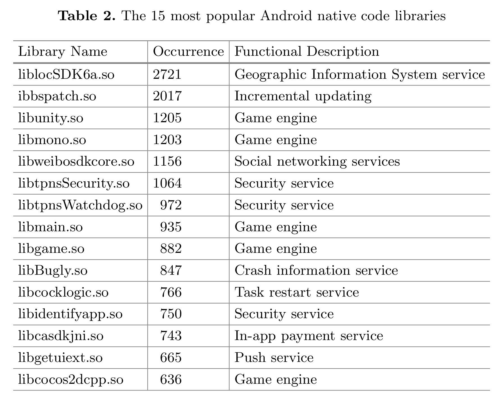
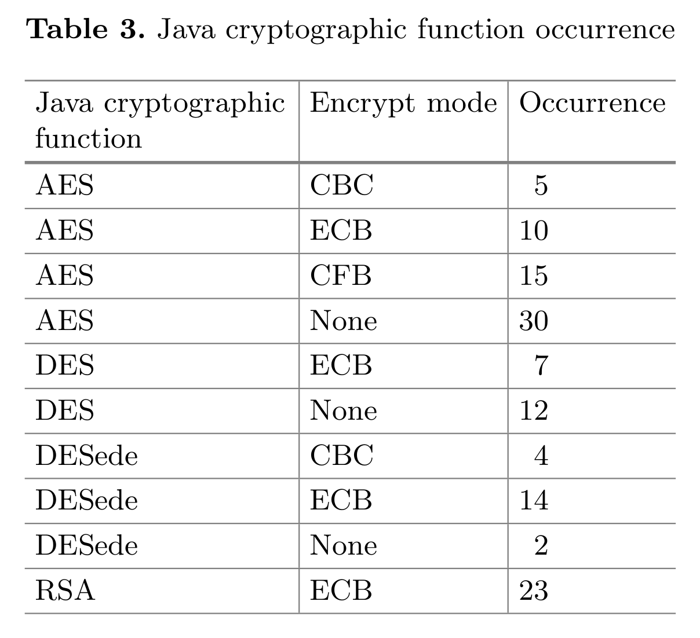
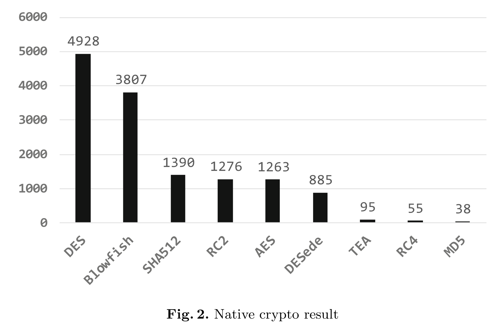
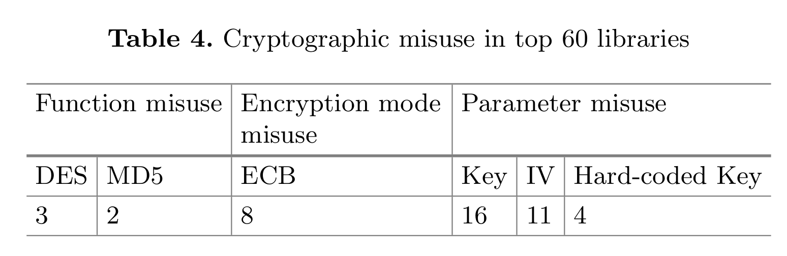

祝大家圣诞节++快乐！	

​今天我给大家带来的论文题目是《NativeSpeaker: Identifying Crypto Misuses in Android Native Code Libraries》，这是一篇期刊文章，被发表在了*Spinger: Information Security and Cryptology, November 3-5, 2017*



​该文章提出了了一种针对Android app加密算法误用的检测的方法，并且对2000个app进行了调研。

## 名词解释

**Crypto Misuses**: 大致意思就是，一些包含加密功能的api 通常会有两个输入:“文本”、“秘钥”，然后该函数会返回一个密文。但是目前android 的crypto libraries 除了这两个参数以外还需要其他的参数：例如,"operation mode","padding scheme" ，并且这些参数需要一些密码学的知识，但是大多数Android开发者并不具备这些知识，因此就会随意填写这些参数。当这些参数输入不正确的时候，我们就称之为Crypto Misuses。

**Crypto function**:  目前android 有两种使用crypto function的方法。第一个，在java层使用*Java Cryptography Architecture(JCA)*, 它提供了一个加密服务来引导开发者去调用Cryptographic API；第二个，直接调用native 层的cryptographic function。

## 框架



​

首先提取app中的native code shared library 然后对其进行复制。然后将两份library中的一份进行Java cryptography architecture(JCA) interface analysis，另一份进行bitwise operation analysis 来确定crypto 函数在library中的位置。如果加密函数能够被识别，相关的语义可以极大地帮助理解应用程序的行为。	当 crypto 函数被定位了以后，可以通过检查该加密算法是否已经过时，并检查输入的参数是否正确。 

## 处理native 库

**获取android ARM 二进制代码**。通常情况下这些ABI会被存放在*/lib/armabi(XXX)* 中，并以*.so*为结尾，但是有的app会将该文件的后缀重命名为*.xml或者.dex等等*。因此我们除了检查后缀名以外，还应检查ELF文件所对应的matic number(*7f454c46010101*)。

**检查native库是否重复**。使用如下几个参数：

* a 文件的哈希值
* b 文件名
* c 作者的签名
* d 接口名称

首先，先生成文ELF文件的接口集合(*interface set*)，其中包含了所有的方法名称。对于两个ELF文件，若其中的方法数量大于20则对两个接口的集合文件进行比较，若重复度大于90%则我们认为两个ELF文件是相同的，同时仅使用最新的ELF文件进行分析。

## Crypto Function 识别

​	**Java Style Crypto Identification**.该方式，native通过JNI层调用java函数。 JCA使用 provider-based 架构，它包含一系列功能包括加密、秘钥生成与管理、证书校验等的API。下图展示了JNI如何调用java API：



​	**Native Style Crypto Identification**.该方式的crypto functions特征比java style的特征少很多，因为它们基本上是由c/c++编写，而且仅能通过理解ARM 二进制代码才能找到crypto functions。目前有多种方式来识别密码原语(crypto primitives)。论文比较了这些方法并选择了Caballero等人提出的方法，该方法利用启发式检测来定位潜在的密码函数。这种方法的想法是，由于密码和编码方法需要高比例的按位运算的实质性特点，而对于普通方法，则很难使用按位运算。因此就可以针对这一特点来开展有效的静态分析，并识别对称和非对称加密算法。

​该论文复现了Caballero提出的方法，由如下几步构成：

1. 静态反编译native 代码，然后标记每一个函数；
2. 将每一个函数分割成多个基本块，对于每一个基本块计算bit层级的指令。
3. 若一个基本块中bit层级的指令占比超过一个阈值(比如55%)，那么该基本块就被认为是一个潜在的crypto相关的基本块。
4. 若一个函数中包含一个crypto相关的基本块则该函数被标记为crypto相关的函数。
5. 进行函数名启发式过滤，以确定潜在的crypto相关的数是否是实际上是一个加密函数。

   ​	由于大多数加密函数是由native库导出以提供特定功能，因此可以认为没有导出信息（如接口名称）的函数不需要分析，并直接删除那些没有导出函数名的潜在加密/编码函数（相当于只分析由上述5步导出的函数）。然后利用分词技术对函数名进行处理，如下例所示：

```
VP8Lencodestream => VP 8L encode stream
```

​	该工作实现并优化了 N-gram 算法来对函数名进行分割，若名称中含有目前常用的加密或者解密算法的字眼(如：AES, DES, DESede, blowfish, RC4, RSA)则标记该函数为crypto函数。除此之外，为了提高准确度，他们使用精心选取的Linguistic Data Consortium数据集的子集。

>N-gram:是一种基于统计语言模型的算法。它的基本思想是将文本里面的内容按照字节进行大小为N的滑动窗口操作，形成了长度是N的字节片段序列。
>
>每一个字节片段称为gram，对所有gram的出现频度进行统计，并且按照事先设定好的阈值进行过滤，形成关键gram列表，也就是这个文本的向量特征空间。列表中的每一种gram就是一个特征向量维度。n-gram模型可以用于评估语句是否合理。
>
>该模型基于这样一种假设: 第N个词的出现只与前面N-1个词相关，而与其它任何词都不相关，整句的概率就是各个词出现概率的乘积。这些概率可以通过直接从语料中统计N个词同时出现的次数得到。常用的是二元的Bi-Gram和三元的Tri-Gram。

## Cryptographic Misuse Detection

​	由于Cryptographic Misuse 会有非常多的组合，因此，我们仅关注对称加密算法的密码误用(crypto misuse of symmetric encryption algorithms)。论文参考了shuai等研究中的缺陷模型，主要关注两种误用：**1. 加密算法的误用；2. 加密参数的误用**。

​	加密算法的误用包括使用了过时的加密算法，例如DES 和MD5。这种误用可以使用致暴力破解的方式进行解密。

​	加密参数的误用主要包括使用了非随机的秘钥和使用了不恰当的加密模式。使用非随机秘钥或者初始的向量会导致加密系统过于脆弱，同时使用了错误的加密模式，例如ECB，会显著降低加密系统的安全性。

> ECB（Electronic Codebook，电码本）模式是分组密码的一种最基本的工作模式。在该模式下，待处理信息被分为大小合适的分组，然后分别对每一分组独立进行加密或解密处理。

#### 检测crypto 误用的策略

​	**Non-random Key Material.** 使用非随机的秘钥或者直接使用密码本中的IV(Initialization Vector)。该文献做了一个调查，下面是一个程序员使用一个固定的字符串秘钥作为*DES Encrypt string*方法的输入：

```cpp
msg = JNIEnv::GetStringUTFChars (* env , msg_input , 0);
msg_len = strlen ( msg );
DES_Encrypt_string( msg , msg_len + 1 , " akazwlan " , & output );//akazwlan是固定字符串
base64_encode ( output , & base64_output , out_len );
result = JNIEnv :: NewStringUTF (* env , ( const char *)& base_output );
```

​	通过函数名称即可定位加密算法，然后该方法的参数全部动态生成。找到方法之后，在该函数的调用端使用一个intra-procedural data flow analysis：若加密函数的参数没有经过调用加密函数的函数参数传递或者通过系统api生成，则就发出key missuse 的警告。

​	**Improper Encryption Mode**。在对称加密中使用诸如电子码本（ECB）。对于 Java style crypto，可以通过分析JNI参数来获取加密方式，并搜索相对应的易受影响的加密模式的字符串(例如AES/ECB)，并最终在用户使用该字符串的时候进行警告。然而在native 加密函数时，如果app中实现非规范格式加密模式，则之前的方法就失去了作用。然后该文章通过一种启发式的检测来解决这个问题。该论文通过调研发现，大多数ECB加密都是在一个循环中处理很长的消息。并且在这个循环中，消息是由加密例程直接处理的，而不是首先被IV mask。因此，该论文首先用其名称标识加密例程，然后检查调用该例程函数，并检测加密例程是否在循环。如果加密的例程存在循环，则检查该例程参数的任何相关的异或运算，以找到潜在的IV。IV的缺失意味着ECB模式的误用。

​	**Obsolete Algorithms。** 即使用了过时的加密方法、由于加密的方式可以直接从函数名称获取到，因此可以直接在调用过时算法的时候发出警告。

## 实验结果

​数据集使用的是从*myapp*(非google官方的最大的应用市场)这个软件商店中下载的2000个软件，并从中提取出了20353个ARM的动态链接库。下表是他们收集的前15个最常用的动态链接库:



​然后他们发现app中使用java进行加密操作的都使用了*javax,crypto,Cipher*类，然后也有47个 动态链接库使用JNI来调用java 加密算法。他们发现，DES作为一种遵循最佳实践原则的密码算法仍然被广泛应用。除此之外，AES也再被广泛使用，但是AES的使用场景是短字符串加密，所以有很多AES种并没有使用encryption mode。具体如下图：



​在native中使用最多的算法依旧是DES，但是其中使用**Java Style Crypto**进行加密的少之又少，因为这样使用起来太过麻烦，并且已经有非常多的使用C++实现的加密算法库。结果具体如下:



​除此之外，加密算法的误用情况如下:



## 缺点和启发

1. 无法抵抗混淆，太过依赖于函数名称，仅可用于识别系统类库

2. 文章中使用加密算法特点来定位加密算法的思路可以借鉴，例如:

   * 循环来寻找ECB

   * 使用bit层级的运算来定位加密函数。
- 期刊网址：<https://link.springer.com/chapter/10.1007/978-3-319-75160-3_19>