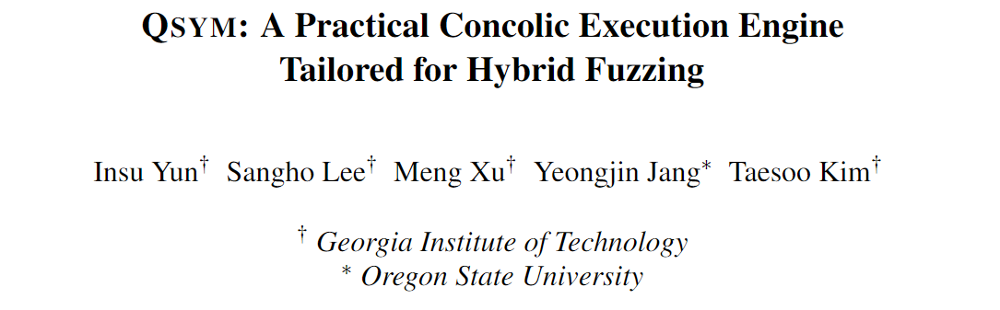
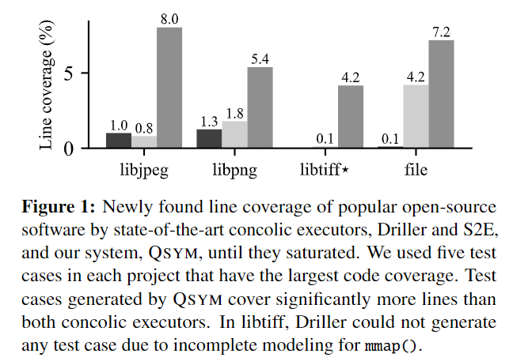
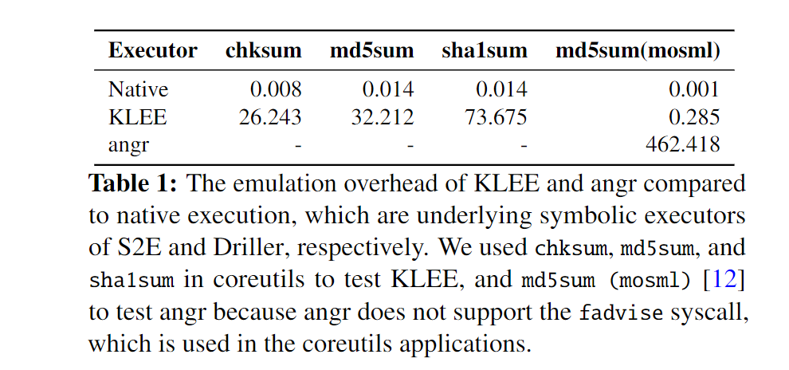
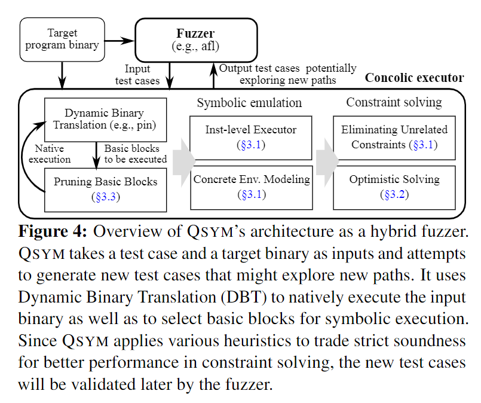
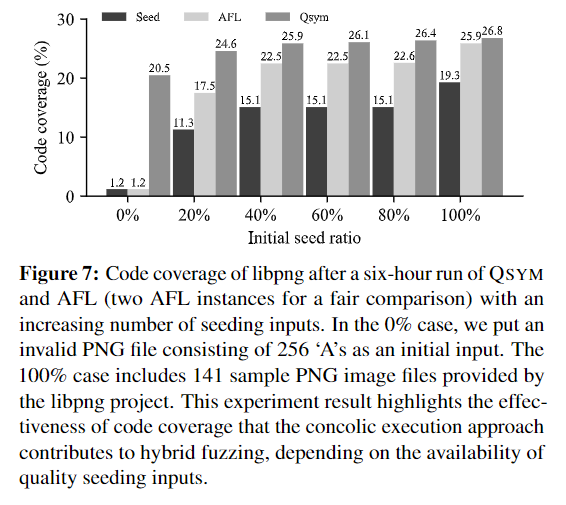
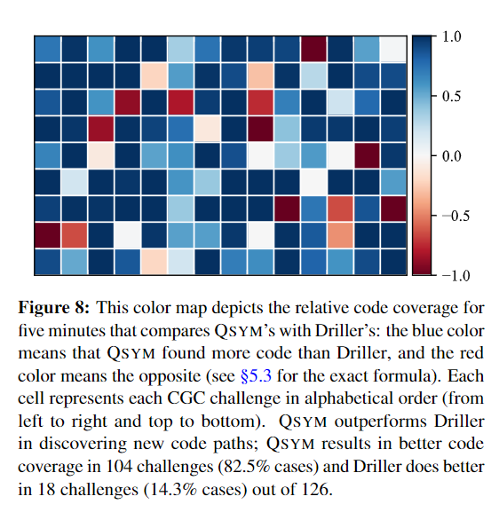
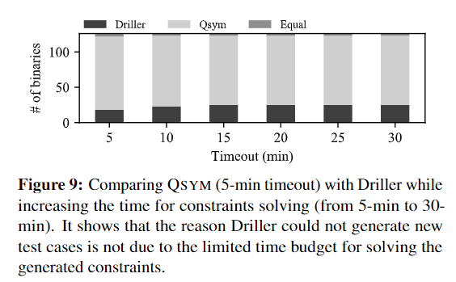
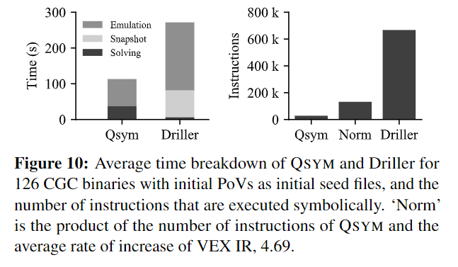

大家好，今天为大家带来的论文是来自于 *USENIX Security Symposium 2018* 的《QSYM: A Practical Concolic Execution Engine Tailored for Hybrid Fuzzing》。

混合模糊测试（hydrid fuzzing）一般用来解决 fuzzing 和混合执行测试（concolic execution）的局限性，并将两者结合起来。这种方式难以扩展，在实际环境中难以查找错误。他们发现现有的 concolic 执行器的性能瓶颈是主要限制因素。

他们提出了一个快速的 concolic 执行引擎：QSYM，支持混合模糊测试。关键思想是使用动态二进制翻译将符号仿真（symbolic emulation）和本地执行（native execution）紧密结合，实现更细粒度、更快的指令集符号仿真。

相比于其他混合执行器（Driller 和 S2E），他们的方法有更高的线覆盖率。

接下来他们系统地分析了用于混合模糊测试的常规 concolic 执行器的性能瓶颈，提出并解答了三个问题。

**问题一** 现有的广泛的符号执行器在符号仿真时会产生大量开销，这是因为现有的 concolic 执行器会采用 IR 简化实现的复杂性，但是会牺牲性能并且会阻止进一步的优化机会。而他们则移除了 IR 转换层，这样实现会很复杂；但是可以减少执行开销，并且可以进一步优化以减少符号仿真。

**问题二** 传统的 concolic 执行引擎使用快照技术（snapshot）以消除重新执行的开销。不过作者们认为，在混合模糊测试中 concolic 执行只是共用一个分支，一个测试用例中的快照不能在另一个测试用例中使用，因此快照的效果不佳。除此之外，快照还不能反映外部状态，还有可能在与外部环境交互的时候出现问题。现有的工具尝试通过完整的 concolic 执行或外部环境建模解决此问题，但是会导致性能下降或者测试不准确。因此作者们优化了重复的 concolic 测试，删除了在混合模糊测试中效率低下的快照机制，并使用具体的执行建模外部环境。

**问题三** concolic 执行试图收集完整的约束保证可靠性（soundness）。但是对复杂逻辑永无止境地分析会导致高昂的代价（例如密码函数和压缩等计算复杂的操作），还会导致过度约束的问题。因此作者们只收集不完整的约束以提高效率，在过度约束的情况下只解决部分约束。

在设计中，QSYM 首先进行测试，然后利用动态二进制翻译以及由覆盖率指导的 fuzzer 提供输入用例以运行程序。

QSYM 只选择性地模拟生成符号约束所需的指令，而不是在受污染的基本块中模拟全部指令，从而大幅度减少了符号模拟数量，提升执行速度。

他们的实验表明 QSYM 在 fuzz 输入样例不是很好的情况下也能生成高质量的测试用例。

除此之外在和其他工具比较的时候，QSYM 也展示出了更好的性能。

- PDF: <https://www.usenix.org/system/files/conference/usenixsecurity18/sec18-yun.pdf>
- slide: <https://www.usenix.org/sites/default/files/conference/protected-files/usesec18_slides_yun.pdf>
- presentation video: <https://www.youtube.com/watch?v=cXr1ZXp40jA&feature=emb_title>
- code: <https://github.com/sslab-gatech/qsym>
