大家好，今天为大家带来的论文是来自于 *IEEE Transactions on Information Forensics and Security  2018* 的《NDroid: Toward Tracking Information Flows Across Multiple Android Contexts》。

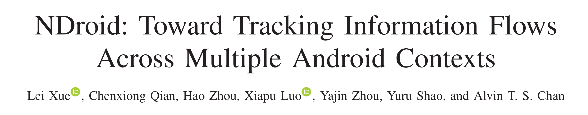

​	他们认为除了java层以外，native层也会出现个人信息的泄露，因此便开发了NDroid。NDroid使用QEMU实现了可以跨越java和native两种上下文的污点分析，并同时支持android的DVM和ART 两种运行环境。

# 整体设计

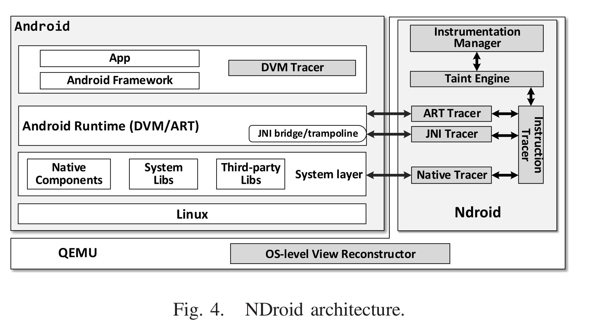

为了跟踪多个上下文中的信息流，NDroid在QEMU中引入了六个主要模块，包括：

1.  Instrumentation manager控制不同模块在上下文转换时的（JNI bridge、系统库和应用程序中的第三方库）插桩的时间和方式；
2.  JNI tracer 处理在调用JNI API和相关函数时污点点的传播；
3.  Instruction tracer 解析每个执行的指令（ARM/Thumb/Thumb2），并根据这些指令的语义进行污点传播；
4.  Native tracker对编译后的系统库和第三方库进行污点传播；
5.  这三个tracker都通过污染引擎(taint engine)提供的接口完成污染传播，并且该引擎还维护了寄存器和内存中污点的信息。
6.  在DVM runtime中，他们使用了TaintDroid作为污点跟踪程序（DVM tracer），并实现了一个ART tracer来跟踪ART runtime时的污点信息。

# NDroid For DVM

## Instrumentation Manager

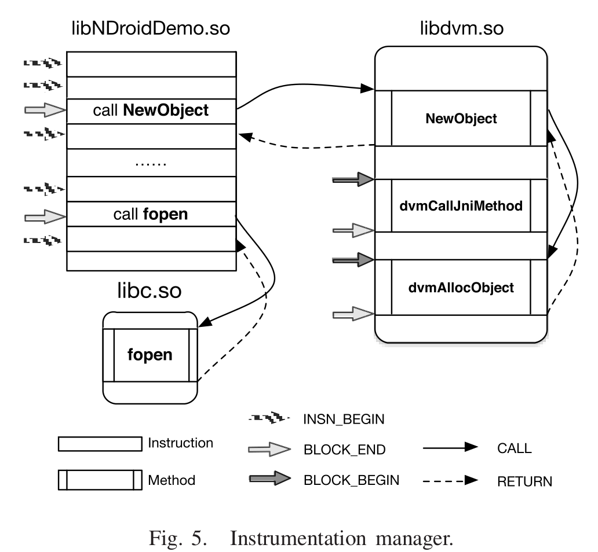

​	当app 通过java传递敏感数据到natie层的时候，数据首需要过JNI bridge 才能到达native 代码中， 然后 native 代码会处理这些数据并可能产生系统调用。

​	图5中对于app私有的native代码，Instrumentation Manager有两种不同的管理方式:

1. 基本块级别(i.e., indicated by BLOCK_END arrow)：如果一个代码块在调用系统方法或者JNI API之前结束，就在调用的结尾插桩。
2. 指令级别(i.e., indicated by INSN_BEGIN arrow)：在每一条指令执行前进行插桩。

这样，所有的代码的都会被检测。并且，该方法仅检测被app调用的系统类库或者第三方库中会被执行的代码。为了降低扎装的时间，他们写了自动化的脚本来反编译系统类库。

## JNI Tracer

​	 污点从java传递到native层的过程中，需要确定不同语言之间污点的传播方式。JNI bridge handler会对JNI API进行插桩。这些API可以被大致分为如下5类：(1)JNI entry;(2) method calling; (3) object/string/array operation; (4) field access;(5) exception.

### JNI entry

​	当上下文从java的DVM转换为native之前，java需要调用*dvmCallJNIMethod()*去做一些准备。因此hook这个方法就能通过frame pointer(图一中的args)定位方法的参数和污点数据。

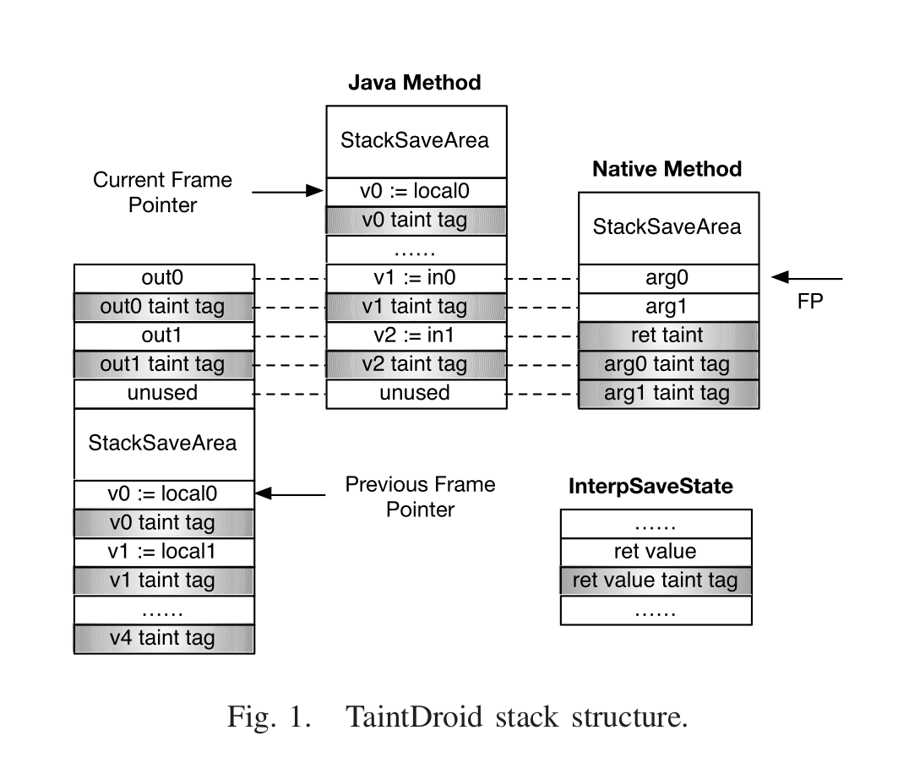

 论文设计了一个数据结构SourcePolicy来存储native方法，具体如下：

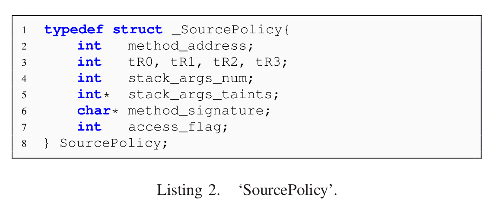

​	通过hook *dvmCallJNIMethod()*，然后使用一个hash表来存储键值对<addr,SourcePolicy>，其中addr是native 方法的地址，SourcePolicy 是将要调用的JNI方法。当存储在addr地址中的指令被调用之后，NDroid初始化和污点数据相关的寄存器和栈中的数据。

### Method Calling

​	当native调用DVM中的java方法时，native会调用如下表3的一系列方法。

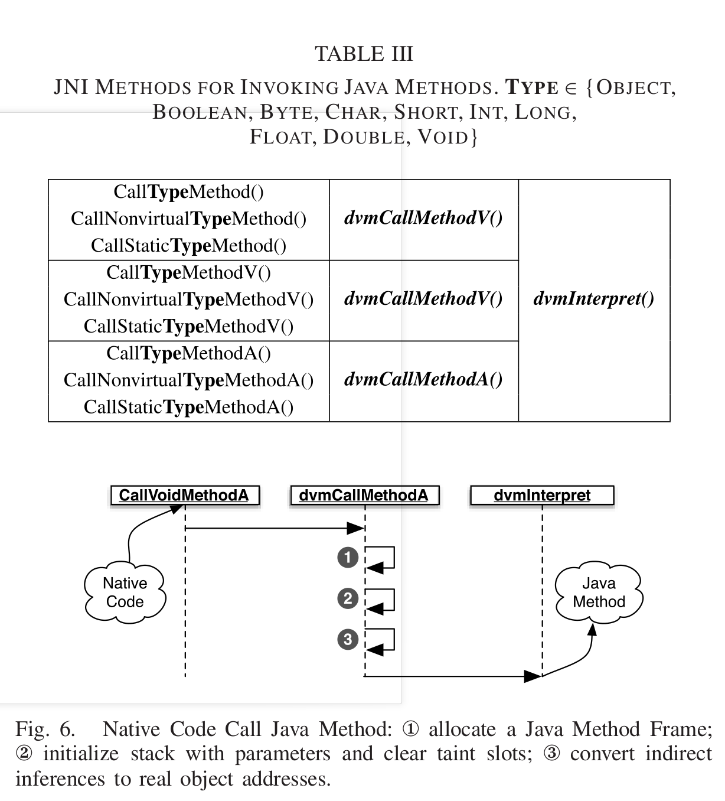

​	最终，*dvminterpret()*会在DVM调用java方法之前被调用。具体调用过程如下：

1. 将Java方法帧放入DVM的栈中，

2. 将参数放如栈中，并清除污点槽

3. 扫描所有参数并将简介引用的对象变为直接引用对象的地址。

4. *dvminterpret()*接管所有的java方法。 

由于*dvmCallMethod*()会清除污点信息，则需要对*dvmInterpret()*方法进行插桩，并java方法运行之前标记污点数据。但是由于在插桩*dvmInterpret()* 的时候无法直接获取间接引用的参数，并且在native层的上下文中又需要使用这些间接引用，所以也需要对*dvmCallMethod\*()*进行插桩。

​	如果不加以限制得在任何地方都检查这些方法的话，将会有非常大的开销因为*dvmCallMethod\*()*和*dvmInterpret()*两个方法也会在非污点传播的代码中调用。因此他们提出了一个多层级的hook系统来保证*dvmCallMethod()*和*dvmInterpret()*两个方法仅会在特定的native 代码中被插桩。多层hook的原理：

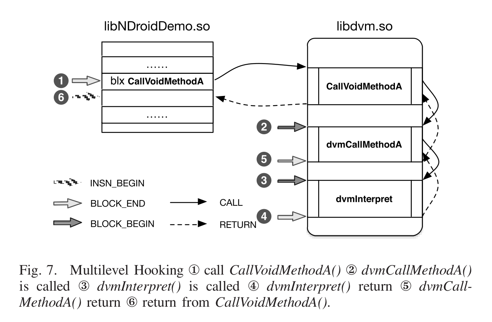

### Object/String/Array Operation:

​	JNI内部有调用Object/String/Array Operation的操作。需要使用多层hook来检查NOF和相关的MAF(如下图的NOF和MAG)、Object/String/Array Operation操作。

 

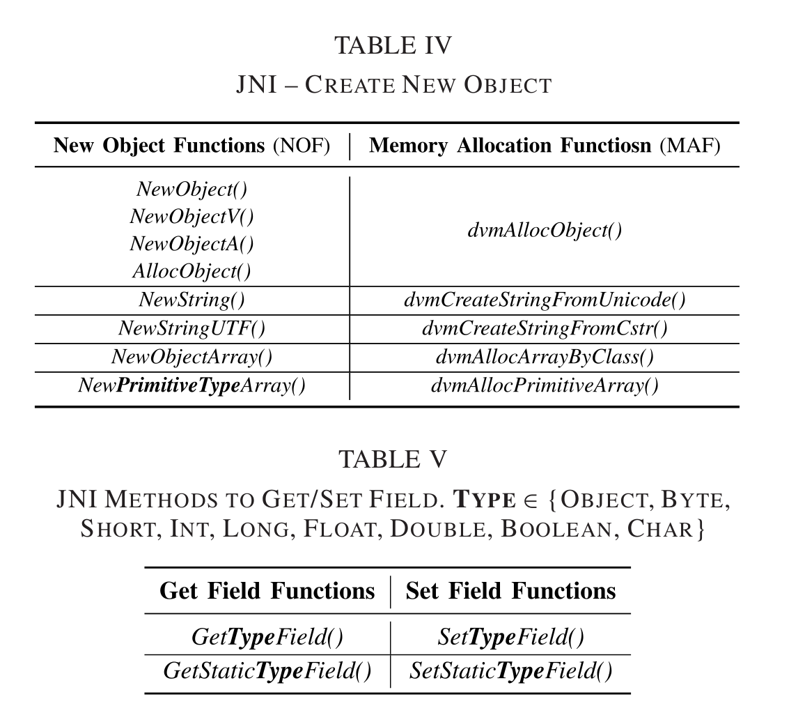

### Field Access:

​	有序native方法可以访问java对象的域，所以也需要hook访问域的所有方法来保证污点在java域之间的传播。

### Exception:

​	native层可以和java进行异常的传递。为了追踪异常传递的流程，可以使用使用多层hook 来对异常传递的方法进行插桩。

## 指令追踪(Instruction Tracer)：

​	当一条指令进入Instruction tracer之后，它首先执行该指令，然后再进行污点的传播。该指令追踪器是基于[darm](https://github.com/jbremer/darm)实现。污点传播逻辑如下表：

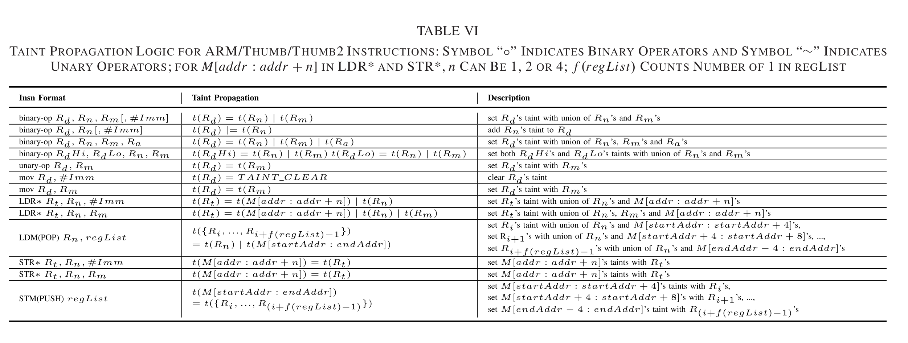

## Native Tracer:

他们仅对下面表中列出的库进行插桩和污点追踪。

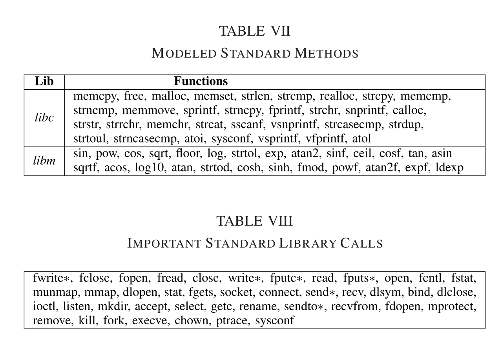

以*memcpy()* 为例子，如下图:

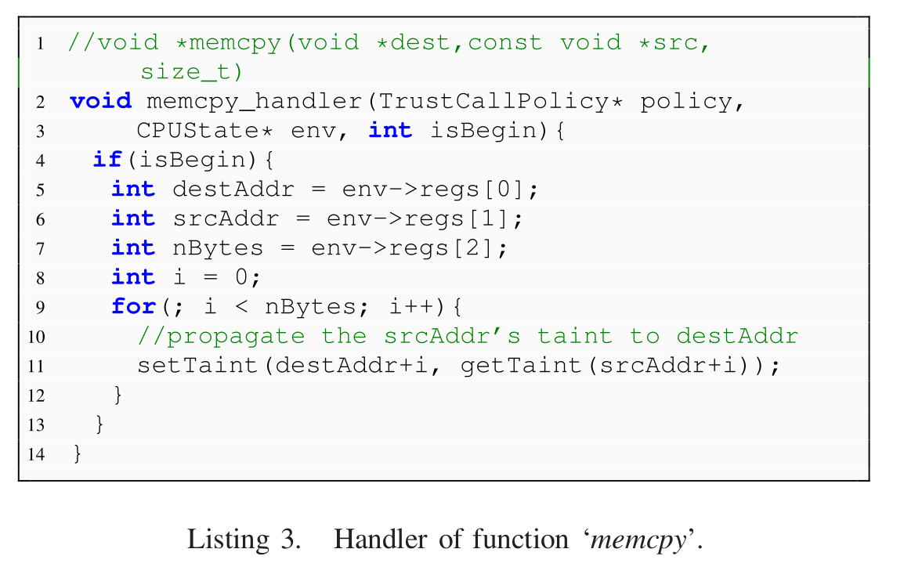

## 污点引擎

​	污点引擎保存了shadow registers和污点映射表来分别存放寄存器的污点和内存的污点。并且对每一个字节，都需要标注它是否是一个污点。并且污点引擎提供了一个特别灵活的接口来让其他模块方便得设置污点。

### 污点保护

​	由于污点的信息是存放在QEMU进程中，因此恶意的native代码可以通过修改内存来修改DVM栈中的污点信息。NDroid禁止native代码直接访问或者调用系统类库来修改DVM堆栈和堆，从而保护Java代码的污点。DVM栈的位置可以通过获取在当前线程的域*interpStackStart*和 *interpStackSize*来获取栈的开始地址和栈的大小。DVM堆的地址可以通过寻找内存中以*/dev/ashmem/dalvik-heap*为名称的对象来获取堆的大小。DVM域中的位置可以通过寻找污点保存在类的定义相同的内存来获得，因此通过*/dev/ashmem/dalvik-LinearAlloc*来获域的取内存地址。

# NDROID for ART

## Thread-Level View Reconstructor

​	NDroid-ART允许同时进行跨线程的污点追踪，它监视每一个线程的启动，并捕捉不同线程之间的切换。NDroid-ART通过hook *do_fork()*监视线程的创建、hook *_switch_to()* 来监视线程切换，这样即可监视ART中的所有线程。

## Taint Propagation Through JNI

​	native层通过*Call TYPE Method()*来实现对java方法的调用,其中*TYPE*表示方法的返回值。当获取到类和methodID之后，通过API *FindClass()*和*GetMethodID()*来获取 java方法，并通过调用ArtMethod::Invoke()来调用java方法。当java方法执行完毕之后，java方法就会回到Call TYPE Method()中，最终返回到so文件。

​	为了完成在native和java方法之间的污点扩散，NDroid-ART检查JNI调用流程的关键点：

1. 调用native方法前

2. 执行native方法前

3. native方法执行后

4. 调用native方法后

​	为了做污点在两个上下文的转换，NDroid-ART hook 了如下几个地方：

1. 调用Call TYPE Method() 一系列api之前
2. 调用java方法之前
3. 调用java方法之后
4. 调用Call TYPE Method() 一系列api之后

## ART Tracer

由于指令级别的污点追踪消耗过大，因此使用方法级别的追踪。整个过程有三步：

1. 对于android framework API ,建立了输入参数与污点传播之间的关系模型；
2. 获取下一个basic bolck的地址然后通过地址来对应相应的系统api；
3. 借助上面两步获得的信息生成一个hook 函数，来监视污点的传播。

​	在建模污点传播行为和framwork api之前，首先从*system@framework@boot.oat*然后使用静态分析工具来建立控制流图，通过控制流图来建立一组和framework api中参数相关的可执行路径。

​	为了提升静态分析的效果，他们设计了一个可以用来检测指令是否属于特定方法的工具。分别调用boot.oat和app中的oat然后将这些函数的地址记录到配置文件中。执行插桩的时候，NDroid-ART会首先检查指令是否属于相关的函数然后再进行污点分析。

# EVALUATION

​	他们对androd 4.0和android 5.0两个系统和QQPhone-Book 3.5 and ePhone 3.3.3进行测试，并且选用了两个已知的恶意软件SpyBubble and PlusLock也进行了测试，并使用CaffeineMark进行性能评估。验证的结果是，NDroid可以在DVM、ART与native层中进行准确的污点传播，并且使用CaffeineMark进行的性能评估的结果良好。

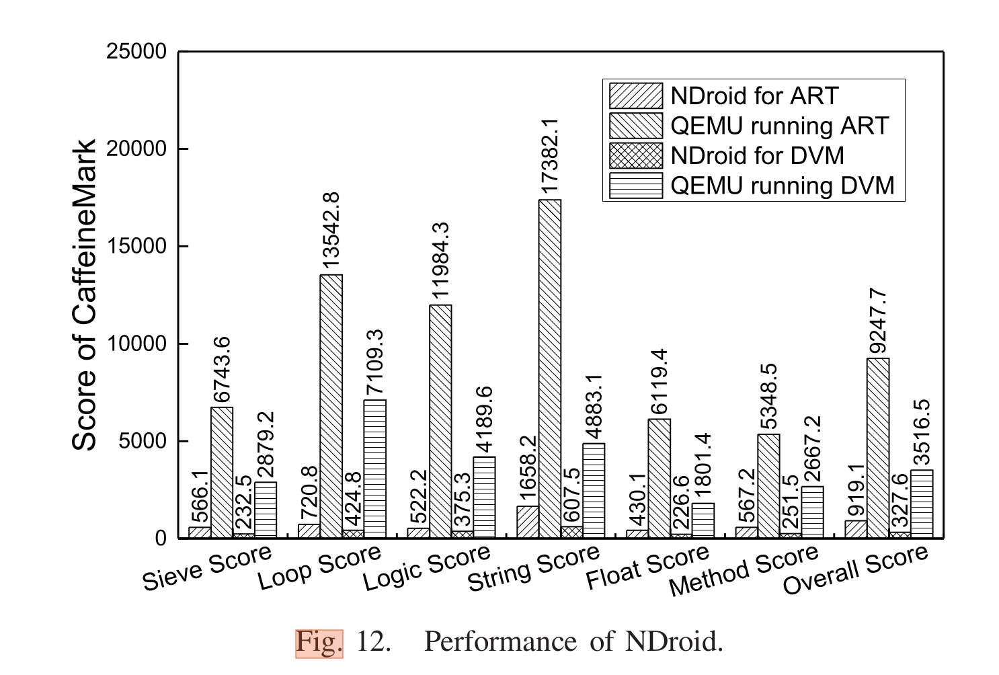

# 不足

1. NDroid-ART仅考虑了framework api 的函数参数之间和函数参数与返回值的关系，所以可能不是特别准确(文中提到的问题)
2. 必须把Ndroid和aosp源代码一起编译

* 原文:[https://ieeexplore.ieee.org/document/8443386](https://ieeexplore.ieee.org/document/8443386)
* github:[https://github.com/rewhy/NDroid](https://github.com/rewhy/NDroid)