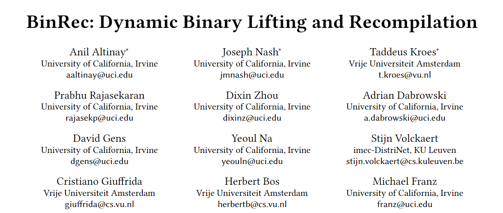
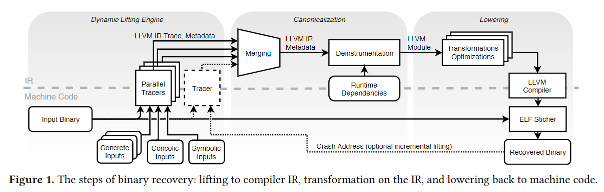
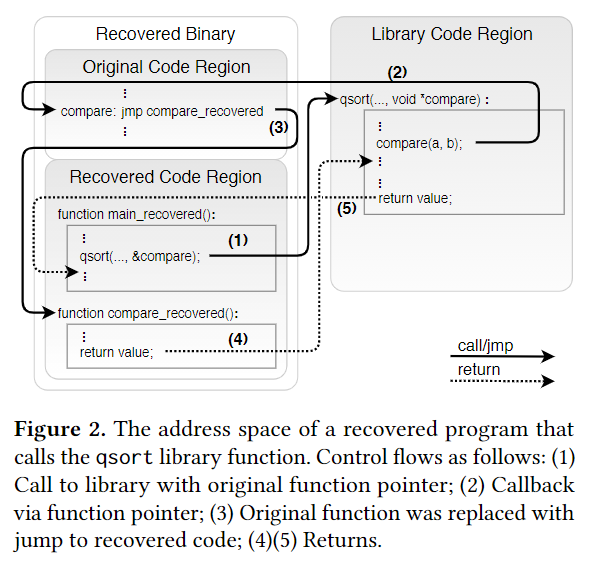
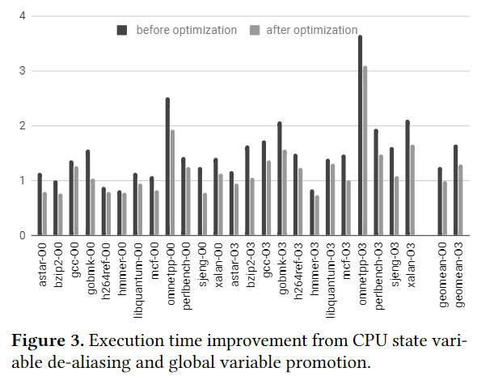
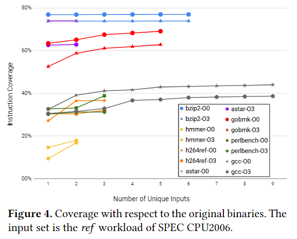
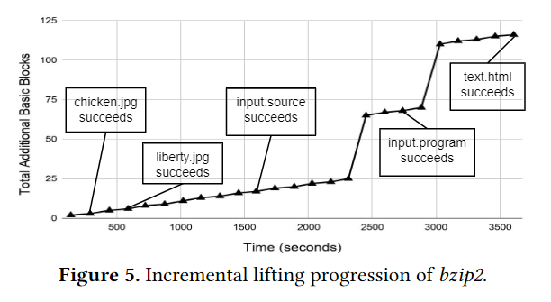
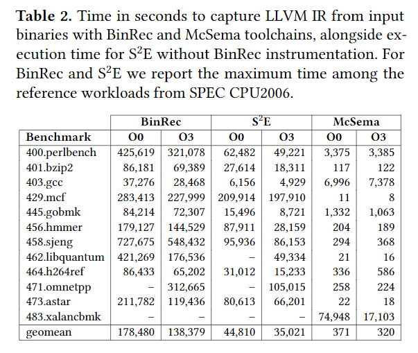
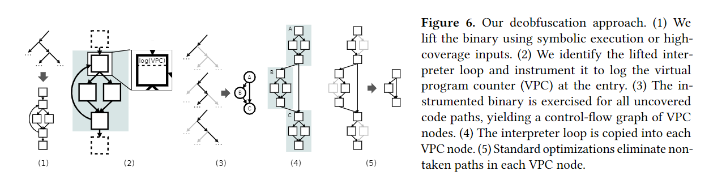
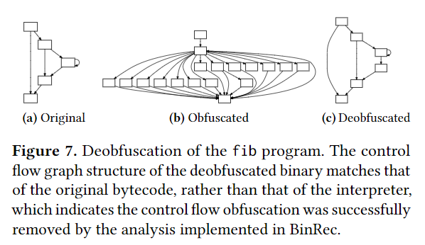

大家好，今天我为大家带来了发表在 *EuroSys 2020* 的工作《BinRec: dynamic binary lifting and recompilation》。这篇论文其实已经被上海交大软件安全研究组 GoSSIP 在 [G.O.S.S.I.P 学术论文推荐 2020-04-23](https://mp.weixin.qq.com/s/8h3kmZPxfWcYVTLkJF0X4w) 中介绍过了，但是他们写的不是很详细，正好我对这篇论文挺感兴趣的，就在这里稍微详细地进行介绍吧~

现有的二进制提升（把机器语言提升到中间语言的级别）方法依赖于静态反汇编，存在以下三个缺点：

1. 无法准确建模间接控制流的目标
2. 无法区分代码指针和数据常量
3. 无法确定数据字节和指令字节的边界

而启发式反汇编的方法通常对二进制有特定的假设，例如是典型的发布版本（typical release）、去符号及调试信息、被故意混淆等假设，而实际中会遇到更多情况：手写汇编、高度优化的代码、非标准编译器编译的代码、混淆/打包后的代码、位置无关的代码等等问题。

而作者们实现的 BinRec 工具利用动态分析的方式解决了以下五个问题：

1. 代码和数据引用的歧义性
2. 间接控制流
3. 外部对内部的调用（例如 `qsort` 函数中的自定义函数参数）
4. 不规范的代码
5. 混淆（虚拟化混淆）

他们的设计如下图所示。

可以看出，为了尽可能地覆盖二进制的 trace，他们通过不同的输入辅助动态分析来取最大的代码集合。

但是很显然，很多时候仍然不能完全地取到所有测试集合，因此他们开发出了一种新的二进制提升的增强机制，在运行时遇到没有覆盖的路径可以自动化地记录 trace，并最后合并到新的二进制文件中，这样即使遇到了新的路径，也不至于 crack。

除此之外，文章对很多静态分析难以处理的问题都进行了讨论。

不过比较难处理的数据引用问题 BinRec 也没有对其进行研究，只是将原本的二进制作为环境变量插入到新的二进制中，维护两套栈和寄存器以方便处理相关的问题。

总的来说，BinRec 把二进制提升到 LLVM IR 级别并重新编译，与未经优化编译的程序相比性能没有下降太多，甚至有的还更优。

而在另一方面，由于 BinRec 能够自动添加新的 trace，因此在代码覆盖率上也有很好的表现。

他们还讨论了遇到新的 trace，生成新的 binary 的时间，大概需要 140 秒。

而与其他的二进制提升工具对比，BinRec 由于没有使用启发式的方法，因此会需要更多的时间开销，但是在提升能力上要远远胜出。

之后文章还讨论了 BinRec 可能的应用。例如二进制控制流缓解（在他们的方法中，原来的栈被模拟成了一个大数组）、虚拟化反混淆（利用编译优化）以及对相关二进制工具的支持。

最后文章也讨论了 BinRec 的种种限制

1. 只能处理 x86
2. 不能处理 PE（这俩都不叫问题吧）
3. 实现线程安全地处理动态跟踪及数据结构需要很多努力
4. 没有实现对自修改代码的处理
5. 没有恢复栈插槽（stack slots）和变量间的映射

总的来说确实是一篇很有趣的文章，里面的介绍也很全面，让我这个对该方面不是很了解的人也有了大概的印象。

- PDF: <https://download.vusec.net/papers/binrec_eurosys20.pdf>
- slide: <https://download.vusec.net/slides/binrec-feast18.pdf>
- 项目 GitHub（尚未开放代码）: <https://github.com/securesystemslab/BinRec>
