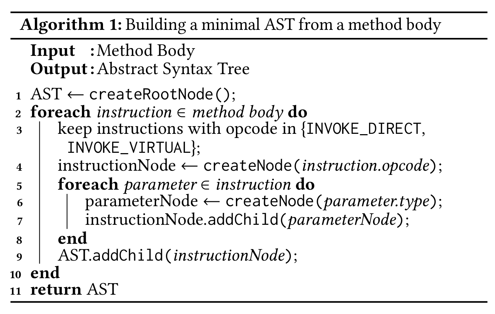
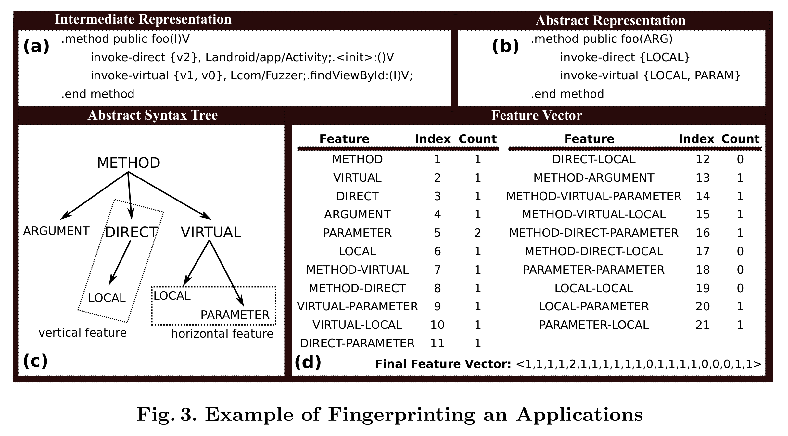
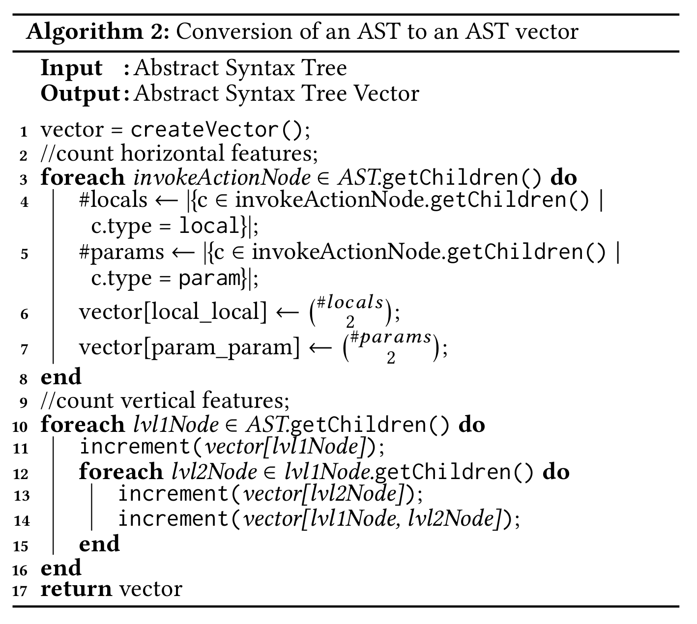
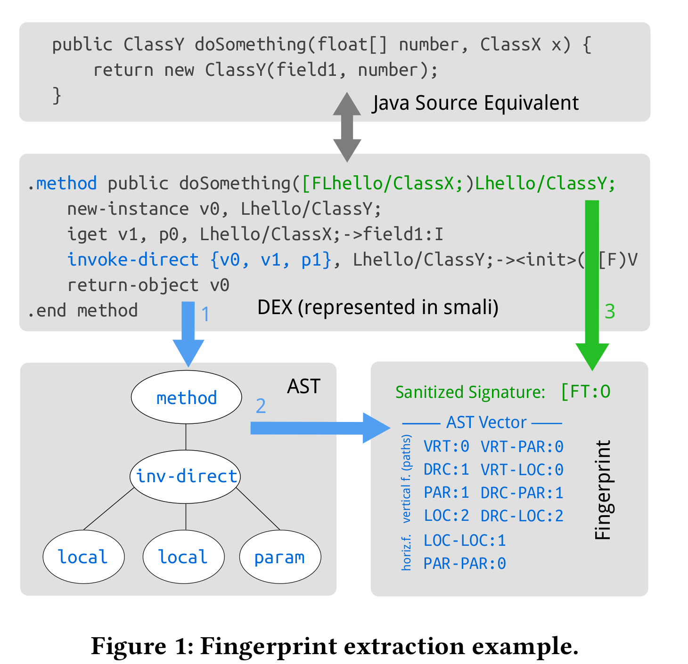
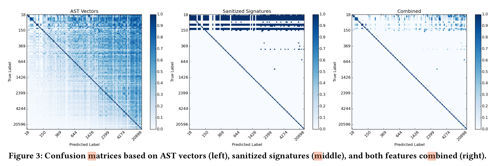
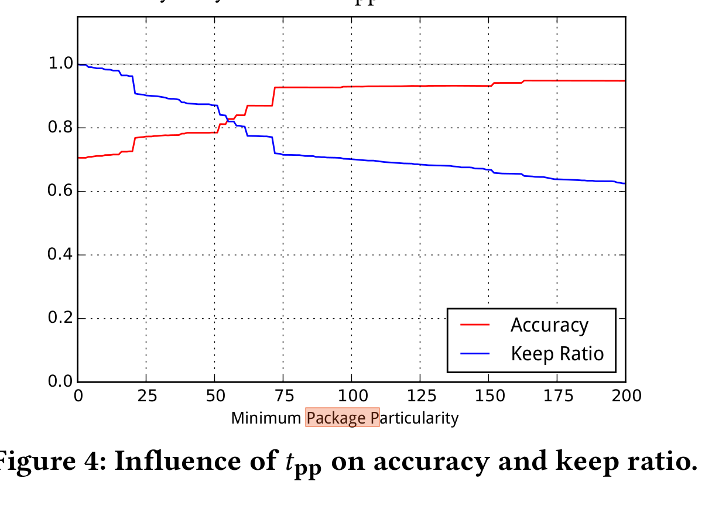
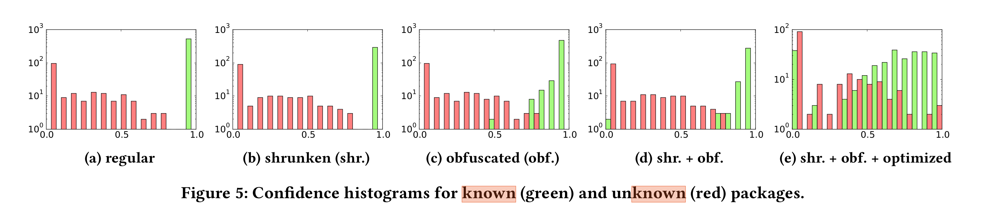
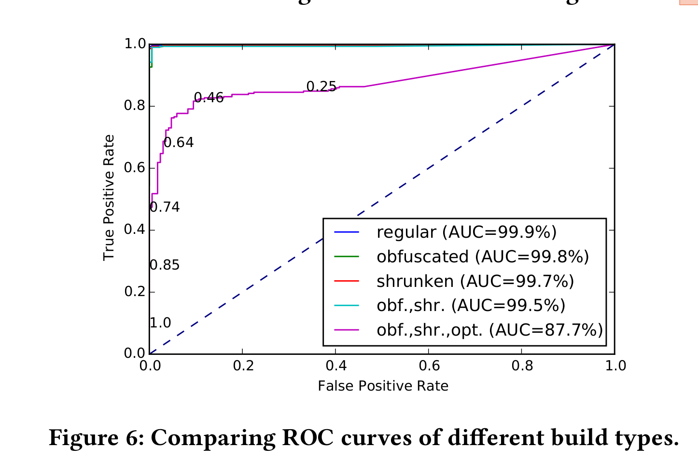
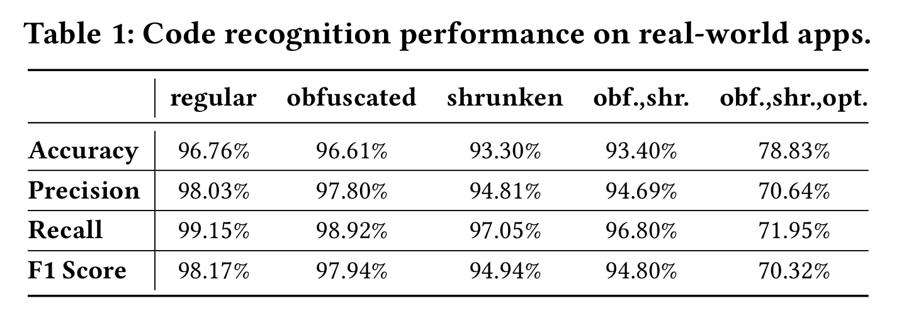

大家好，今天为大家带来了发表在 **ARES '19: Proceedings of the 14th International Conference on Availability, Reliability and Security** 的工作《Obfuscation-Resilient Code Recognition in Android Apps》。

## 背景和目的

​	android 的第三方库中可能会有恶意代码来获取用户隐私，该论文提出了一种新的解混淆的方案来判断app中是否使用了第三方库。具体来讲，使用解混淆技术来提取android app中第三方库中代码框架和数据流，并结合AST、函数签名来判断程序的指纹，最后使用一个得分矩阵来在函数、类、包三个层次来判断app中是否使用了第三方库。

## 前人工作的局限性

1. 关注于使用lib的名称和版本来检测单独的类库，需要很大的ground truth。若lib很小，则特征不明显。
2. 十分依赖于java包名、目录层级和不变的方法签名。但是不同版本的代码和目录结构都会不同，使得工作量很大并且准确率不高。
3. android app多使用code transformation 技术，包括混淆、标识符重命名、和代码缩减(code shrinking)，并且之前工作很难应对。

## 论文贡献

​	使用类库中代码的AST结构来作为类库的特征用于识别第三方库，可以应对代码混淆、缩减和等等技术，并且不依赖别类名、包名和方法名，这些仅作为补充。	使用从AST中提取的向量化的指纹代替hashed-based指纹，增强准确度。设计了一个评分指标来比较代码段，它可以准确地定位包含在其他代码部分中的代码段，并且可以基于函数指纹的累积来表示类和包的相似性。

## 系统设计

该工具由两个阶段：

​	学习阶段：使用代码片段和类库进行学习。

​	匹配阶段：使用学习的知识来匹配代码块。

旨在达到如下的效果：

1. 若app中使用了一些代码段或者第三方类库，则需要识别其名称和版本；
2. 能够抵抗混淆
3. 自动检测并输出app中的代码和检测出的第三方代码库的匹配百分比(相当于app中使用了多少的第三方库)

### 抵抗混淆

​	论文使用如下流程来克服对应的代码转换:

1. 标识符残余(Identifier Renaming)，混淆器会对代码中加入没有任何意义的debug symbols来影响程序分析。该工作完全不使用debug symbols。

2. 代码缩减(Shrinking)，这一步，混淆器会移除所有没有使用到的代码、包和类。该工具在学习阶段并无法得知哪一部分的代码会被移除，因此克服代码缩减会在对类库进行指纹提取的时候完成。
3. 优化(Optimizations)，代码优化器会对代码进行增加或者修改来改变代码框架。但是经过他们的调查，AST 向量的匹配是基于距离的，因此影响不大(猜测可能是使用相同的优化手段，然后都使用优化后的结果进行比较)。但是，经过清洁的签名被修改后不能返回原始方法，因为在比较签名时会检查是否严格相等。

文章还指出了一个混淆工具[ProGuard](https://www.guardsquare.com/en/products/proguard/manual/usage/optimizations)会对该工作产生影响的几个点：

1. inline，短方法会被嵌在调用端。
2. Code Merging，ProGuard识别重复的代码片段，并通过修改分支目标来合并它们。
3. 方法参数去除。这样会影响方法的签名，从而影响匹配。

## 工作流

### AST向量	

首先将dex文件转换为smali，然后基于smali进行操作。

为了获取AST 向量，首先获取AST，如下：

​	

​	从root 节点(第一行)，枚举一个方法中所有的smali语句(第二行)，然后选过滤掉INCOKE_DIRECT和INVOKE_VIRTUAL(smali中调用函数和虚拟函数的语句)，除此之外，我们还需跟踪一些后缀，例如_SUPER， _STATIC 和 _INTERFACE。为当前调用创建一个AST节点（第4行），并为方法的每个参数附加一个子节点（第5-8行）。最后，将指令节点作为子节点添加到树根（第9行）。

​	使用Potharaju定义的方法将AST变为水质和水平的特征：水平特征是具有相同父节点的一对叶节点，而垂直特征是从根节点开始的任意长度的有向路径。AST向量中的每个维度都与特定水平或垂直特征的出现次数相似。

​	从一个空向量开始，首先通过遍历AST中所有第一层节点来确定水平特征，然后确定每一个节点的叶子节点数量(3-8行)。对于每一个方法调用，记录个局部变量和参数的数量然后计算locl-local和param-param的数量。由于这个问题和握手问题类似，我们可以使用二项式系数。接下来，再次迭代AST的第一级节点（第10-16行）来计算垂直特征，并将当前节点的出现计数增加1（第11行）。最后，迭代它的所有子节点，并增加两条路径的出现次数，无论是仅二级关系还是第一级和第二级节点的连接。（第12行）。

### 经过清理的签名

​	经过清理的签名进包含了方法的签名，并且和混淆无关。为了得到这些签名，首先去掉了源方法的方法标识(method identifiers)、参数名称(parameter names)等是信息。然后使用一个single letter code替换参数类型和返回类型(如Figure 1 中右下角方框中的绿色字体)。若该类型和正在处理的类型相同，则用T代表，若使用同一个包的不同类则用O，其他的使用E。

### Fingerprint and Package Hierarchy

​	具体如上图。但是这些指纹有的时候无法辨别出具体方法，例如get和set方法，因为大多数的方法长得都一样，从smali code从提取的指纹无法辨别。

​	于是便使用了经过清洗的签名(绿色的字)。由于两个不相关方法可能有相同的指纹，但是两个不相关的类不可能都完全出现相同的方法指纹。这里，定义包的相关性：当且仅当两个包使用了指纹相同的方法，则两个包是相关的。之后他们定义了一个数据结构来扩散相似性，即函数的指纹影响类的相似性，类的相似性影响包的相似性。称之为包层次结构（Package Hierarchy）。之后的代码识别就是基于Package Hierarchy来进行第三方库的识别。

## 代码识别

​	从android app提取的代码层级$P_a$，对于一个包的层级$p_a \in P_a$ ，使用如下步骤进行识别：

1. 将所有的指纹$p_a$ 按照特定降序排列。
2. 对于每一个指纹，从数据库中提取已经训练完成的AST 向量和经过清理的签名，并提取与其相近的包层级指纹(上图绿色的字)并存储在候选序列$P_l$
3. 对于每一个$p_l \in P_l$ ，若$p_a \in p_l$ 则这个包被已知的类库包含。
4. 若$p_a \subseteq p_l$ 则计算连个包的相似度两者相似度$s(p_a, p_l)$。若不相似则记为0.
5. 按照相似性得分降序对候选包进行排序，并返回满足最小阈值的最高分数的包作为匹配的结果。

### 相似程度评估

该评估帮助判断两个包的层级p和p'有多近似，具体分为包间、类间和AST向量：

​	**包间相似度**。我们使用匈牙利算法计算相似度评分 $s(p,p')$。并使用代价矩阵S来存储对应另个类的相似度  $s(c,c')$:

$$
S \in \mathbb{R}^{\vert p\vert \times \vert p'\vert},S\lbrack i \ j\rbrack = 
\begin{cases}
s(c , c') & if \enspace c_i \subset c_j' \\
0 &else
\end{cases}
$$

 由于匈牙利算法找的是最小代价，因此我们将其转换成反转的矩阵：

$$
S_{inverted} = (max(S)-S \lbrack i,j \rbrack)_{ij}
$$

使用之前一样的方法计算$cost(S,f_c)$

​	**类间相似度**。 令 $c = \{m_1,...,m_n\}$ 是一个由指纹列表组成的类，其中每个指纹由一个经过清洗的签名$s_i$和一个AST向量$v_i$组成。然后用匈牙利算法再次确定类相似性s(c，c')。首先，生成代价矩阵T: 

$$
T \in \mathbb{R}^{\vert c \vert \times \vert c'\vert},T\lbrack i \, j \rbrack = \begin{cases}s(v_i,v_j') & if& s_i = s_j' \\0 &else \end{cases}
$$

和上面的S相同，将T进行翻转，然后再使用匈牙利算法得到最好的指派。然后使用$cost(T,f_c)$计算相似程度

​	**向量之间相似度**。用以下公式表示两个AST向量v和v'之间的相似性：

$$
s(v, v' ) = max(0, \lVert v_1 \rVert - \lVert v - v' \rVert_1 )
$$

以上的向量距离均为曼哈顿距离。该的算法满足了如下的需求：

1. 如果向量相距太远，则相似度为0。如果向量之间的差值大于向量本身，则相似度为0。
2. 不接受相似度的负值，这样就能避免向量不匹配然后导致作业的总分恶化的情况。通过取差值与0之间的最大值来确保这一要求。
3. 当两个向量相等时，则是最大的相似性。在这种情况下$\lVert v - v' \rVert_1=0$，$s(v,v')=\lVert v_1 \rVert_1$。
4. 如果$\lVert v_1 \rVert_1>\lVert v_2 \rVert_1$，我们需要$s(v_1,v_1)>s(v_2 , v_2)$，因为我们想要更大的向量，因此更特殊的向量对分配成本有更大的影响。

## 方法效果评估

​	使用*[F-Droid Repository](https://f-droid.org)*数据集并对其中的app 进行不同程度的代码缩减和混淆，并从中提取了经过混淆150个app然后和已经收集好的类库进行比对。他们比较了每一个包和收集到类库的相似度。首先，为了验证方法的可行性，首先从150个app中提取出20596个包并和20898个lib中的包进行相似度匹配，结论是使用AST向量和经过清洗的签名结合在一起的效果最好

之后他们又做实验寻找包特征的最小值$t_{pp}=75$，这个最小值定义了一个包能够被当成特征的下限。

​	

最后又实验了判断两个包相似的阈值，同时结合ROC曲线得出最佳值为$t_{mc}=0.5$,  

​	最终，该系统的效果如下：

## 不足与启发

1. 仅能应对java lib，无法应对任何native lib
2. 混淆技术也有很多，论文中并未指明能够抵抗哪种混淆

- 论文地址:[https://dl.acm.org/doi/10.1145/3339252.3339260](https://dl.acm.org/doi/10.1145/3339252.3339260)