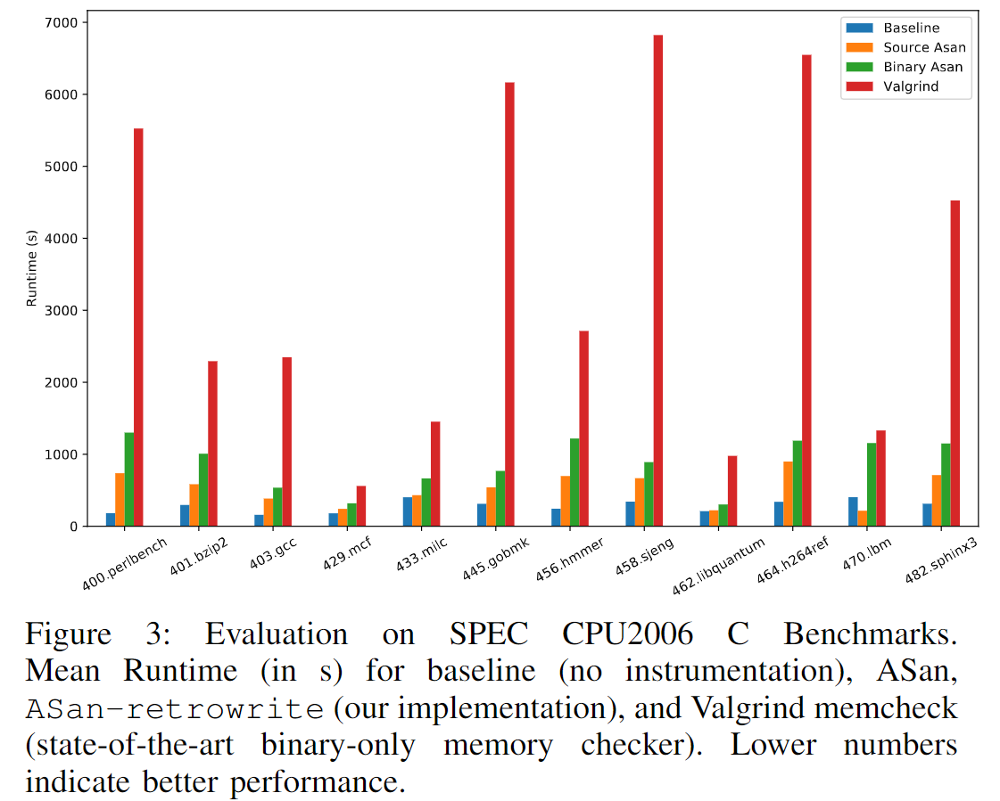

新年（阳历）将近，预祝大家新年快乐，多发论文！今天我给大家带来了来自 *S&P 2020* 的文章《RetroWrite: Statically Instrumenting COTS Binaries for Fuzzing and Sanitization》。

作者们发现当前二进制的测试方法有以下三种：

1. 采用黑盒 fuzzing
2. 依赖动态二进制翻译
3. 使用启发式的不可靠的静态重写

而静态重写困难在于消除引用和标量常量的歧义。当前的二进制重写有以下三种技术：

1. 重编译，会将代码提升到 IR 级别
2. 蹦床（trampolines），会插入间接代码段而不改变基本块的大小
3. 可重汇编的汇编，会创建一个等效于编译器发出（emit）的程序集的文件

本文利用了 64 位的位置无关代码（PIC）所需的重定位信息生成可重汇编的汇编文件。为了证明他们的方法的可靠性，他们还利用了 fuzzer 进行测试。他们对 fuzz 二进制的需求也很明确：

1. 为了最大化 fuzzer 吞吐量，需要一种机制生成与编译时插入指令性能相同的插入指令的二进制文件。
2. 二进制重写和预期效果应保持一致，并且可以扩展支持真实世界的用例。

总的来说他们的贡献如下：

- 一种对 64 位 PIC 二进制文件进行重写的框架
- 一种插桩方法，让二进制文件的运行性能和基于编译器的 AFL 的插桩相同
- 一种通过 ASAN check 改进二进制文件的插桩方法，使二进制的内存安全分析效率提高了三个数量级
- 全面评估 ASAN 和 AFL 插桩，并讨论其局限性

在实现中，他们认为一个理想的重写器应该拥有以下三个特性：

1. **性能** 使用工具重编译时，运行时和开销较低。
2. **准确性** 保留原始程序的特征。
3. **可扩展性** 可以扩展到真实的软件上。

他们设计了一种重写方法 RetroWrite，如下所示。

他们的方法分为五步：

1. 预处理：这一步会加载例如 text 和 data 等 sections。还会加载符号和重定位信息，以及通过线性扫描反汇编并生成 CFG。
2. 符号化：这一步使用加载阶段的重定位信息和恢复的 CFG 识别数据段和代码段的符号常数，并把它们转化为汇编器的标签。这一步结束时 RetroWrite 会输出可重汇编的汇编。
3. 插桩操作（Instrumentation Passes）：通过对可重汇编的汇编进行操作修改二进制文件。
4. 插桩优化
5. 重汇编：生成一个插桩的汇编文件

其中符号化的过程是他们方法的核心。他们在三个阶段进行了符号化。

1. **控制流符号化** 将控制流指令（call 和 jmp），也就是代码与代码（c2c）的引用转换为汇编程序的标签。
2. **pc 相对寻址** PIC 引用的是相对地址，因此可以将其转换为标签，包含了代码对代码和代码对数据（c2d）的引用。
3. **数据重定位** 这一步还是利用了 PIC 程序中一切都是相对的这一特性，将重定位项转换为标签。这一步包含了数据到数据（d2d）和数据到代码（d2c）的引用。

由于他们针对的是 64 位的 PIC 二进制文件，因此他们的方法实质上是利用了其中的偏移，这也是他们的方法与现有的启发式的方法不同的原因，也显然是有局限性的。

之后他们实现了基于此方法的 ASan 和 AFL，并在实验中取得了不错的效果。他们对以下四个方面进行了实验：

1. RetroWrite 是否支持大型文件？
2. 是否在运行时开销和覆盖率等方面改善了当前的二进制内存检查器？
3. 能否在运行时开销和覆盖率方面和基于源代码的内存损坏检测器（memory corruption detectors）竞争？
4. 与基于源代码的 AFL 插桩工具相比的覆盖率如何？是否能替代基于 QEMU 的 AFL 插桩？

除此之外他们还讨论了一些局限性，包括支持 C++ 编译的二进制、进一步优化、Asan-retrowrite 的局限性以及混淆相关的问题。

这篇文章是我沿着 BinRec 的参考文献找到的。总的来说，相比于之前介绍的 [BinRec](./1229.md)，RetroWrite 似乎更专注于支持已有的二进制分析工具。不过现在看来，BinRec 做的更好一些，因为 RetroWrite 只支持 PIC 的二进制，而 BinRec 则支持得更广泛。

- PDF: <https://hexhive.epfl.ch/publications/files/20Oakland.pdf>
- video: <https://www.youtube.com/watch?v=VdT_0jPr00U>
- source code: <https://github.com/HexHive/retrowrite>
- slide: <http://nebelwelt.net/publications/files/19CCC-presentation.pdf>