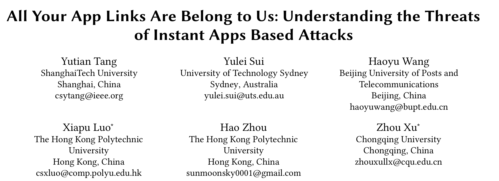

姗姗来迟的文章推荐，祝愿大家在新的一年身体健康，梦想成真！

今天给大家推荐的是来自*ESEC/FSE 2020* 的文章《All your app links are belong to us: understanding the threats of instant apps based attacks》

android deep link 是android 6.0 之后允许用户从web app中直接无缝打开相关的app(例如使用默认浏览器打开百度的时候会弹出是否开启百度 app)的功能。但是这种deep link并不向他们声称的那样安全，因为instat app 在使用这些链接的时候可以绕过验证过程。

该论文研究了目前app中链接机制的缺陷，并且提出了三种劫持攻击。

* link hijacking with STS
* link hijacking without STS
* instant app hijacking

并且这三种攻击在最新版的android 系统 android 9和android 10上面均可以成功执行。之后他们也提出了一个用于检测app是否易受malicious instant app(MIA)攻击的静态分析工具，并且提出了防御这三种攻击的方法。

   他们对400000个android app进行测试，并发现27.1%的app会受到 link hijacking with STS 链接劫持攻击；30% 会受到link hijacking with STS攻击，然后所有的app都会受到instant app hijacking攻击。

​	

​	*instant app*是当用户在需要一个app的功能的时候，就从Google Play上下载这个程序的部分功能，从而体验到App级的用户体验，用户使用完这个应用的功能模块后，系统会丢掉这个功能模块。

	

 *smart text selection(STS)*可以让android系统识别用户选择或者点击的文本来辅助用户进行下一步的操作。例如当用户选择了一份电话号码的时候，系统就会提示用户是否拨打电话。

# 攻击方式

三种攻击如下：

link hijacking with STS:这个攻击依赖于STS(Android 8之后的特性)，当用户选择了Yelp地址的时候，STS系统就会向用户推荐使用MIA并诱导用户打开MIA

link hijacking without STS: 当用户希望使用浏览器打开Yelp的时候，当用户点击了URL，android系统会从系统中将所有可能的候选项进行排序，并且android系统对于instant app的优先级更高，因此MIA就会成功优先级最高的app。

Instant app hijacking:当用户点击URL之后，系统会通过包名来对候选instant app进行排列。例如，用户点击链接*google.com/tripsapp*，若攻击者使用了一个比期望打开的instant app 包名(*com.google.android.apps.travel.
onthego*)更“短”的包名(*a.example.instantappurlauto*)，此时MIA就会启动。

他们提出的MIA的静态分析工具是基于FlowDroid的，可以用于检测app是否会被上述三种攻击劫持。

# 检测工具（MIAFinder）

检测link hijacking with STS:

检测link hijacking without STS: 

检测Instant app hijacking:由于所有的instant app均会受到这种攻击，文章中并未给出具体的解决方案。

# 评估

论文回答了如下的问题:

1. 目前app中是否正确配置了 app 链接？

   回答：在所有20万个googleplay应用中，有8682个应用使用应用链接。只有18.0%的用户正确配置了应用程序链接。在所有20万个腾讯Myapp应用程序中，4035个应用程序使用应用程序链接。只有3.1%的用户正确配置了应用程序链接。

2. 目前app是否能够抵御通用的link hijacking with STS攻击？

   回答：因此，有53619个googleplay应用（26.8%）容易被STS链接劫持攻击。那里有54650个腾讯Myapp应用程序（27.3%）易受此攻击。

3. 目前app是否能够抵御通用的link hijacking without STS攻击？

   回答：有57442个google play应用（28.7%）在没有STS攻击的情况下容易被链接劫持。有62496个腾讯Myapp应用程序（31.2%）易受此攻击。

4. 目前app是否能够抵御通用的Instant app hijacking攻击？

   回答：所有即时应用都容易受到即时应用劫持攻击。

5. MIAFinder准确性如何？

   回答：通过对800个应用程序的实验，他们发现该工具的查准率为100%，查全率为87%。

- 论文:[https://dl.acm.org/doi/10.1145/3368089.3409702](https://dl.acm.org/doi/10.1145/3368089.3409702)
- demo:[https://sites.google.com/view/instant-app-attacks](https://sites.google.com/view/instant-app-attacks)