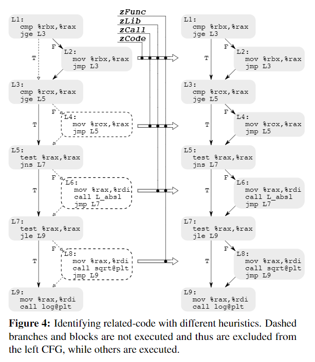

大家好，今天我为大家带来了来自 *USENIX Security 2019* 的《RAZOR: A Framework for Post-deployment Software Debloating》。

本文引用了一句名言：

> “如非必要，勿增实体。”（Entities are not to be multiplied without necessity.）

他们的想法是：商用程序通常提供了大量的功能，但是用户很可能只会用到其中的一小部分，而且复杂的代码会带来宽阔的攻击面。于是他们提出了一个根据用户需求定制的面向二进制的去臃肿（debloating）框架，可能这也是他们的方法叫做“Razor”的原因吧。

针对二进制的去膨胀有以下两个挑战。

1. 用户对软件内部知之甚少，如何让他们选择需要的功能。
2. 如何修改二进制在保留所需功能的同时删去不必要的功能。

在本文中作者们使用了启发式的方法来解决这些问题。假设给定了一个执行路径 $p$，作者们希望能找到满足下面四种要求的路径 $q$：

1. $q$ 中没有不同的指令。
2. $q$ 没有调用新的函数。
3. $q$ 不需要任何额外的库函数。
4. $q$ 不依赖具有不同功能的库函数。

作者们逐渐提高启发式的级别直到程序稳定，最终得到了不错的结果。

以下图中的一个“臃肿”的图像解析器为例，如果我们只需要解析 png 代码的话，解析 jpeg 的部分就是“臃肿”的部分，需要被去除。

而在设计中他们总结出了三个问题并对其进行了回答。

1. 如何表达不必要的功能
2. 如何将功能映射到程序代码中
   - 前两个问题通过测试样例解决，这又引出了第三个问题：
3. 如何从有限的测试用例中找到更多相关的代码
   - 作者们通过基于控制流的启发式方法解决第三个问题。他们的方法可以推断出更多的相关代码。例如在上图中，测试用例可能不包含第 12 行的对其代码。如果简单的去膨胀的话会将其删除，而他们的启发式方法则会将其保留。

Razor 的设计示意图如下所示。Razor 会首先用测试样例运行程序并通过 Tracer（例如 [Dynamorio](https://dynamorio.org/)、[Intel Pin](https://software.intel.com/content/www/us/en/develop/articles/pin-a-dynamic-binary-instrumentation-tool.html) 等）收集执行路径（主要是基本块的信息），然后解析重建只包含执行路径的控制流（CFG）。为了支持相同功能的更多输入，他们通过启发式方法扩展了控制流。最后再生成一个支持所需功能的最小版本的应用程序。

作者们采用“尽力而为”的启发式（best-effort heuristic）尽量覆盖更多的相关代码。从保守到激进他们提出了四种启发式方法，分别是零代码启发式（zCode）、零调用启发式（zCall）、零库函数调用启发式（zLib）以及零功能启发式（zFunc）。相应的例子和算法如下图所示。

他们还使用了一个查找表在运行时将原始目标地址转换为新的地址。从而有效地实现了静态和动态二进制重写之间的混合方法。

不过他们的方法还是将 data 段保留在了源程序中，以支持某些 d2d 和 d2c 的访问，这也体现出了对数据处理的难度要大于处理控制流的难度。

作者们通过以下五个方面对 Razor 进行了评价。

1. **代码减少量** Razor 可以从原始的臃肿的二进制中减少多少代码？
2. **功能性** 去膨胀的二进制是否支持给定测试样例中的功能？PathFinder 在查找互补代码方面的效率如何？
3. **安全性** Razor 是否减少了二进制文件的攻击面？
4. **性能** Razor 会给去膨胀的二进制带来多少开销？
5. **实用性** Razor 是否能在真实世界中的软件上工作？

文章中进行了大量的实验，对 Razor 的功能和可靠性进行了充分地验证。

除此之外，作者们还讨论了 Razor 在“尽力而为”路径推理、控制流完整性和去膨胀、库的去膨胀以及消除原始代码上的一些操作。

总的来说这篇文章在“去除冗余代码”上做了相当大的工作。而他们的启发式方法主要是去为了包含一些可能会需要的路径，这可能也为 [BinRec](../2020/1229.md) 的工作带来的一定的启发。

- PDF: <https://www.usenix.org/system/files/sec19-qian.pdf>
- souce code: <https://github.com/cxreet/razor>
- video: <https://www.youtube.com/watch?v=7PfAcUlKQWw>
