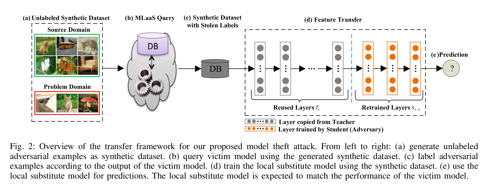
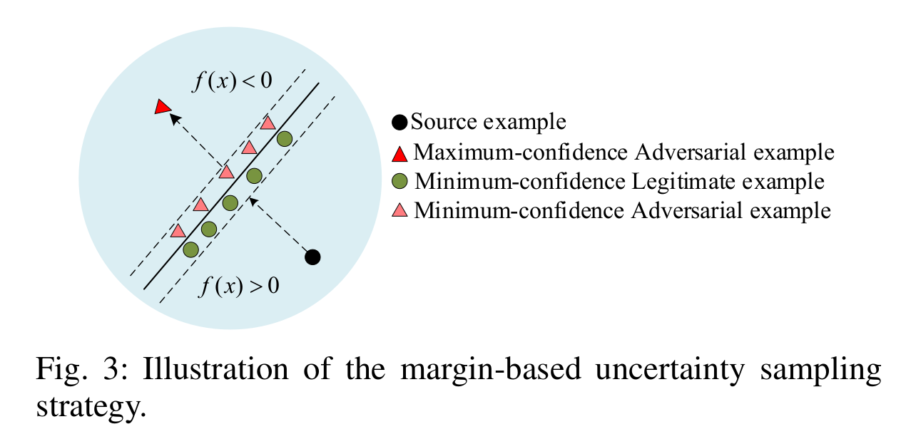
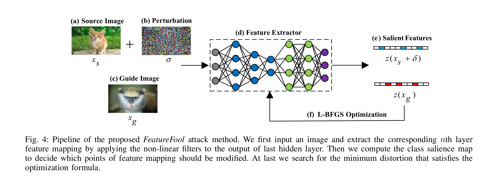
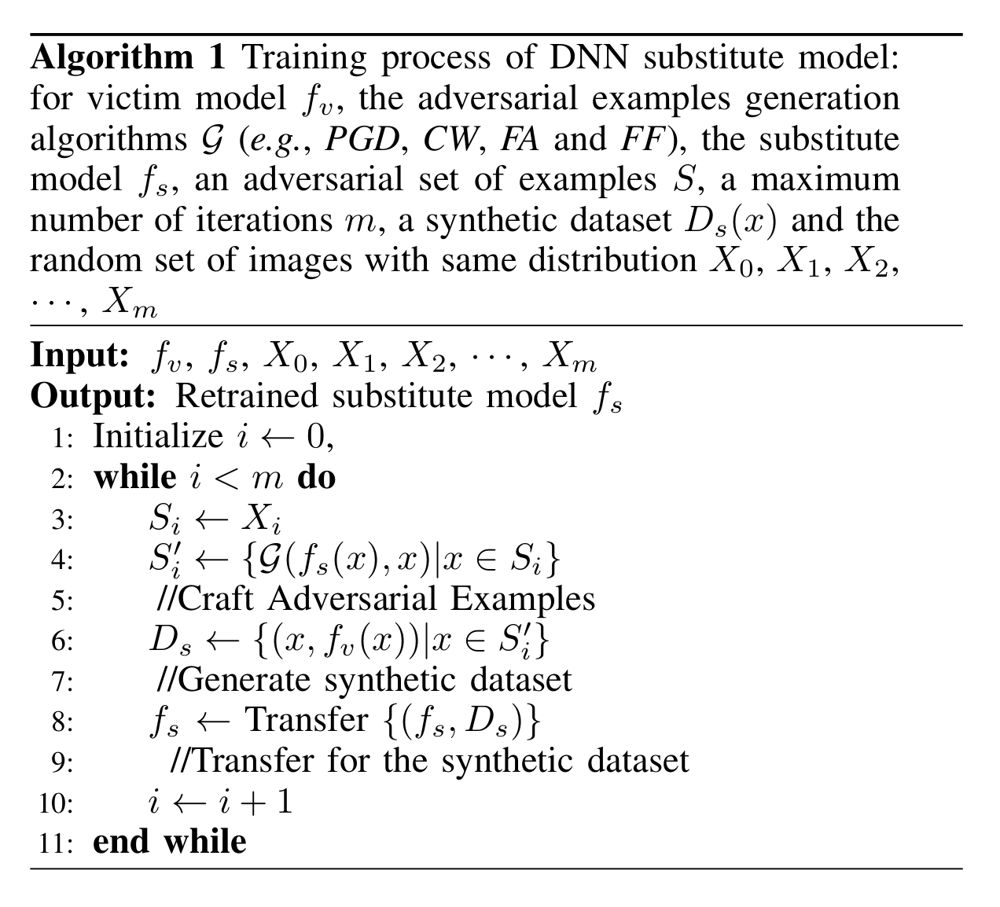
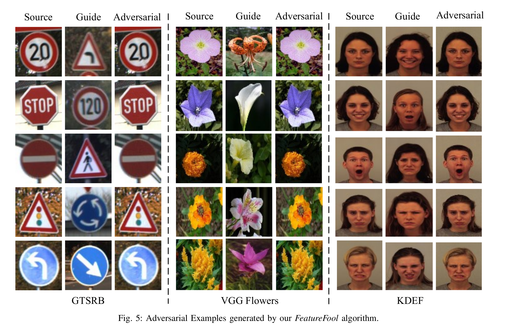
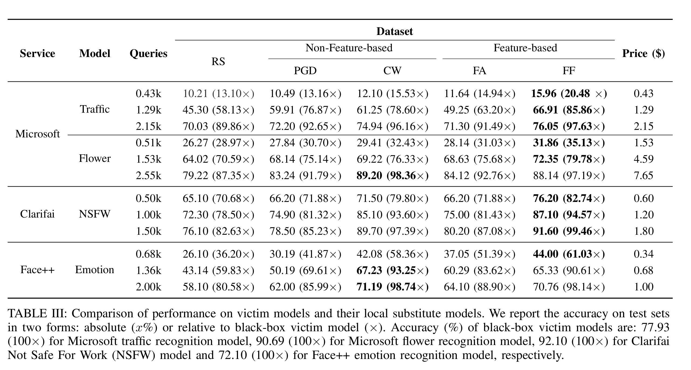
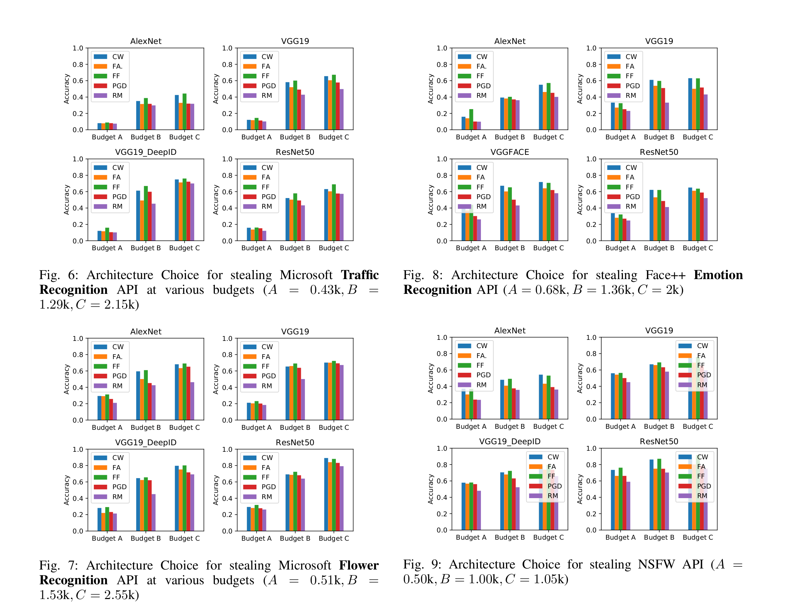

大家好，今天为大家带来了发表在 **NDSS 2020 **的工作《CloudLeak: Large-Scale Deep Learning Models Stealing Through Adversarial Examples》，该论文提出了一套新的方法学用于偷取深度学习服务中的深度神经网络。

# 威胁模型

​	攻击者攻击的对象是需要付费才能使用的深度学习云服务(MLaaS)，目的是训练一个模型$f_s$ 似其尽可能得接近MLaaS中被攻击的模型$f_v$。攻击者仅能通过MLaaS提供的API来向$f_v$输入数据和获取相对应的输出结果，并且攻击者对不知道$f_v$的任何信息（例如网络结构，层数，训练数据等）。

# 系统架构

​	使用攻击样本对MLaaS进行攻击，使用并修改预先训练好的公开模型例如AlexNet, VGG19, VGGFace 和 ResNet50进行迁移学习。

## 攻击思路	

​	对于一个多分类的神经网络，对模型的攻击即是获取到不同类别的分类边界。他们提出一套方法学“margin-based adversarial AL“。它的思路是：已知一个被攻击的模型$f_v$，通过该方法生成的训练样本训练出的模型$f_s$能够近似被攻击的模型$f_v$. 基于这个思想，他们设计了*FeatureFool*。

​	margin-based adversarial AL能够生成最小置信的合法样本（下图的绿色圆圈）和最小置信的非法样本（下图浅红色三角）。并且这两种样本均靠近分类的边界。

​	*FeatureFool*是使用基于特征的优化算法生成对抗样本攻击思路和评估手段，从而误导大规模的深度学习模型输出错误的分类结果。

​	他们提出的攻击算法从L-BFGS优化算法开始：输入图片$x$,目标分类器$f(x)$，目标分类$l$，优化如下公式:
$$
minimize \enspace d(x_s',x_s) \\
such \enspace that \enspace f(x') = l \enspace x_s' \in {[0,1]}^n
$$
​	其中$d(.)$是损失函数，$x_s'$是使用对抗算法修改过的输入，参数$n$是用于限制扰动幅度在$n$内的约束。相当于，L-BFGS攻击旨在找到一个扰动，让图片$x_s'$能够被人类正确识别但是会被分类器$f(x)$错误得识别为$l$.

​	除此之外，论文还对上述公式进行了优化，由于参数过多，大家可以从他们的论文中查看。

​	*FeatureFool*流程如下：

## 评估手段

​	他们使用(Average Test Error)ATE来评估他们提出的攻击。ATE越低则意味着偷取到的模型效果越好。

## 模型的偷取算法

​	除了他们提出的*FeatureFool(FF)*之外，他们同时使用了**Random Sample (RS), Projected Gradient Descent (PGD), Carlini and Wagner Attack (CW), FeatureAdversary (FA)**来进行模型的偷取，然后使用和MLaaS模型功能近似的模型进行训练(例如人脸识别模型则使用VGG face)。具体算法如下：

# 实验结果

图5是使用*FeatureFool*生成的对抗样本：

​	实验结果表明使用FF生成的样本训练出的模型和MLaaS提供的模型的近似度最高。

​	除此之外他们还发现使用不同功能的网络训练出的结果也较为不错。

​	之后他们计划研究两个问题：

1. 为什么不同功能的网络训练出的模型的准确率也比较高
2. 为什么低可信度的样本能够在任何DNN的模型中达到较好的效果

- NDSS 2021 论文网址:[https://www.ndss-symposium.org/ndss-paper/cloudleak-large-scale-deep-learning-models-stealing-through-adversarial-examples/](https://www.ndss-symposium.org/ndss-paper/cloudleak-large-scale-deep-learning-models-stealing-through-adversarial-examples/)
- 论文:[https://www.ndss-symposium.org/wp-content/uploads/2020/02/24178.pdf](https://www.ndss-symposium.org/wp-content/uploads/2020/02/24178.pdf)
- PPT:[https://www.ndss-symposium.org/wp-content/uploads/24178-slides.pdf](https://www.ndss-symposium.org/wp-content/uploads/24178-slides.pdf)
- 视频:[https://www.youtube.com/watch?v=tSUQl85Hprs](https://www.youtube.com/watch?v=tSUQl85Hprs)

