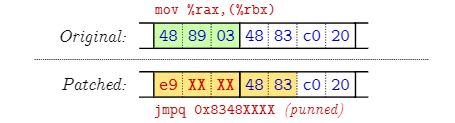

大家好，今天我为大家带来了来自 *PLDI 2020* 的《Binary Rewriting without Control Flow Recovery》。


当前的二进制重写需要进行控制流图恢复和相关的假设以及启发式方法，对于小的二进制可能有效，但是当二进制的大小扩充成百上千倍时就可能失效。本文介绍了一种新的不需要上述控制流恢复以及相应假设的方法，并实现了一个工具 E9Patch。他们的关键思想是专门使用与控制流无关的二进制重写方法，无需知道输入二进制中的跳转目标集合。例如一种有前途的方法是基线指令校正（baseline *instruction punning*），之前用来实现动态插桩的想法。

但是基线指令校正的适用性很大程度上取决于重叠指令的字节值，最终的校正跳转可能会指向无效的内存，导致覆盖率降低。而 E9Patch 则利用指令驱逐（instruction eviction）开发了一套修补策略来修复这种情况。

除此之外，合适的蹦床位置通常收到约束，很可能是不连续的，这会导致高度的碎片化以及输出文件大小膨胀。作者们使用了一种新的空间优化方式，物理页面分组（physical page grouping）来解决此问题。

总的来说，文章中的贡献如下：

- 使用基准指令校正重写二进制，并开发了指令填充（padding）和指令逐出提高覆盖率。
- 提出了一种物理页分组形式的优化
- 实现了相关的工具 E9Patch 并进行了实验。

::: details 现有的控制流无关的指令修补方法

- **B0: 信号处理程序** 通过 `int 3` 指令替换需要修补的位置，用信号处理程序处理实现补丁，性能很差。
- **B1: 跳转** 通过跳转指令跳到蹦床，但是当待修补的指令小于五个字节时会很复杂。
- **B2: 指令校正** 设计专门的，可以与其他指令重叠的跳跃指令。基本思想是找到一个与任何重叠指令共享相同字节表示形式的相对偏移值（rel32）。然后可以使用这个特殊的 rel32 值用相对近的跳转安全地替换修补指令。

例如对于指令 `mov %rax,(%rbx)   add $32,%rax`，在修补之后如下所示。



但是不是每次都会遇到这么好的情况的。

:::

作者们设计了一套新的修补策略，在 B1/B2 的组合（跳转与指令校正）失败时基于指令填充、校正和逐出的组合尝试新的策略 T1, T2 和 T3。

他们对二进制的假设如下：

- E9Patch 不假定输入的二进制文件是用特定的编译器或编程语言编译的。
- E9Patch 不假定是否存在符号以及调试信息
- E9Patch 不假定控制流信息可用或可恢复
- E9Patch 不尝试对二进制进行符号化

以及一些其它灵活的假设。

以下面的代码为例来描述他们的方法。

``` nasm
Ins1: mov %rax,(%rbx)
Ins2: add $32,%rax
Ins3: xor %rax,%rcx
Ins4: cmpl $77,-4(%rbx)
```

如下图所示，如果我们直接 patch Ins1 的话长度肯定不够。如果按照现有的控制流无关的指令修补方法中的 B2 方式（指令校正）patch 的话虽然可行，但是可能遇到地址无法使用的情况。

- **T1: 指令前缀字节填充** 通过添加指令前缀的方式改变相对偏移，而 B2 就是 0 填充的特殊情况。但是收到的约束也很大，非常可能出现构造失败的情况。
- **T2: 后继驱逐（Successor Eviction）** 向后驱逐一个指令，可以扩大 patch 的范围。
- **T3: 近邻驱逐（Neighbour Eviction）** 如果 T1 和 T2 都失效，则用近邻驱逐，和后继驱逐不同，近邻驱逐会寻找更后面的指令，用一个双重跳转来进行跳到蹦床的操作。


作者们用对 CVE-2019-18408 的 patch 证明了他们方法的有效性。


单纯地将补丁映射到文件上会导致巨大的空间浪费，例如下图中方法 a 的一一映射和方法 b 的物理内存分组映射，前者明显占据了更大的空间。接下来他们介绍了他们对内存和文件大小的管理。


物理页面分组（Physical page grouping）用了类似于在每一页中的相对偏移来存储修补代码，可以将在多个页的修补代码合并到一页上，从而大大减少了空间的使用。

E9Patch 可以支持很多类型的二进制文件，包括位置无关的可执行文件、共享库文件以及修补后的二进制文件。

不过 E9Patch 仍然不能保证完美覆盖，在遇到虚拟地址空间不足、单字节指令或尝试修补太多指令的时候可能会失效。

而后作者对 E9Patch 进行了实验，包括 SPEC2006 测试集、大型二进制文件（Chrome 和 Firefox）的测试等。


- PDF: <https://www.comp.nus.edu.sg/~gregory/papers/e9patch.pdf>
- source code: <https://github.com/GJDuck/e9patch>
- video: <https://www.youtube.com/watch?v=qK2ZCEStoG0>
