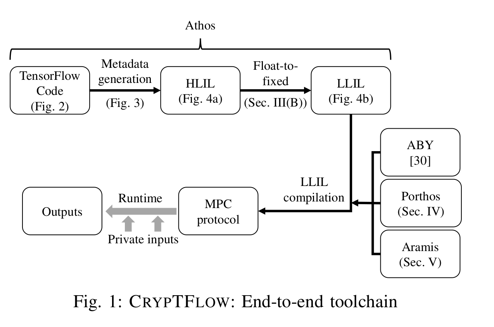
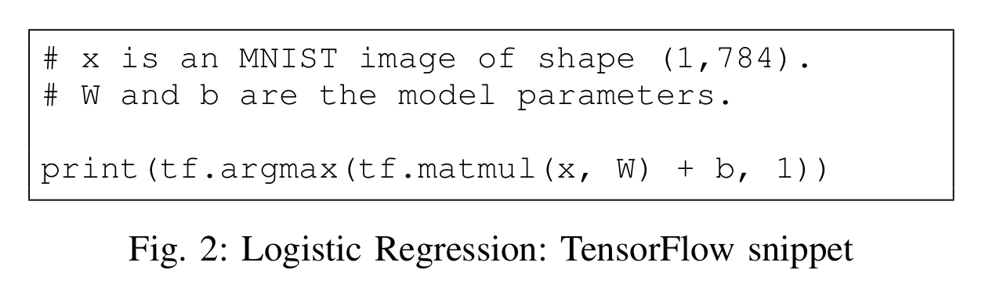
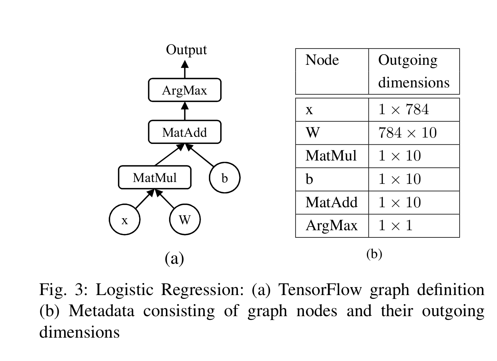
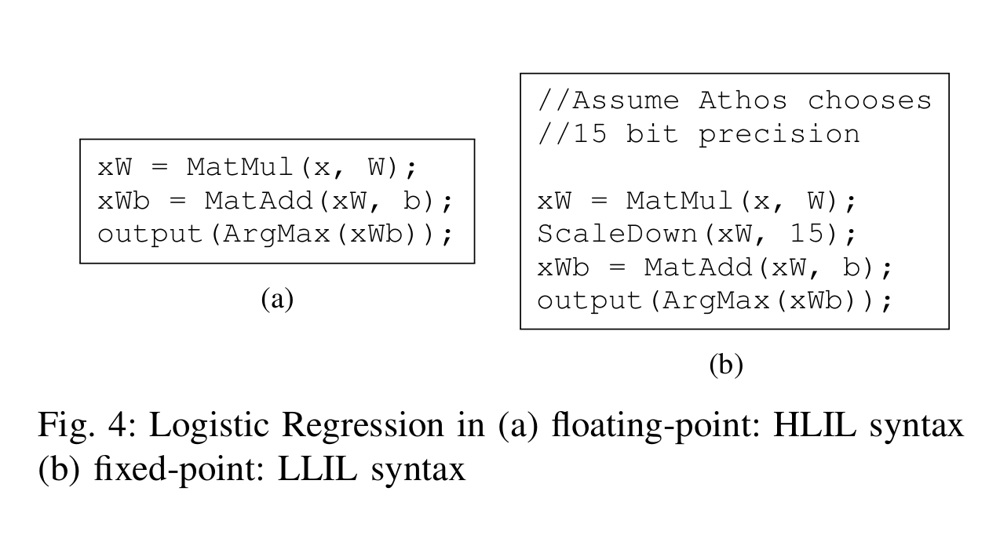
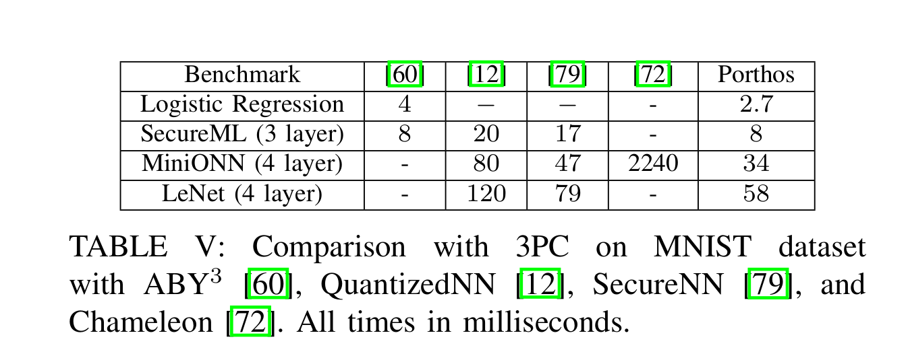
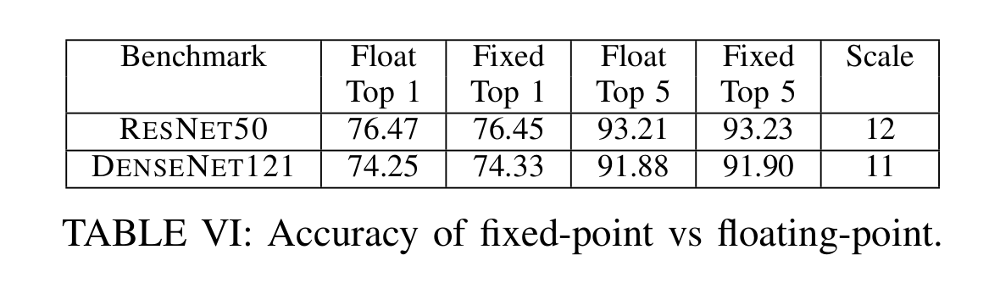
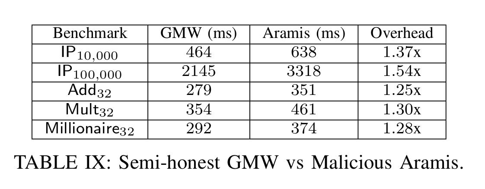

大家好，今天为大家带来了发表在 **S&P 2020 **的工作《CRYPTFLOW : Secure TensorFlow Inference》，该论文实现了cryptflow,目的是将tensorflow推理的方式一键转化为高性能的安全多方计算(MPC)。

为了达到该目的，他们做了如下三个组件。

1. Athos是一个从TensorFlow到各种半诚实MPC协议的端到端编译器。

2. Porthos是一个改进的的第三方协议，它为类似TF的软件提供加速。

3. Aramis则是一种使用具有完整性保证的硬件技术，它能将任何半诚实的MPC协议转换为提供恶意安全的MPC协议。

# 系统结构

​	cryptflow的toolchain结构如下:

​	

​	使用基于MNIST数据集的逻辑回归算法来研究一下其具体流程。代码如下图:

​	

1. 首先，cryptflow的输入是TF的代码，然后使用Athos 将TF graph(Fig 3 b)、原始数据dump下来辅助计算张量的维度。

2. Athos然后将TF graph编译到高级中间语言 HLIL中，Fig 4 (a)展示了HLIL中该例子的代码。
3. 之后Athos 将浮点运算转化为定点运算，并将HLIL转为低级中间语言LLIL，如Fig 4 (b)。
4. LLIL中的方法调用可以使用数个安全执行后端来实现，例如ABY、Porthos、和Aramis。不同后端会分局不同安全需求来进行运算。
5. 最后生成MPC协议。

# Athos

​	Athos由如下几部分构成：

* 前端：前端的输入时TensorFlow的代码，它的难主要挑战是协调TensorFlow中的动态类型和HLIL中的静态类型。由于python代码中不存在tensor 的维度，因此Athos必须分析出Tensor的维度之后才能生成HLIL代码。
* 浮点到定点的转化。由于ML模型使用浮点进行运算，但是MPC协议要求进行定点运算，因此Athos可以自动进行浮点到定点的转化。
* 模块化LIL。Athos 将带有浮点运算的代码再次编译到定点运算的代码LLIL中。LLIL语言可以很方便得让各种加密协议的后端嵌入Athos中。
* 优化。Athos使用程序流图分析、编译优化等对两种中间语言进行优化。

# Porthos

​	Porthos大体基于SecureNN，但是减少了DNN中线性层和非线性层的通信，其中线性层包括全连接层和卷积层。除此之外他们改进了卷积层的通信，并且改进过后优化增益随着滤波器尺寸的增大而提高。关于非线性层（ReLU和MaxPool），他们修改了SecureNN中的两个协议Compute-MSB和ShareConvert的使用方式。总体上，他们通过修改协议中生成某些共享的方式来降低通讯的次数。

# Aramis

​	Aramis是一种通过依赖安全硬件将任何半诚实的安全MPC协议转换为抵抗恶意破坏的安全MPC协议的技术。该技术让在恶意安全协议下维持了半诚实协议所能接受的被破坏方的阈值。

* 威胁模型。考虑一个强威胁模型，其中对手不仅控制恶意的操作系统（即主机操作系统在可信计算基础之外），而且还观察其安全硬件的整个状态。Aramis对硬件的完整性做了一个非常小的信任假设，即代码证明（硬件生成的输出确实来自它所证明的代码）。这隐含地要求硬件拥有一个可产生签名的可信组件，并且该签名方案不能被对手伪造。然而，对手可以看到被破坏的硬件的状态（即所有代码和用户数据），即Aramis无法保证状态的机密性。前者将MPC和硬件（SGX）结合在一起，对硬件的机密性和完整性做出了更强的信任假设，因此，仅能在较弱的威胁模型中提供安全性，其中硬件可以向对手隐藏驻留在其中的数据。

# 系统评估

在性能方面，porthos的运算时间最短

准确度方面，当固定的位数等于5位的时候，准确率相差小于0.03

​	在延迟方面，基于Aramis的恶意安全的开销在半诚实协议的54%以内。

- 论文:[https://www.computer.org/csdl/proceedings-article/sp/2020/349700b646/1j2LgsZYkQE](https://www.computer.org/csdl/proceedings-article/sp/2020/349700b646/1j2LgsZYkQE)

- github:[https://github.com/mpc-msri/EzPC](https://github.com/mpc-msri/EzPC)

