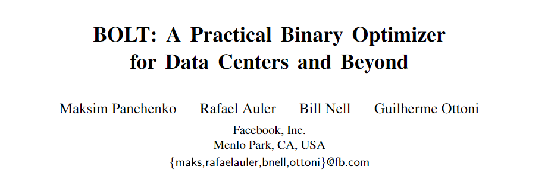

大家好，今天我为大家带来了来自 *CGO 2019* 的《Bolt: a practical binary optimizer for data centers and beyond》。

这篇文章主要讲了后链接优化器（post-link optimizer）在现代数据中心应用程序中的好处以及应用，并设计了 BOLT，基于 LLVM 的后链接优化器，可以显著提高真实世界应用程序的性能，即使对于使用反馈驱动优化（feedback-driven optimizations, FDO）和链接时间操作优化（link-time optimizations, LTO）构建的高度优化的二进制也是如此。

::: details 关于 FDO 和 LTO

**FDO**

- **优势** 数据中心应用程序一般都是大型的，存在性能瓶颈，适合使用 FDO（也被称作文件引导优化（profile-guided  optimizations, PGO））
- **缺点**
  - 可扩展性差
  - 基于插桩的方法难以从生产系统中收集精确的分析程序（成本、开销太高）

因此文章希望有一个系统可以从正常的生产环境中运行的未修改的二进制文件获取 FDO 的配置文件数据。他们通过使用基于样本的配置文件实现，这样的配置文件可以以最小的操作复杂性收集高质量的配置文件。这一原理也是 BOLT 的基础。

**LTO**

在编译链中稍后注入配置文件数据相比于更早地注入配置文件可以更准确地使用信息，实现更好的代码布局。原本的编译阶段是在生成机器代码之前优化，而现在则是在二进制级别进行后链接的优化，可以更准确地使用配置文件数据。

:::

他们的贡献如下

- 描述了基于 LLVM 的后链接优化器设计
- 证明了与传统基于编译器的方法相比，后链接优化器能更好地利用基于样本的实例文件数据改善代码布局
- 编译时、链接时和后链接时的 FDO 与其他 FDO 互补且前者不可替代。

作者们使用了基于样本分析的 FDO 技术而不是传统的基于插桩的 FDO 技术，因为后者开销更大。而基于样本的配置文件数据可以在编译的任意位置插入，如下图所示。

基于样本的配置文件在二进制级别收集，因此越是接近二进制级别，数据映射回二进制程序表示的准确性就越高，因此他们选择实现后链接二进制优化器。而他们希望对数据中心中的大型程序进行优化，因此优化哪一块分支也很重要，这些信息在编译时不易于获取。而为了减少开销并可以处理自修改的代码块，他们选择实现静态的二进制修改器。

BOLT 最初只实现了支持 x86-64 二进制文件中的有限代码布局，随着项目的迭代增加支持的范围。由于重定位链接器众多且可以在重定位时优化，他们实现了独立的后链接优化器。二进制的重写流程如下图所示。

BOLT 使用 LLVM 反汇编、生成 CFG 和重写二进制。除此之外，BOLT 还能识别 DWARF 信息并更新。

BOLT 在优化时使用了下面这 16 个 pass。

BOLT 使用 LBR 优化 PGO，并对调用表进行一系列操作来提升性能。最终在 Facebook 服务器工作负载以及 gcc、clang 上面进行了评估。

结果显示，BOLT 确实可以加速大应用程序。而对于 gcc 和 clang 的加速效果显示，相对于单纯的 PGO+LTO，BOLT 有着稍好的效果，而且它们是互补的，结合起来会更好地提升性能。他们还构建了 HHVM 在 BOLT 前后的热力图。从图中我们可以看到，BOLT 前的热力图是不均匀的，而 BOLT 将执行时最常执行的部分打包在了一起，这可以提升二进制的性能。

总的来说，BOLT 通过改变二进制文件的 layout 最终实现优化控制流的效果，而且可以覆盖大型二进制，这确实可以优化大型二进制的执行速度。

- PDF: <https://arxiv.org/pdf/1807.06735.pdf>
- source code: <https://github.com/facebookincubator/BOLT>
