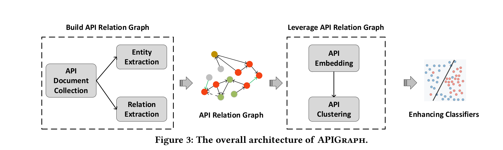
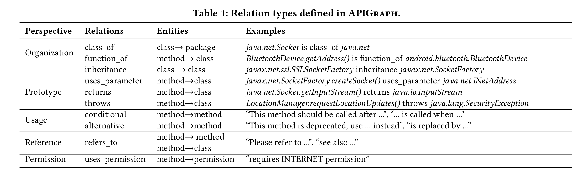
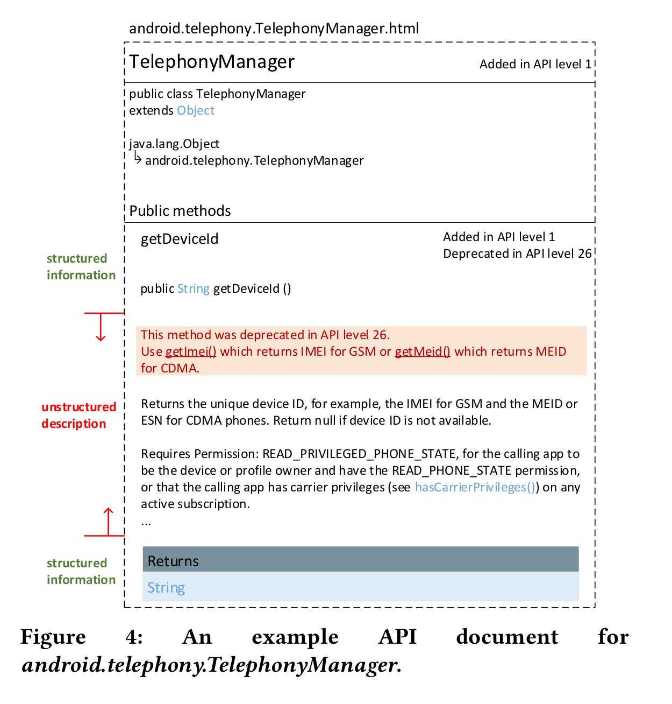
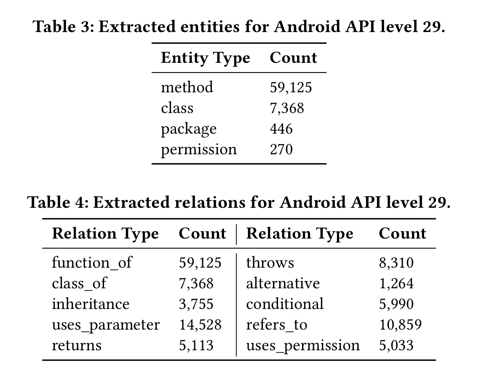
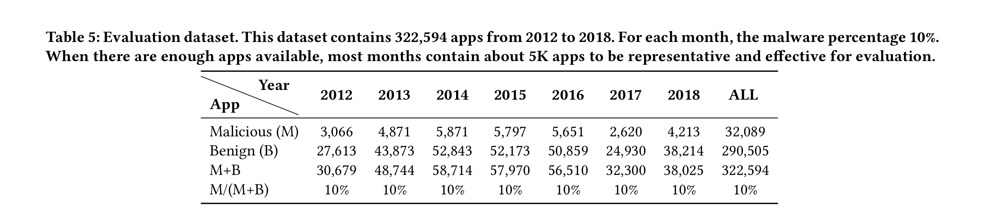
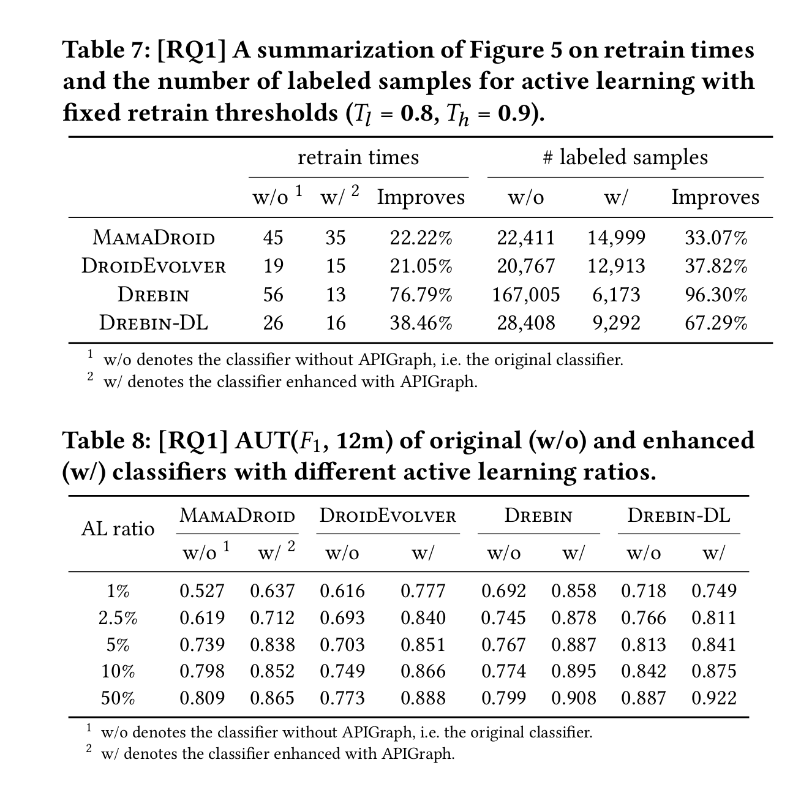
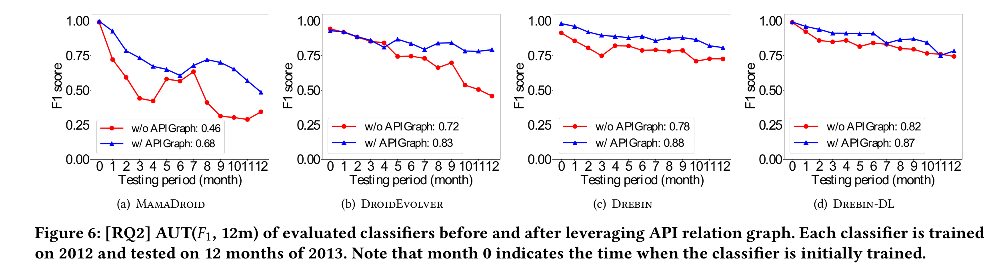

大家好，今天我为大家带来了来自 **CCS 2020** 的《nhancing State-of-the-art Classifiers with API Semantics to Detect Evolved Android Malware》。

# 论文发现的问题

1. 基于 ML 的恶意软件检测随着恶意软件的发展，其准确率由原来的 100% 降低到了 80% 甚至 60%
2. 现有工作必须人工标注新的恶意软件，工作量很大。

# 论文的工作内容

1. 发现了恶意软件的通性：即相同的语义但是有不同实现方式
2. 提出在恶意软件演化过程对语义相似度进行捕捉，并利用捕获到的信息来减缓恶意软件检测软件的老化。
   2.1 文章还发现若 android API 的调用语义相似，则这些相似性会体现在 Google 的官方 API 文档。可以通过语义知识来辅助判别恶意软件
3. 设计了 APIGraph，它根据官方文档中提供和提取的信息来构建 Android api 的关系图。APIGraph 中每一个节点表示一个关键实体，例如 API、异常或者权限；每一个边表示两个实体的关系，例如 API 抛出的异常或者 API 所需的权限。APIGraph 然后从关系图中提取 API 语义，并将相似的 API 进行聚类。
4. 构建了一个跨越七年的大规模演化数据集，它几乎是当时最大的用于评估模型老化的数据集（TESSERACT）的三倍。

# 系统设计 

​APIGraph主要由有两个阶段：首先通过API文档构建API关系图。然后使用API关系图对恶意软件检测软件进行强化。

## API关系图

​API 关系图的节点主要由 android 的函数、类、包、权限构成。关系图中的边的类型通过关系分类学的思想，基于前人的工作([文献1](https://www.bing.com/search?q=Improving+API+Caveats+Accessibility+by+Mining+API+Caveats+Knowledge+Graph.+In+Proceedings+of+the+IEEE+International+Conference+on+Software+Maintenance+and+Evolution&PC=U316&FORM=CHROMN)和[文献2](https://dl.acm.org/doi/10.1109/TSE.2013.12)进行实现，主要由 table 1 中的关系构成。

## API 文档收集

​Android 的官方 API 文档的是由层级结构组成的，并且每一个 HTML 文件军用来表示一个最基本的类，其中包括类的层级结构、方法、域等等，具体如 Figure 4。 

​

### 实体的提取

​	实体的提取主要有以下几步：

1. 由于类名是用结构化文本描述的，因此每一个HTML中均可提取到一个类；

2. 从类名中将多各包进行拆分从而获得包名；

3. 将每一页文档转化为 DOM 树，并从中提取类的方法；

4. 通过(https://developer.android.com/reference/android/Manifest.permission)[https://developer.android.com/reference/android/Manifest.permission]提取权限。

### 实体之间关系的提取

他们使用了两个方法来提取实体的。

**结构化文本的关系提取** 由于关系由于一些关系能从 HTML 的元素结构中体现出来（例如方法、类之间的福安息）。因此在提取类实体的时候就可以将类与类中方法的关系进行提取，然后再通过方法的返回值、参数和异常来扩展实体的关系。

**基于模板的非结构化文本关系匹配** APIGraph 能够通过 NL P技术来匹配四种模板：conditional, alternative, refers_to 和 uses_permission。匹配的步骤如下：

1. 手动输入模板
2. 递归得扩展模板的集合
3. 使用 NLP 进行模板匹配

## API 关系图的使用

​APIGraph 将关系图中的每个 API 转换为一个嵌入表示，然后将这些嵌入表示进行聚类。API 嵌入的概念是将关系图中的每个 API 转换为一个向量来表示其语义。在 APIGraph 成功地对 api 进行聚类后，APIGraph 用每一个聚类的中心，来表示聚类中独立api的语义。

​然后他们使用关系图对 MamaDroid、DroidEvolver、Drebin、Drebin-DL 这四个恶意软件检测软件进行增强。

# 数据集

​下面是数据集的构建步骤：

1. 从 VirusShare, VirusTotal 和 AMD 数据集中下载最初始的数据集；
2. 从 Google play 下载 1,060,000 个 app，然后将所有应用程序都提供给 VirusTotal，并且只保留由 VirusTotal 的所有 AVs 报告为良性的 1033073 个 app。
3. 根据样品的出现时间戳对所有样品进行排序，并为七年中的每个月选择一个子集。

# 评估

APIGraph 提取的 api 关系图的统计：

从 2012 年到 2018 那年恶意软件的进化：

增强的效果

- 论文：[https://dl.acm.org/doi/abs/10.1145/3372297.3417291](https://dl.acm.org/doi/abs/10.1145/3372297.3417291)