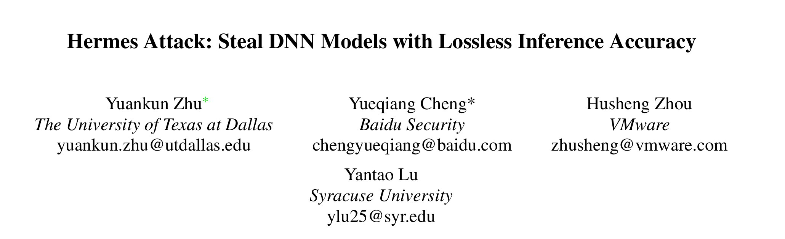
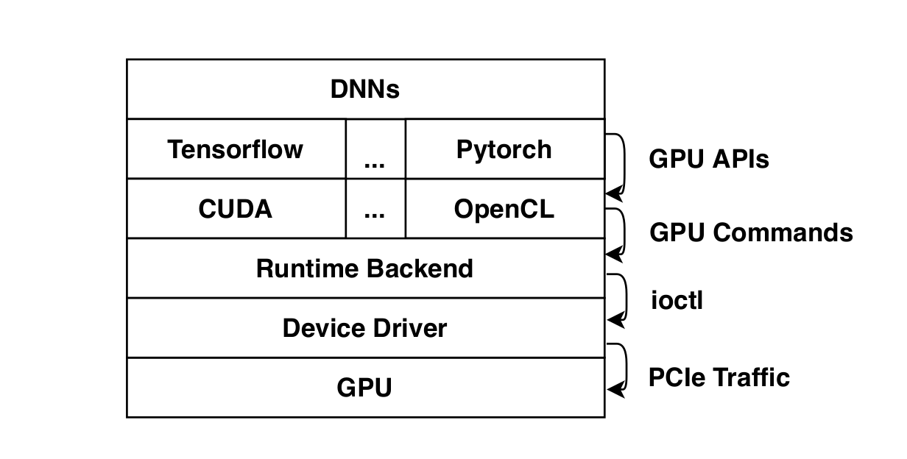
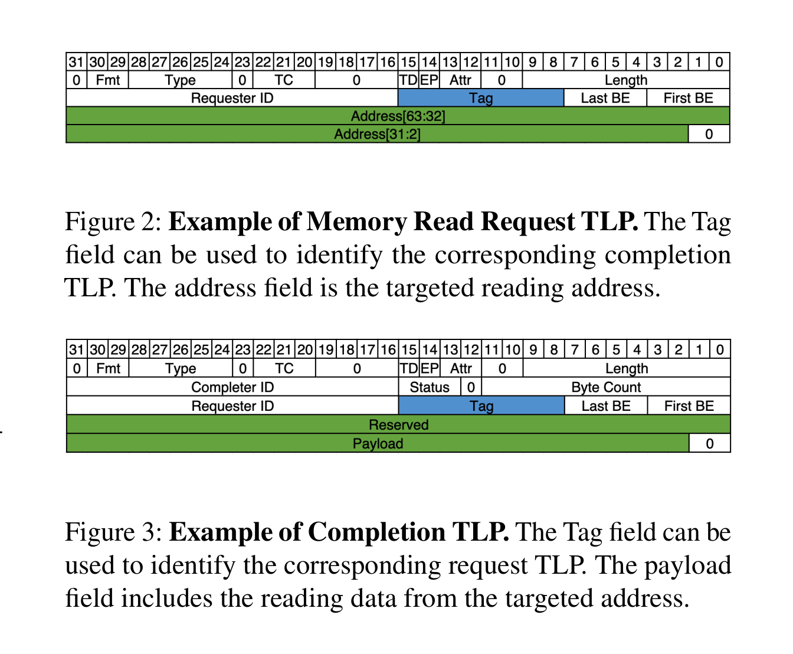
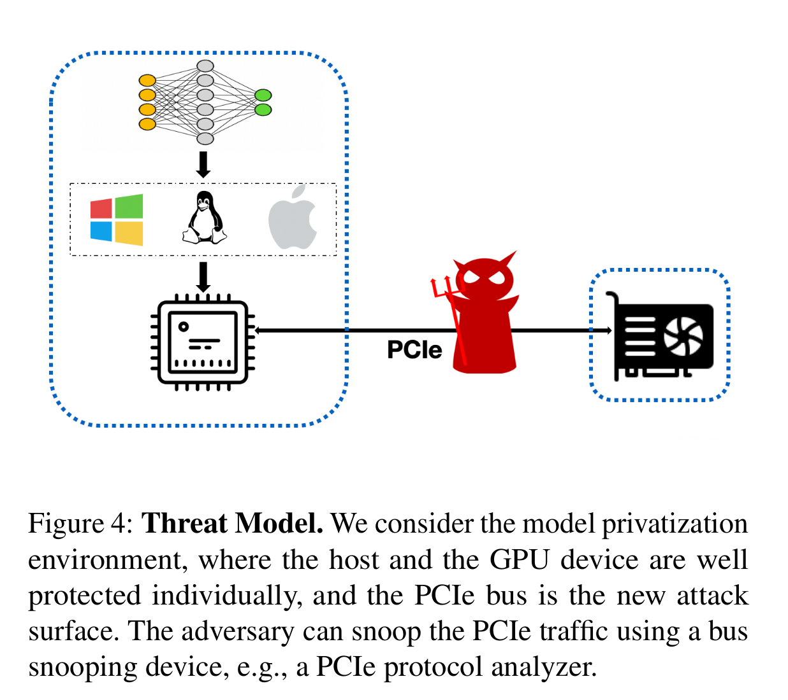
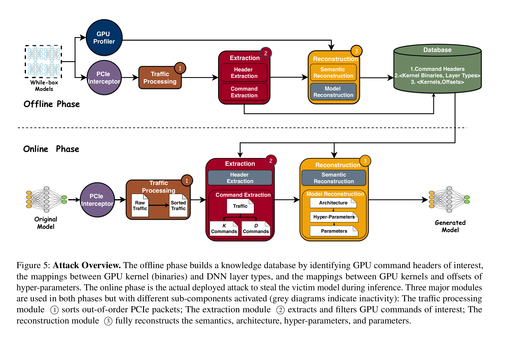
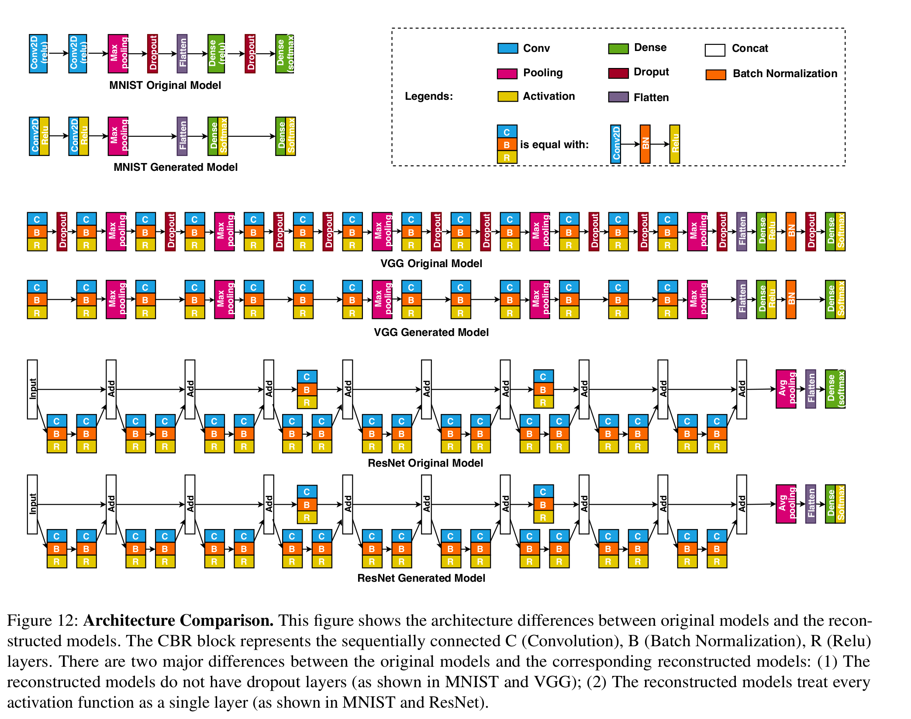
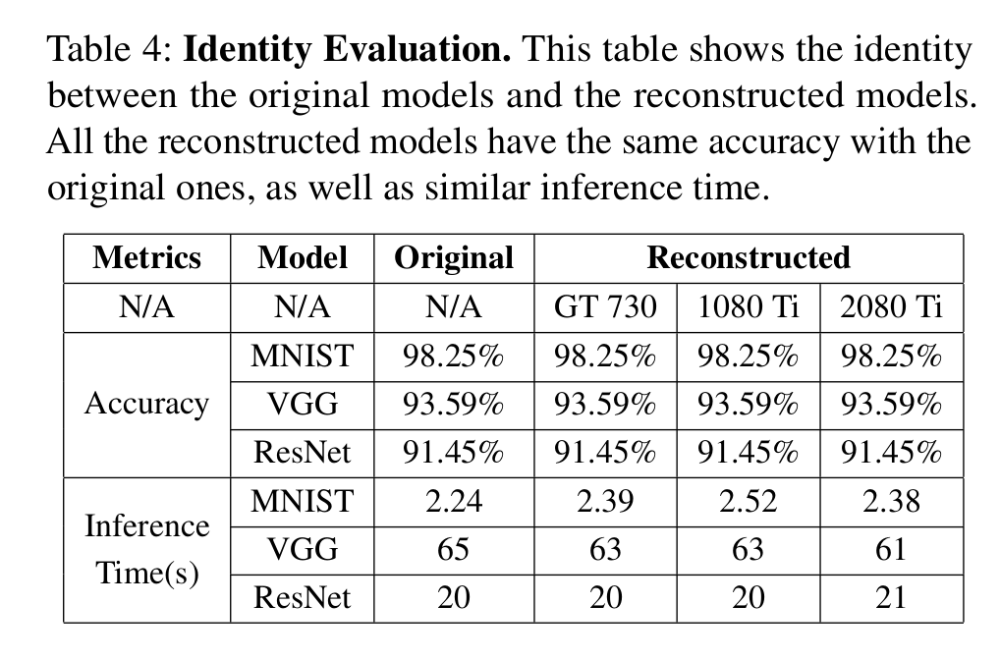
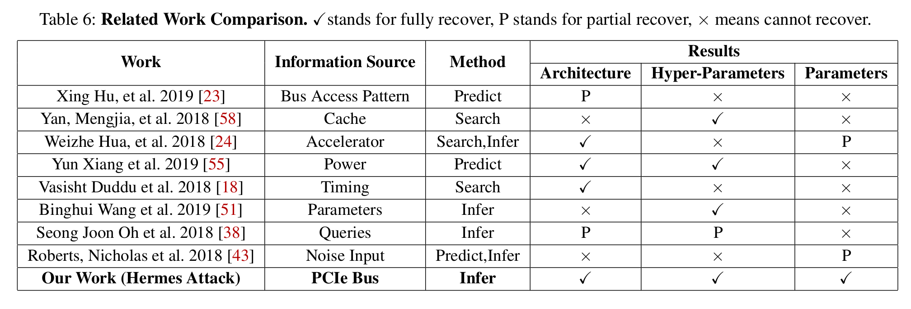

大家好，今天为大家带来了发表在 **USENIX 2021 ** 的工作《Hermes Attack: Steal DNN Models with Lossless Inference Accuracy》，该论文提出了一套新的方法 :通過PCIe接口偷取DNN模型。

由于现有的DNN模型偷取技术偷取到的模型精度较低而且都有较高的运算开销，并且他们仅能偷取一些公开的模型、若遇到定制化的模型则大部分工作并不能很有效得偷取模型。因此他们提出了 **Hermes Attack：** 使用未加密的PCIe流对DNN模型进行偷取。他们的方法能够完整得偷取到了DNN模型的超参数、参数以及与原始DNN网络语义相同的DNN模型。

​	他们面临的最主要的难点是：

1. 闭源的CUDA运行环境、驱动和数据结构的黑箱导致可能会遗漏很多关键数据；
2. PCIe数据流量很大因此必须剔除其中非DNN数据的噪声。

# 基于GPU的DNN系统

## 系统架构

​	大部分的DNN系统通过不同框架(TF,pytorch等)实现DNN模型，模型会会根据部署时的配置调用不同GPU前端的API(CUDA,OpenCL等)，然后这些API会向GPU后端通过ioctl端发送指令到设备驱动，最终这些指令会通过PCIe传输到GPU硬件。

​	

## PCIe协议

​	PCIe协议由三个部分构成：传输层、数据链路层、和物理层。图3显示了具有64位寻址的内存读取请求Transaction Layer Packet (TLP)和完成TLP的格式。每个TLP的报头长度为四个双字（DWs），最大有效负载大小为128DWs。

​	

# 攻击的设计

## 威胁模型

​	他们假设：服务提供商将其私有AI模型打包到异构CPU-GPU设备中（例如，智能物联网、监控设备、自动驾驶），并通过订阅、许可等方式将其出售给第三方客户。用户可以使用该设备的物理接口，即PCIe。GPU设备连接在了没有假面的PCIe接口上、并且DNN模型使用软件加固技术进行加固。此时，对于DNN模型的攻击面仅剩下了PCIe接口。

	

## 攻击方式

​	他们的攻击方式分为两个阶段：

1. 离线阶段。他们使用白盒模型来建立一个数据库，其中包含已识别的命令头、GPU内核（二进制文件）和DNN层类型之间的映射以及GPU内核和超参数偏移量之间的映射。具体而言，流量处理模块（图5中的1）对PCIe窥探设备截获到的无序PCIe数据包进行排序。提取模块(3)有两个子模块：报头提取模块和命令提取模块。报头提取模块从已经排序的排序的PCIe数据包中提取命令报头。提取的命令头会被存储在数据库中，从而加速在线阶段的命令提取。离线阶段的命令提取模块有助于获取内核二进制文件。重构模块(3)中的语义重构模块接收来自命令提取模块和GPU profiler的输入，并创建内核（二进制）与层类型之间的映射，以及内核与超参数偏移量之间的映射，便于在线重构模块阶段。
2. 在线阶段。首先利用原始（受害者）模型对单个图像进行推理。由于受害者模型是一个黑盒模型，因此它与离线阶段使用的白盒模型完全不同。然后使用流量处理模块PCIe流量拦截并排序。命令提取模块(2)使用离线阶段分析的头信息提取K（与内核启动相关）和D（与数据移动相关）命令以及GPU内核二进制文件。最后，整个数据库被输入到模型重建模块(3)，以完全重建DNN模型、超参数和参数。

# 实验结果

​	他们对Hermes Attack 在安装了CUDA10.1 、和使用的NVIDIA Geforce GT 730, NVIDIA Geforce GTX 1080 Ti 和 NVIDIA Geforce RTX 2080 Ti的攻击效果进行了实验。

​	他们对MNIST,VGG,ResNet进行了攻击，并比对了偷取的模型和源模型的结构差异，如图12。可以发现，偷取的模型基本相同，但有一些小瑕疵，例如：MNIST生成的模型没有dropout layers，并且容易将激活函数识别为单独一层。

​	偷取的模型准确率和源模型完全一致，并且推理的时间相差不大。

	

​	Hermes Attack 也与之前的工作进行了比较。结果是他们的Hermes Attack能够偷取到最完整的模型数据。

​	

- 论文: [https://arxiv.org/abs/2006.12784](https://arxiv.org/abs/2006.12784)

