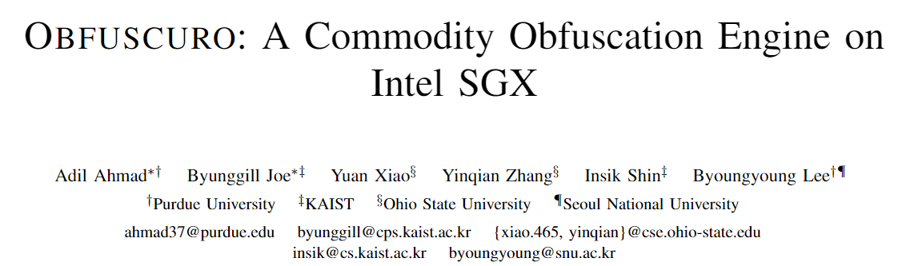
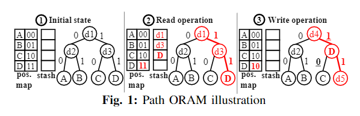
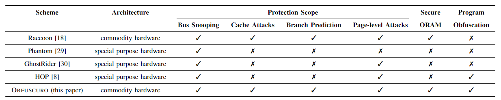
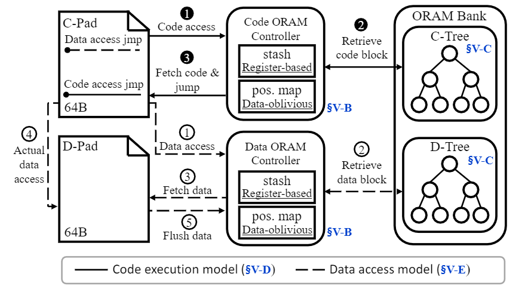
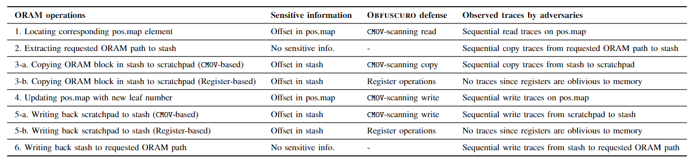
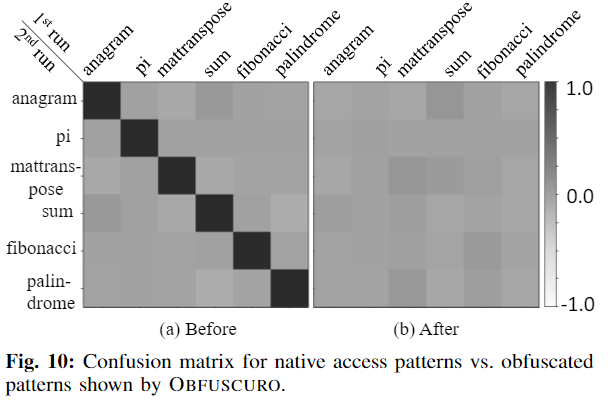
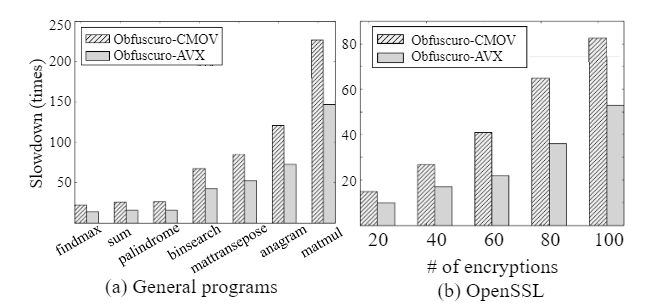
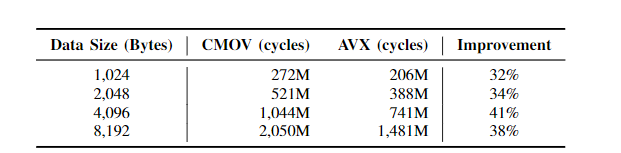

大家好，今天我为大家带来了来自 *NDSS 2019* 的《OBFUSCURO: A Commodity Obfuscation Engine on Intel SGX》。

Intel SGX 在商用处理器上预打包了大量的特性，这些特性有可能会被滥用，导致混淆失效，而且 SGX 的无特权执行让这些特性不能被 SGX 程序控制（或禁用）。问题的根本在于因为 CPU 的设计依赖于其他子系统的执行计算，因此完全隐藏对私有数据的内存访问是一项挑战，可能允许对手观察和收集 SGX enclave 的内存轨迹。

OBFUSCURO 运用了三个主要思想：

1. OBFUSCURO 采用了数据无关（data-oblivious）的 ORAM 实现。他们通过设计高效的基于寄存器的存储，改进了之前提出的 ORAM 实现。
2. OBFUSCURO 设计了基于侧信道的抵抗基于暂存器（Scratchpad）的代码执行和数据访问模型，抵抗攻击者观察到的内存访问模式，弥合传统 ORAM 和本地程序执行之间的差距。
3. OBFUSCURO 通过为所有应用程序提供时间标准化确保目标程序从开始到结束的混淆，从而保护程序免受基于定时信道泄露的影响。

::: details 背景

**SGX 侧信道攻击**

1. 页表攻击
2. 缓存攻击
3. 分支预测攻击

**ORAM**

Path ORAM，ORAM 的改进版，使用二进制的树状结构将加密的内存存储在服务器上。下图描述了 Path ORAM 的算法。

:::

作者们认为在 SGX 上实现混淆的挑战如下：

1. 如何在 SGX 中强制执行基于 ORAM 的安全程序？
2. 如何保护在 SGX 中的 ORAM 控制器？

因为与特殊用途的硬件不同，SGX enclaves 不能控制页表、缓存和/或分支预测器。攻击者可能滥用这些功能推断出 ORAM 中的重要信息。而且 SGX 的可信区域很小。下图展示了 OBFUSCURO 和现有的不经意执行（oblivious execution）方案之间的区别。

OBFUSCURO 的系统级描述如下图所示，它的核心设计特点总结如下。

- **安全的 ORAM 方案** OBFUSCURO 使用数据无关的算法实现了自己的 ORAM 控制器，以抵抗侧信道攻击。同时 OBFUSCURO 实现了基于寄存器的存储，改进了现有的侧信道弹性 ORAM 实现；
- **重新利用本地程序** OBFUSCURO 通过内存布局转换和虚拟地址转换来转换本地程序，以弥补本地程序执行与基于 ORAM 的操作之间的语义差距；
- **代码执行模型** OBFUSCURO 确保（目标程序的）代码仅在固定的位置 C-Pad 中执行。所有的指令都使用 ORAM 操作加载到暂存器上，并从暂存器的开始到结束执行。此外，他们的 C-Pad 设计具有 SGX 感知保护功能。
- **数据访问模型** OBFUSCURO 确保所有的数据访问都在数据暂存器 D-Pad 上执行，D-Pad 是一个使用 ORAM 操作更新固定内存位置的暂存器。无论执行的上下文如何，目标程序的读写操作都在同一内存位置中执行。OBFUSCURO 还确保每个 C-Pad 始终执行一次数据访问，以规范数据访问模式的数量。
- **从始至终的混淆** OBFUSCURO 确保目标程序继续执行直到某个预定义的时间，以缓解基于时间的侧信道，而与程序的逻辑无关。OBFUSCURO 通过在终止预期逻辑后，对目标应用程序进行指令化处理，引入虚拟内存块来实现此目的。

作者们在 LLVM 和 SGX SDK 中的 enclave 加载器上实现了两种 OBFUSCURO 原型：OBFUSCURO-CMOV 和 OBFUSCURO-AVX。之后论文还讨论了 OBFUSCURO 对访问模式攻击以及基于时序的攻击的安全性。

他们通过运行 openSSL 的基准测试对 OBFUSCURO 进行评估。其中 OBFUSCURO-CMOV 的平均开销是正常的 83 倍，OBFUSCURO-AVX 的平均开销是正常的 51 倍。

而 OBFUSCURO-AVX 相对 OBFUSCURO-CMOV 的性能可以提高 30% 到 40%。

- PDF: <https://www.ndss-symposium.org/wp-content/uploads/2019/02/ndss2019_10-1_Ahmad_paper.pdf>
- source code: <https://github.com/adilahmad17/Obfuscuro>
- slide: <https://www.ndss-symposium.org/wp-content/uploads/ndss2019_10-1_Ahmad_slides.pdf>
- video: <https://www.youtube.com/watch?v=FFoOk1_FDno>