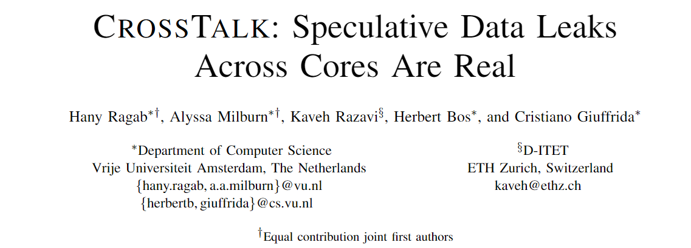
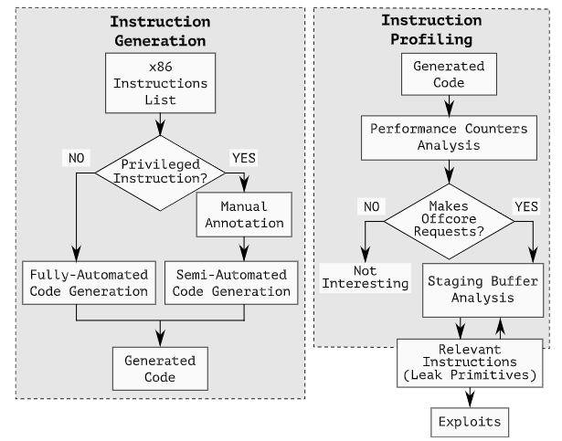
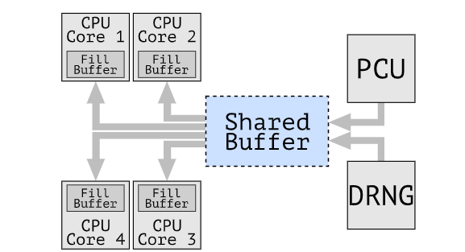
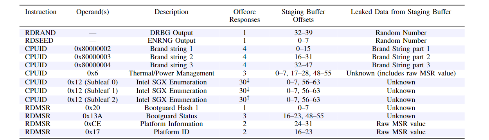

大家好，今天我为大家带来的是来自 *S&P 2021* 的《CrossTalk: Speculative Data Leaks across Cores Are Real》。

对瞬态执行（transient  execution，也被称作 speculative execution，也就是推测执行）漏洞的最新研究表明，我们应该更加关注 CPU 管道的内部细节。Meltdown、Specture、Foreshadow、ZombieLoad 和 RIDL 共同展示了在现代 CPU 内核支持的任何和所有安全域之间的直接信息泄露。到目前为止，这些攻击要求攻击者和受害者共享相同的核，这使得人们相信，将不同的安全域隔离在其自己的内核上将可以防止这些瞬态执行攻击，留给我们的只有对共享资源，如缓存的充分理解的定时攻击。操作系统和系统管理程序的各种调度机制都遵循这一原则，并在其自身的内核上隔离了不同的安全上下文。本文对这一原则提出了挑战，并证明了在现代 Intel CPU 中，敏感信息通过一个内核间共享的暂存缓冲区在内核间泄露。

为了研究内核间瞬态执行的泄露面，作者们构建了 CROSSTALK，可以在不同的上下文中识别和分析 x86 指令。与以往描述指令性能的工作不同，CROSSTALK 在各种不同的上下文中执行指令（最重要的是使用了不同的操作数(operands)），使得作者们能研究更广泛的指令行为，并从更广泛的性能计数器中收集数据。

作者们发现，各种 Intel 处理器中都存在一个全局（跨内核的）共享暂存缓冲区，这个缓冲区保留了先前执行指令的信息。他们在 CROSSTALK 的第二阶段对此进行了探索，他们使用了最近发现的 MDS 瞬态执行漏洞，通过观察哪些指令修改了缓冲区并泄露了它们留在缓冲区的数据，来进一步研究这些指令的性质。作者们还发现了 Intel CPU 使用共享的暂存缓冲区从某些 CPU 内部源执行读操作。这个缓冲区的内容对于可以执行这些指令的系统上的任何内核都是可见的，包括虚拟机中的非特权用户空间的应用程序。

这种行为的安全影响非常严重，因为它可以使攻击者跨 CPU 内核发起瞬态执行攻击，这意味着在**内核**粒度上分隔安全域的缓解措施不足。作者们在攻击没有暴露内存或寄存器内容的前提下执行跨核攻击泄露了由 `RDRAND` 和 `RDSEED` 指令生成的随机数。在实际应用中，作者们利用这一点针对 SGX enclave 进行了攻击，即使禁用了超线程技术并已应用所有其他缓解措施，这个漏洞也可以使攻击者观察到同一台计算机上的其他虚拟机甚至 SGX enclave 中硬件随机数生成器（RNG）的输出，也就是说会威胁到当前部署的 SGX enclave。

::: details 背景

**MDS 攻击**

微体系结构数据采样攻击（Microarchitectural Data Sampling, MDS）允许攻击者跨 Intel CPU 上的任意安全边界泄露敏感数据，例如从内部缓冲区（行填充缓冲区（LFB）、加载端口和存储缓冲区）获取任意的运行数据，包括未在 CPU 缓存中的数据。

**RDRAND 指令**

`RDRAND` 在 Ivy Bridge 架构中引入，返回从数字随机发生器（DRNG）生成的随机数，并可用于所有权限级别。

:::

CROSSTALK 的组成如下图所示。在第一阶段，CROSSTALK 对所有发出核外（offcore）内存请求的所有 x86 指令进行配置。

接下来将第一阶段的输出与 MDS 结合使用，以了解内核 LFB 与全局共享的核外缓冲区之间的交互，如下图所示。

有了这些知识，CROSSTALK 的第二阶段会自动发现信息在写入核外缓冲区中不同偏移量时如何从一条指令泄漏到另一条指令。CROSSTALK 的第二阶段会输出很多指令，每条指令都可以从系统中不同内核上执行其他指令中泄露信息。他们在第二阶段发现了大量可以泄露秘密信息的原语指令。

之后作者们利用这个漏洞进行了攻击，由于某些数据的泄露，此类攻击可以泄露 SGX 生成的密钥。

作者们还讨论了一些缓解措施，包括软件层面的缓解、禁用某些硬件功能等。Intel 也发布了一些缓解措施，但是会使得性能下降。在某些处理器上，`RDRAND` 指令的性能降低了 97%。

总的来说这篇论文提出了一种新的侧信道泄露的方法，而且现在可能没有一种广泛的缓解这类攻击的方法。

- PDF: <https://download.vusec.net/papers/crosstalk_sp21.pdf>
- videos(talk preview): <https://youtu.be/7CerMNsPDtQ>
- introduction: <https://www.vusec.net/projects/crosstalk/>
