大家好，今天为大家带来了发表在 **USENIX 2019** 的工作《XONN : XNOR-based Oblivious Deep Neural Network Inference》。他们实现一个了基于混淆电路协议的 BNN 框架。

目前 GC 和 BNN 的缺点如下：
1. Garbled Circuits(GC) 的缺点:乘法太低效
2. Binary Neural Network(BNN) 缺点:准确度太低。

他们提出的 XONN 不仅对于 BNN 来说提升了准确度，而且提升了 GC 的运算效率，并且不需要进行乘法运算。

训练神经网络是一个很复杂的优化过程，在神经网络的不同隐含层中会有不同的局部最优解，他们选择的距离局部最优最近的(包括 weight 和 bias)二进制解当作最终解。

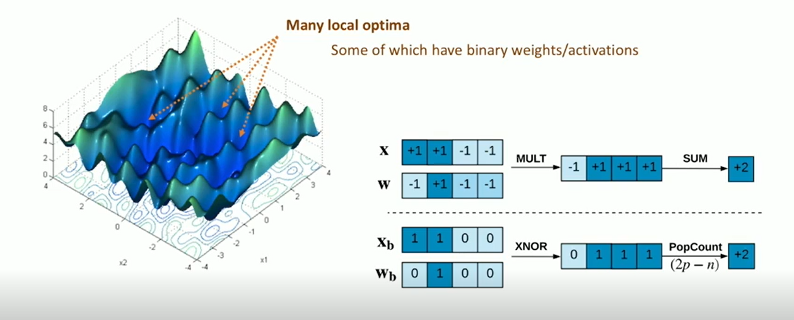

使用二进制的输入 x 和二进制的 weight，使用 xor 进行运算，最后得到的 1 的个数就是最终结果。
如果仅作如上的操作，整个神经网络的准确度会有很大的损失。

为了提升准确度，他们使用了两种方式：

1. 使用 Scale layer 对输出进行缩放
2. 对神经网络进行修建

他们将对输出使用 Scale layer 进行缩放，然后设置缩放比例为 2 和 3 进行测试，准确率有所提升。

在此基础上，他们对神经网络进行修剪，并保持准确度，方式是降低对最终结果贡献率低的神经元的值。

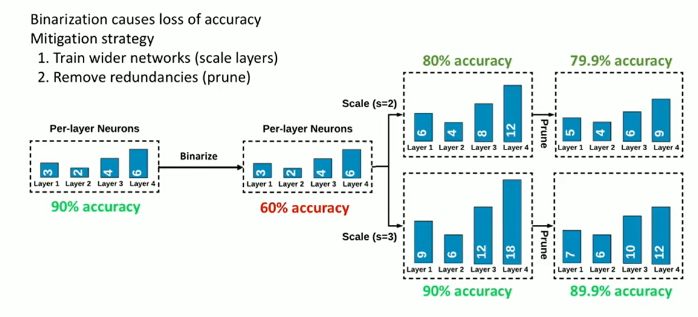

## Oblivious Inference

### Integet-VDP
在第一个卷积层中使用 Integet-VDP 的方式计算向量内积。因为第一个卷积层中的输入是未经二值化的 b 位 Integer，权重是经过二值化的 $w_i\in{\lbrace-1,1\rbrace}$。最后使用 popcont(x) 函数和 sign(x) 激活函数输出最终的二进制值。第一层卷积就相当于 OT 问题。

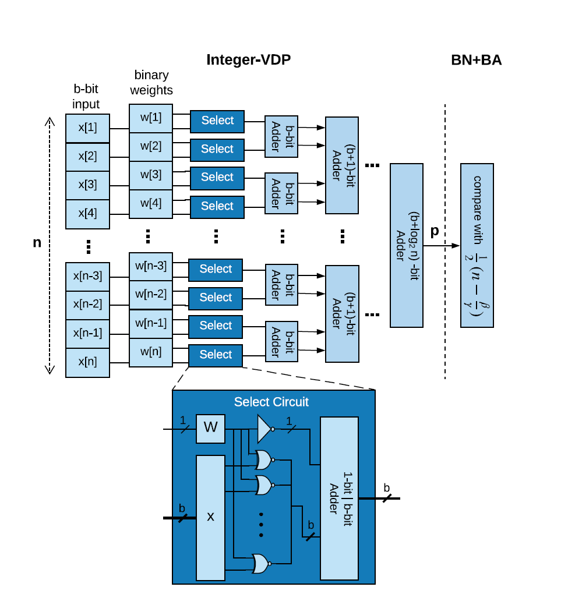

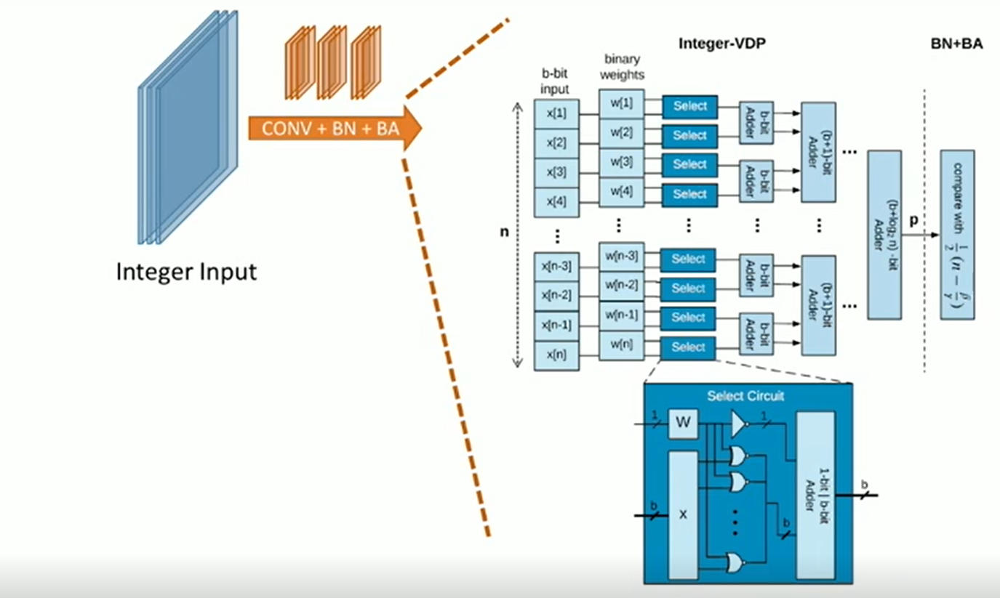

### Binary-VDP

经过了第一层卷积之后，就可以使用 Binary-VDP(二进制向量积)来进行高速运算。

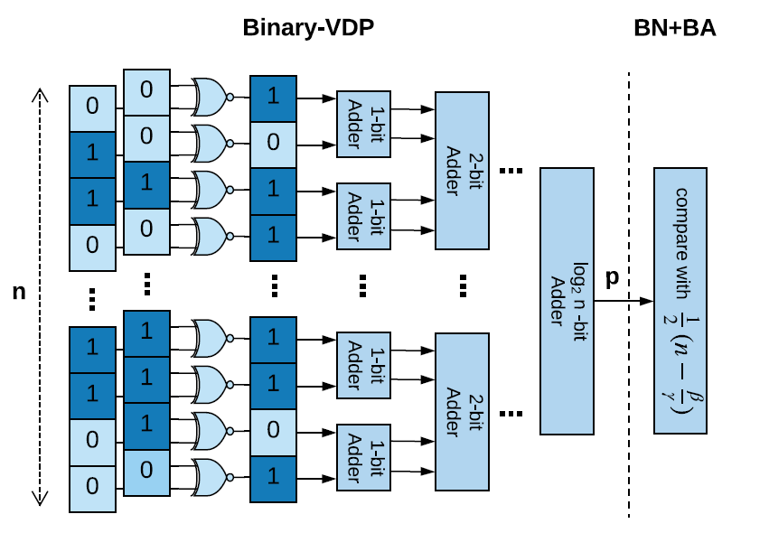

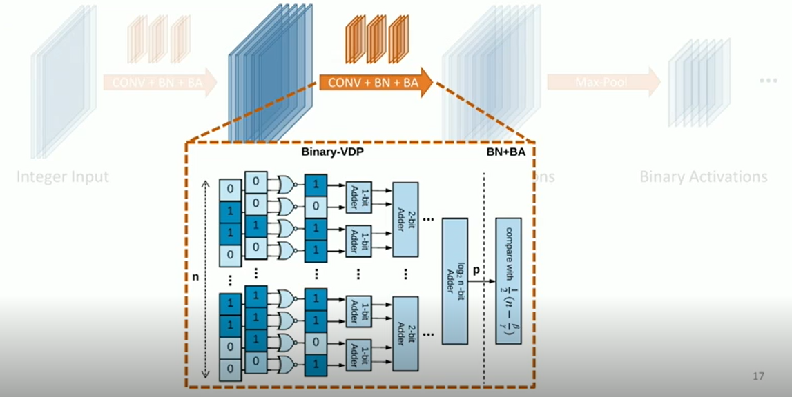

### pooling

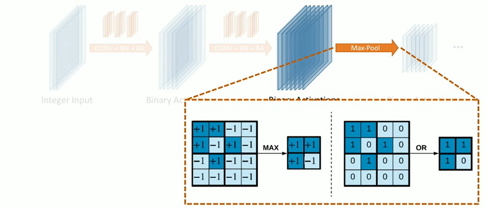

使用 or 运算来代替 max pooling。

## 实验结果

他们使用 MNIST 对使用 XONN 转化的 DNN 做了实验。转换的网络如下表

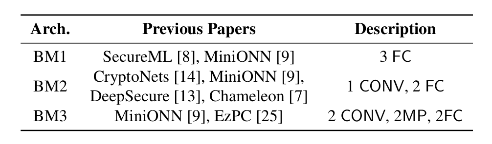

运行的时的性能以及准确度：

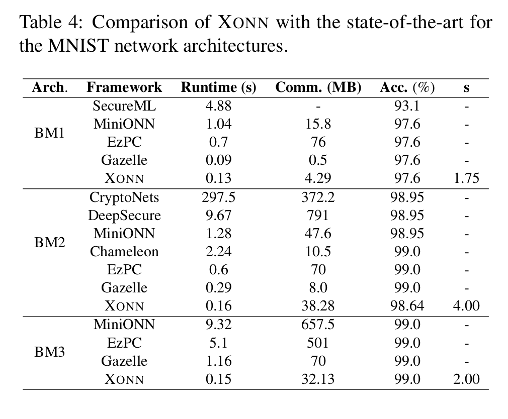

在 CIFAR-10 数据集的表现如下：

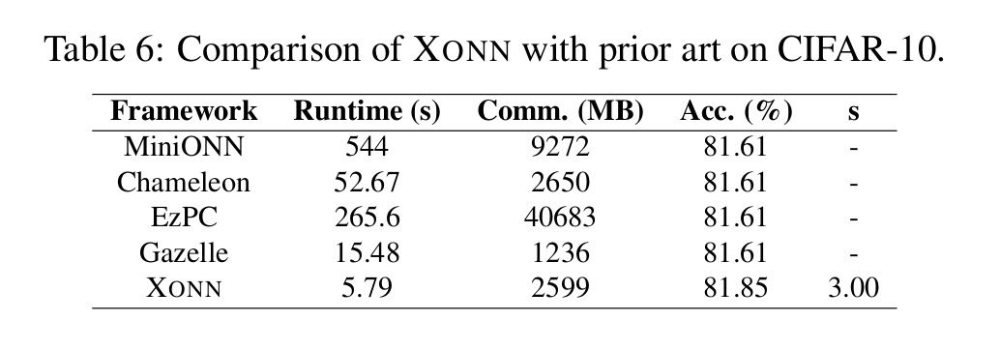

除此之外，他们还对现实生活中医疗行业的数据进行了实验，表 7 和表 8 是数据集的介绍和实验结果：

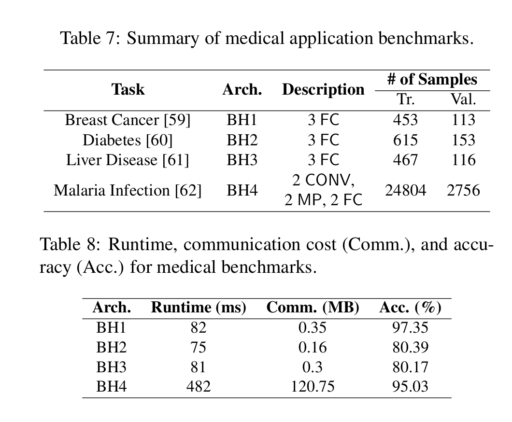

## 总结

1. BNN 非常适合 oblivious deep neural network 
2. GC 带来的几点优势
   1. 客户端和服务器使用常数进行交互(取决于神经网络的层数)
   2. 可以升级为更健壮的安全模型
3. 可以结合其他不同的 DL 算法来实现安全计算

* 论文、录像、ppt 的链接：[https://www.usenix.org/conference/usenixsecurity19/presentation/riazi](https://www.usenix.org/conference/usenixsecurity19/presentation/riazi)