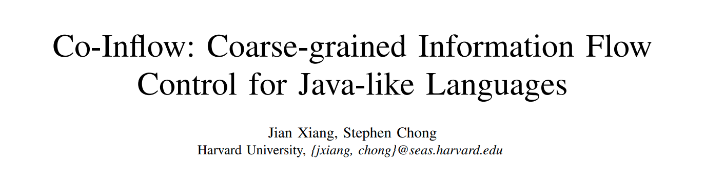
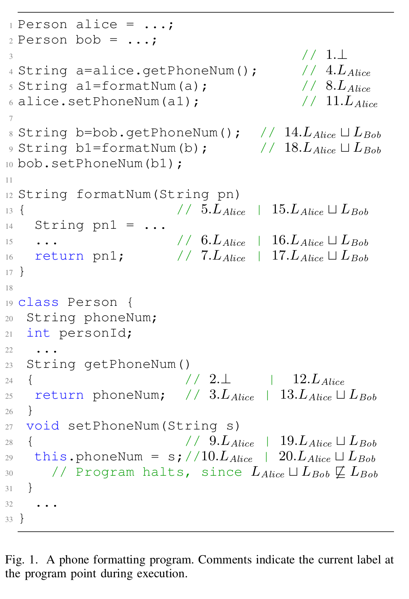
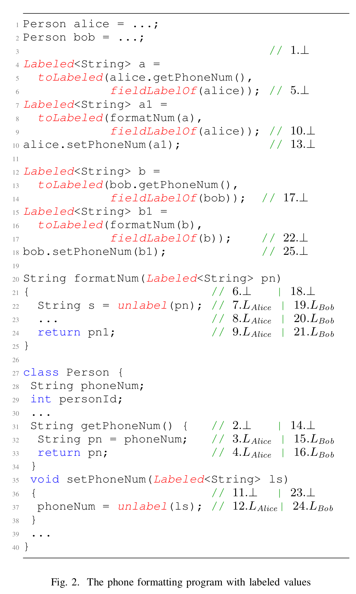
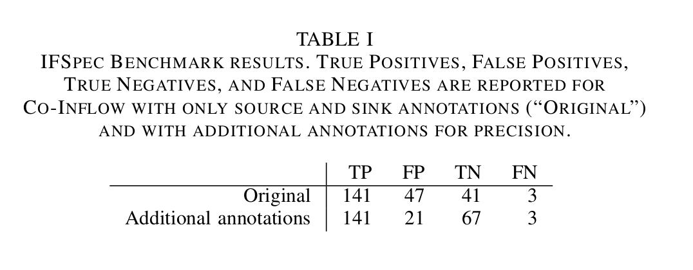
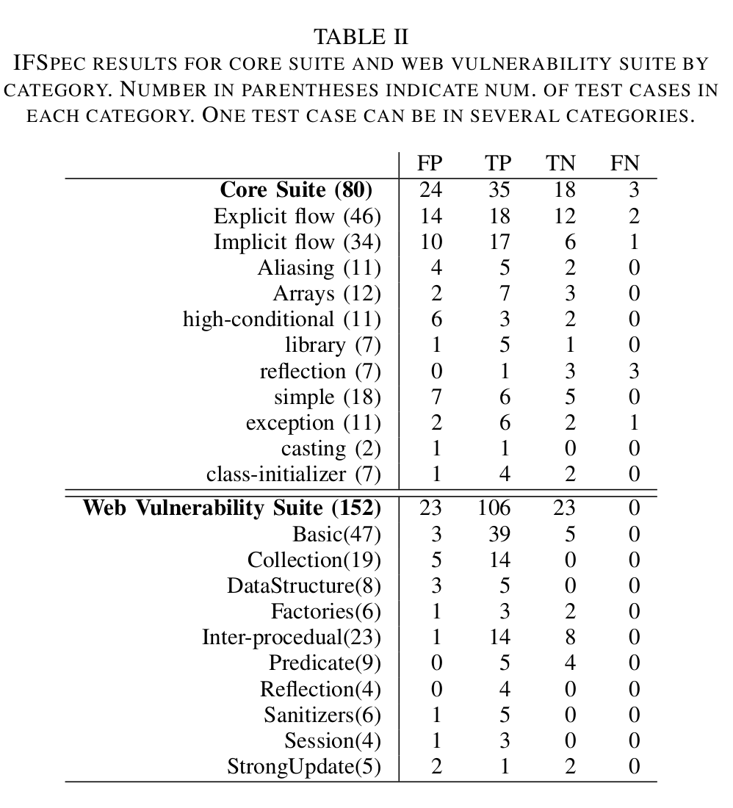

大家好，今天为大家带来了发表在 **s&p 2021** 的工作《Co-Inflow: Coarse-grained Information Flow Control for Java-like Languages》。他们提出了一个非常适合于面向对象编程语言的粗粒度动态信息流控制（IFC）工具**Co-Inflow**。Co-Inflow可以帮助编码人员分析数据数据流，降低数据泄露的风险。

​	应用程序的正确性和安全性通常依赖于对敏感信息进行适当的限制。但是前人的信息流控制（IFC）技术通常是有很多的重复工作并且强迫编码人员对代码格式进行调整的，需要应用程序程序员提供许多安全注释或调整程序设计以符合一些强制性的机制。他们认为粗粒度动态IFC非常适合于命令式面向对象编程语言（如Java）。现有的Java语言抽象与粗粒度的IFC概念非常吻合，例如：java的方法调用是自然计算容器；java对象是自然数据容器。因此，可以使用粗粒度动态IFC对Java进行扩展，不需要修改设计模式或过多的安全性注释，也不需要很大的性能开销。

# 系统概要

## Context labels and field labels

Co-Inflow 是基于*计算容器*的思想，每一个计算容器有一个上下文标签(context label)，其中标识流入容器中的数据的上界称为安全标签(security label)，并且当越来越多的信息流入容器之后，容器的上界就会发生变化。Co-Inflow 把每一个方法调用视为一个计算容器，因此每一个栈帧都与一个上下文标签相关。

​	fig 1 是Co-Inflow的一个例子，在第3行的时候，context label为空，当alice执行类中的方法的时候，context label就加入$L_{Alice}$。当bob执行类中的方法的时候就向contex label中加入$L_{Bob}$。需要注意的是，同一段代码在不同时刻会有多个context label。

​	当程序执行到第6行的时候，alice所对应的域中会保存一个新的phone number，并且每一个object都有一个与标签(field label)来表示域中存储信息的上界。例如，对象alice的域标签是$L_{Alice}$，写入域$alice.phoneNum$中的数据被标为$L_{Alice}$，同时它也是调用$alice.setPhoneNum$上下文标签，因此域写入成功。   

​	但是当执行到第8行的时候，上下文标签变为$L_{Alice} \sqcup L_{Bob}$，但是在执行第10行的时候b1的上下文标签和bob的域标签($L_{Bob}$)并不相符，因此程序会在此挂起来避免安全违例。但是在第29行的时候由于这种context label的不精确性，会导致一些非必须要的挂起。

## Labeled Values

​	可以通过Labeled Values这种方式来增加Co-Inflow的精确度。Labeled Values指的是使用键值对的方式存储，由值v和一个安全标签(v 所依赖的信息的上界)构成。直观地说，只要容器不对值v进行检查或计算，容器就可以在不提升容器上下文标签的情况下传递已标记的值。并且容器可以取消标记已标记的值，这将上下文标签至少提升到安全标签并允许容器使用v进行计算。图2 是加入Labeled Values之后的代码。

但是Labeled Values的标记需要很大的人工参与，并且会修改很多方法签名。

## Co-Inflow

​	Co-Inflow在上述两个技术的基础上实现了自动标记Labeled Values，显著降低了工作量，并且能够达到和人工标注近似的效果。

​	**其他语言功能**. 类似Java的语言将表达式与语句区分开来，并且Co-Inflow有一种接受语句的toLabeled形式。数组与对象相似：每个数组都与一个对象标签和一个域标签相关联。域标签是通过知道数组的元素而传递的信息的上界。构造函数的处理方式与方法类似。初始化器被视为在构造函数的容器中运行的代码。Lambda表达式类似于方法：为Lambda expression函数的每次调用创建一个新容器。每个类都有一个保护其静态字段的对象标签和域标签：域标签是类静态字段中包含的信息的上界。静态初始值设定项和静态方法的处理方式与方法类似。

​	**特定于应用程序的标签**. 一般来说，要使用的安全标签的适当格将特定于应用程序。为了实现这一点，Co-Inflow可以定义自己的标签和标签流中的关系。实现这些设置在程序的执行开始时指定，并且在执行期间不能更改。

​	**sources和sinks**. 应用程序程序员必须能够在sources（即信息进入应用程序的位置）和sinks（即信息离开应用程序或用于安全相关操作的位置）为数据指定适当的标签。Co-Inflow为程序员提供了一种机制，它可以方便地指示sources和汇以及与之相关的标签。也就是说，如果容器访问sources，其上下文标签将增加到与sources关联的标签，并且将检查访问接收器的容器以确保其上下文标签流到接收器的标签。sources和汇可以是对象的字段、方法的参数或方法返回值。

​	**强制执行的措施**。可以将Co-Inflow的配置为在发生安全冲突时采取以下三种可能的操作之一：记录安全冲突，但继续执行；引发异常，捕获并处理该异常；终止程序执行。

# 实验与评估

​	他们测试了多款不同类型的软件，并使用IFSpec进行评估。

​	使用IFSpec测试的information flow 的结果如下table 1和table 2：

性能方面Co-Inflow平均overhead 为20%

 - 论文：[http://people.seas.harvard.edu/~chong/pubs/oakland21_coinflow.pdf](http://people.seas.harvard.edu/~chong/pubs/oakland21_coinflow.pdf)