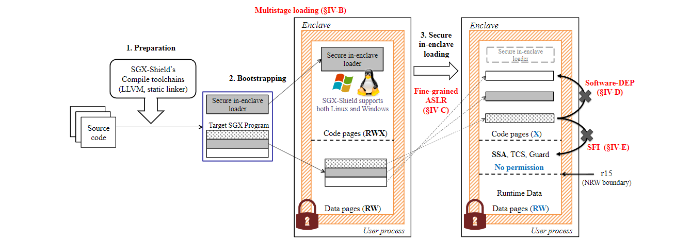
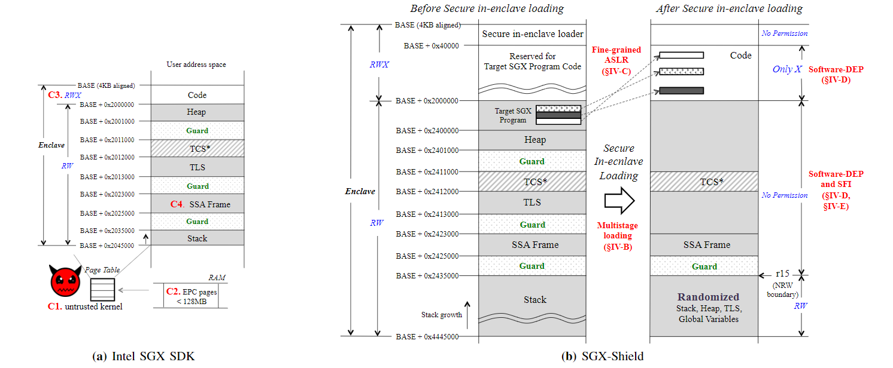

大家好，今天我为大家带来了来自 *NDSS 2017* 的《SGX-Shield: Enabling Address Space Layout Randomization for SGX Programs》。

ASLR 是阻止进攻者发动攻击的强大工具。但是 Intel 对 SGX 的 ASLR 设计存在一些关键限制，导致 ASLR 的安全保证无效。为 SGX 安全部署 ASLR 需要解决以下四个问题：

1. SGX 强大独特的攻击模型使 enclave 内存区域暴露给不受信任的系统软件，使得 SGX 程序完全不受 ASLR 保护。按照设计，SGX 将页面映射管理委托给不受信任的系统软件，从而将虚拟内存映射信息泄露给底层软件。而在非 SGX 环境中，这些都不是问题，因为在那里系统软件始终充当用户进程的可信计算基础。
2. SGX 只为 enclave 提供了有限的内存（64MB 或 128MB），因此用于 SGX 的 ASLR 不能充分利用虚拟地址空间，严重限制了 ASLR 的随机性和安全性。
3. ASLR 需要动态重定位方案来更新代码和数据部分中的相对地址，这与 SGX 的证明过程相冲突。具体地说，SGX 在 enclave 执行开始之前完成完整性度量，但是之后必须执行 ASLR 的重定位。这种固有设计分歧导致了可写代码页的出现，使得可执行空间保护这项基本强化技术无效。
4. SGX 规范强制对 enclave 内的某些安全关键数据使用固定地址。出于安全原因，SGX 使 enclave 内的几个数据结构不变，可能导致使用它们绕过 ASLR 保护。

本文介绍了 SGX-Shield，这是一种为 SGX 环境设计的新 ASLR 方案。它引入了多级加载器的概念，将所有与 ASLR 相关的操作向后推至安全的 enclave 内的加载器中，以隐藏所有对安全敏感的操作。为了最大限度地提高内存布局的随机性，SGX-Shield 通过将代码分成一组随机单位来采用细粒度的随机化。SGX-Shield 还强制执行软件数据执行保护（data execution protection, DEP）以保证 enclave 代码页中的 W⊕X（即 Write XOR Execute 权限），并将安全敏感的数据结构与攻击者隔离。

SGX 的设计如下图所示。

其工作流程如下

1. 在准备阶段使用目标程序的源代码构建 SGX 二进制文件；
2. 引导阶段将安全的 enclave 内加载器加载到代码页，并将目标 SGX 程序加载到数据页；
3. 最终阶段在安全的 enclave 内加载最终的目标 SGX 程序。

也就是说，在第一级加载中只加载了引导器，把程序加载到了数据页中，在第二级加载时才进行 ASLR。在加载时使用 `RDRAND` 指令随机选择基址，该指令保证了随机性。在加载其他模块时也随机独立地调整，加载完成后清除加载器。

他们还对 enclave 进行了细粒度的随机化。以下图为例，作者们通过在基本块的最后添加无条件跳转重新定位指令。

由于 SGX-Shield 的多级加载让代码页既可写又可执行，SGX-Shield 使用基于软件的 DEP 从代码页中移除读写权限，建立 NRW 边界，这是代码页和数据页之间的虚拟屏障。如下图所示。

SGX-Shield 通过

1. 保留所有内存访问指令
2. 确保仅进行对齐的控制传输

保证这一点。除此之外，SGX-Shield 还将状态保存区（State Save Area, SSA）的页面位置放在已知位置，并且不允许其重定位，并使用软件 DEP 实现 SFI 隔离 SSA以隔离对安全关键数据的访问。

为了与 SGX 硬件（例如，远程证明，固定地址）兼容，SGX-Shield 通过基于 LLVM 的编译器设计了基于软件的数据执行保护机制。

作者在真实的 SGX 硬件上进行全面评估。它显示了内存布局中的高度随机性，并很有可能阻止内存损坏攻击。SGX-Shield 在运行常见的微基准测试时显示出 7.61% 的性能开销，而在运行 HTTPS 服务器的更实际的工作负载时则显示 2.25% 的开销。

- PDF: <http://cps.kaist.ac.kr/papers/ndss17-sgxshield.pdf>
- source code: <https://github.com/jaebaek/SGX-Shield>
- video: <https://www.youtube.com/watch?v=Ud8Lq87qfEc>
