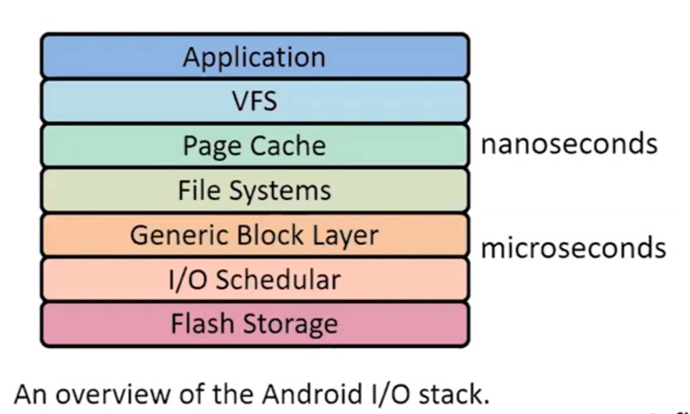
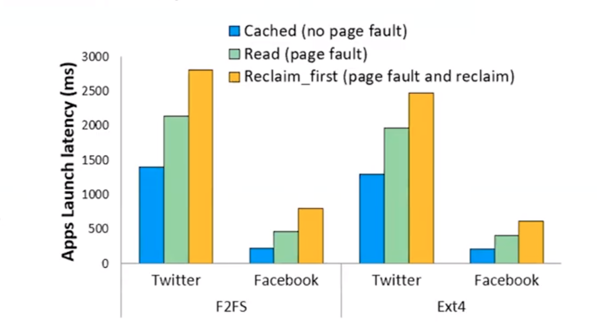
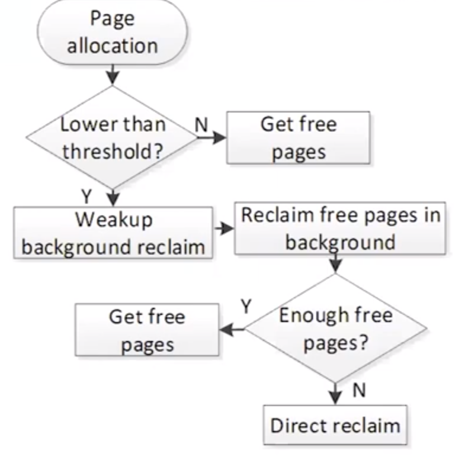
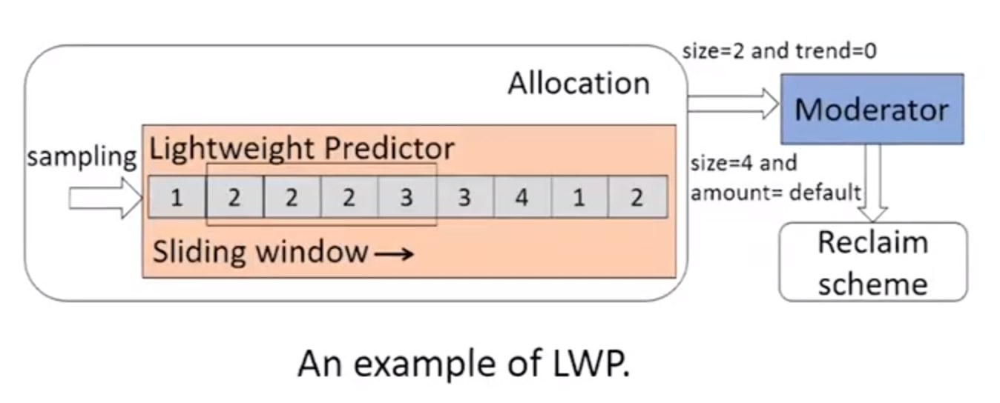
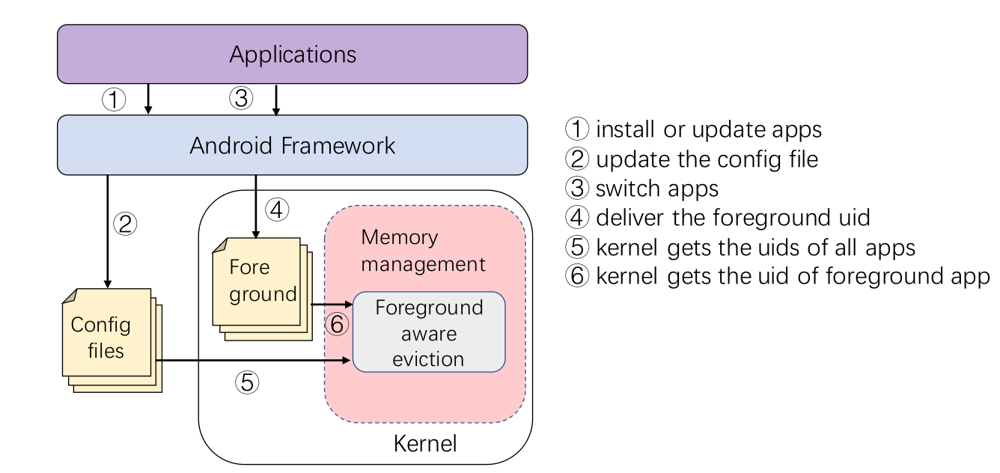
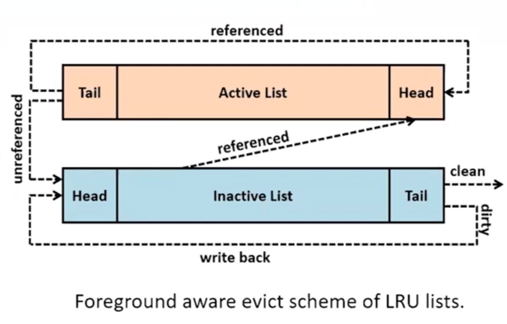
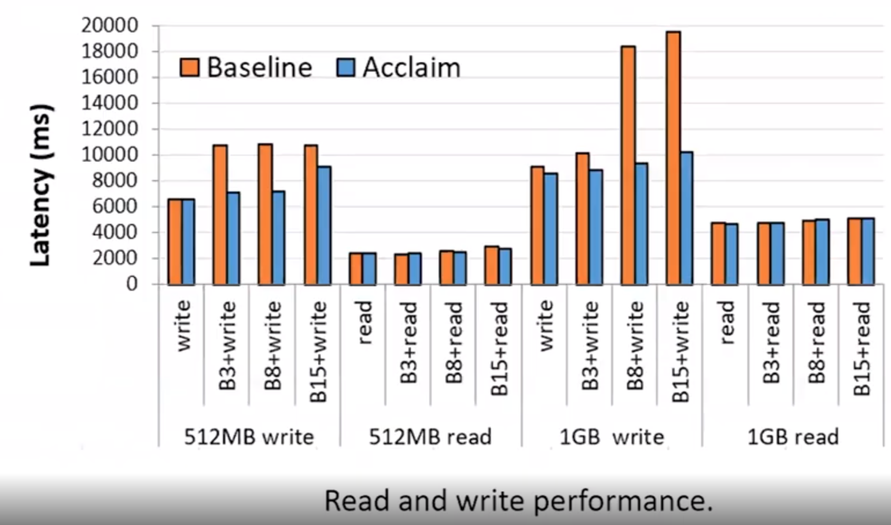
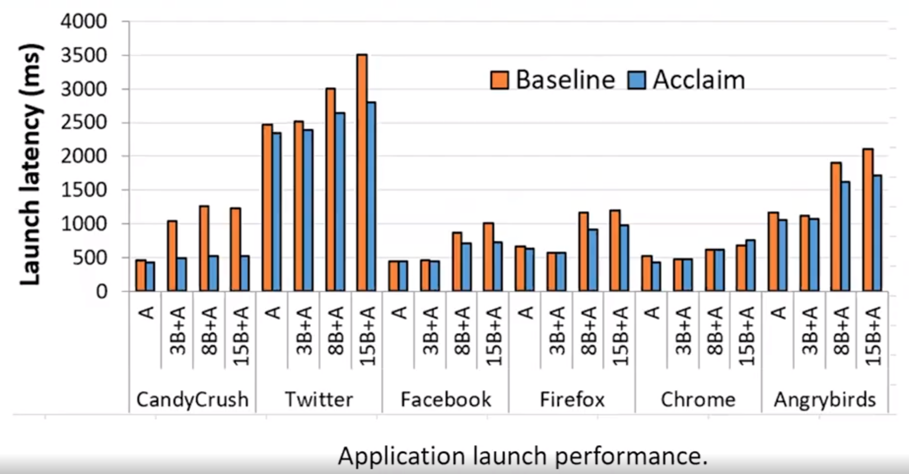

大家好，今天为大家带来了发表在 **USENIX 2020** 的工作《Acclaim: Adaptive Memory Reclaim to Improve User Experience in Android Systems》，通过精细得计算系统申请的页的大小来用于提升android的用户体验。

他们发现Android中申请页的效率很低，尤其是高IO的情况下page fault很高。由于下面两个原因：

1. android 申请的页过大
2. app在后台疯狂吞噬内存

# Android目前的机制

 ## I/O模型

下图是android 的I/O栈。当app启动的时候，kerner会从cache中找页，若cache hit 则从cache中拿cache的时间仅有几纳秒；若cache miss则会出现page fault，若内存被占满了系统则会释放page，这一套流程下来申请page的时间就高达数微秒。

​	下图是不同情况下app启动的延迟：

## 发生缺页的三种情况

1.  第一次执行程序，物理内存中并未存储该app的页的信息；
2. 地址读取错误的时候，该进程会被杀掉，进程持有的资源会被释放
3. 读一个已经被驱逐的页。

## 系统重新申请页的两种模式

1. 后台申请，在页满足系统需要的时候异步申请page

2. 直接申请，当页不足以满足系统运行的时候直接申请page，并且这种情况下系统的开销将会非常大。

   下图是申请页的流程：

当内存完全不够用的时候，android系统就会杀掉后台进程来释放页。

# Acclam 系统

​	他们的设计思想是让系统使用后台应用释放的的页来让系统刚好申请足够前台运行程序运行大小的页。基于此，他们提出了Acclam。Acclam有两个模块预测的出**轻量级的内存申请模式(LWP)**和**前台感知驱逐 (FAE)**。FAE首先将后台应用程序中空闲的页重新定位到前台应用程序；然后LWP基于当前工作量来并结合FAE中释放的页来系统减少申请新页的大小。

## 轻量级的内存申请模式(LWP)

​	LWP包括一个轻量级的预测器和一个调制器。他们使用滑动窗口实现了预测器，它使用采样的请求页的大小作为输入，输出预测出的申请页的大小和申请页数量的趋势，然后调制器基于预测器的输出和后台释放的页大小重新计算最终需要申请的页的大小。

## **前台感知驱逐 (FAE)**

​	FAE首先需要知道哪些页是属于后台应用程序，然后才能对后台的页进行回收。FAE基于UID来判断该UID是否是前台程序。当用户将app切换到前端时，该app所对应的UID会传递给kernel其余UID则为后台程序。

​		当对后台app进行驱逐的时候，该app对应的页会被放入inactive list。

​		

除此之外他们还对释放后台播放的音乐和视频的app进行了约束，这些和这些功能相关的页不会被移动到inactive list

## 实验结果

​	在执行不同大小的读写操作的时候，效果做好的时候Acclaim的延迟基本上比Baseline低了49.3%

除此之外，Acclaim能够显著降低app的启动时间

- 论文详情:[https://www.usenix.org/conference/atc20/presentation/liang-yu](https://www.usenix.org/conference/atc20/presentation/liang-yu)

