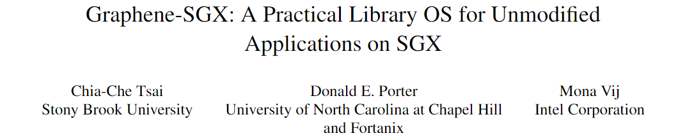
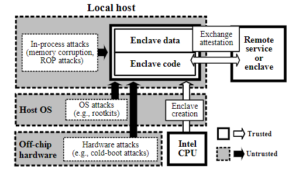
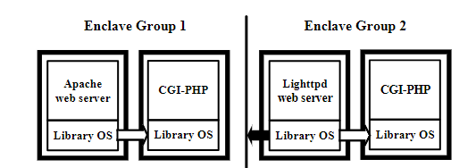
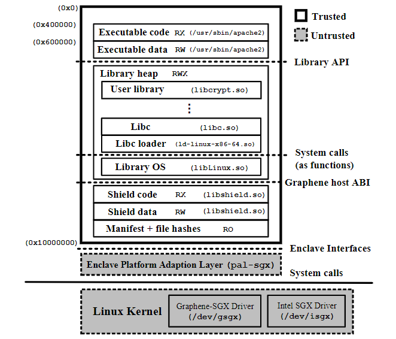
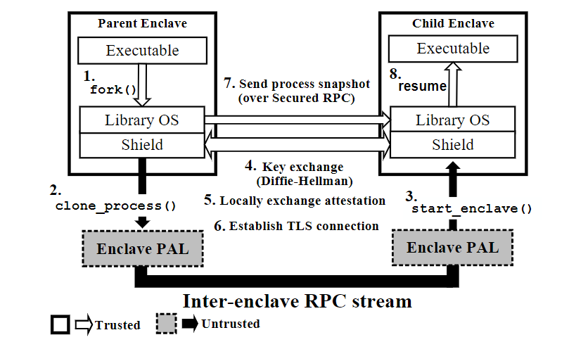
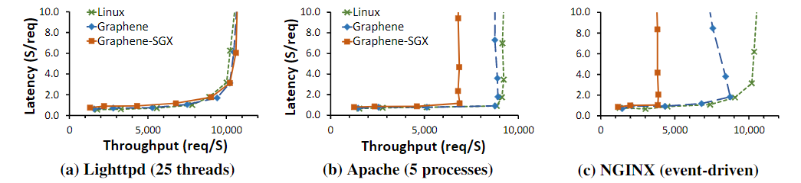
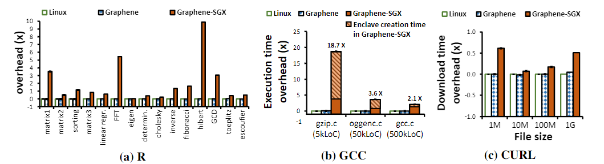
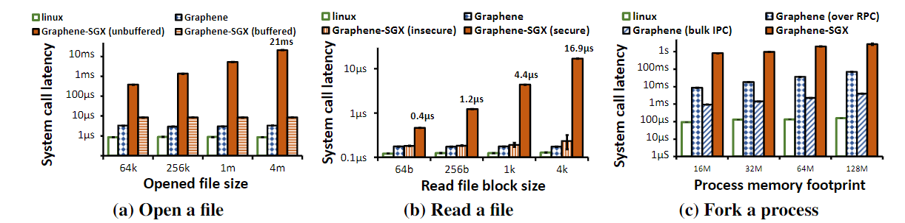
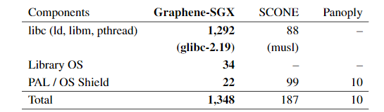

大家好，今天我为大家带来了来自 *USENIX ATC 2017* 的《Graphene-SGX: A Practical Library OS for Unmodified Applications on SGX》。

当前的应用程序不能在开箱即用（work out-of-the-box）的 SGX 上运行（例如在 SGX 中不能使用系统调用，应用程序倾向于在 SGX 中模拟系统调用）。尽管之前的工作表明库操作系统可以在 SGX 上执行未经修改的应用程序，但人们认为，库操作系统会对性能和 TCB 大小造成毁灭性影响，这使得程序代码修改称为采用 SGX 的隐含前提。

这篇文章证明了这些问题已得到解决，功能齐全的库 OS 可以在 SGX 上快速部署未修改的应用程序，其开销与修改为使用“填充（shim）”层的应用程序相当。作者们将 Graphene 移植到 SGX，并根据 SGX 安全优势进行了改进，例如对动态加载库的完整性支持和安全的多进程支持。Graphene-SGX 支持各种未经修改的应用程序，包括 Apache、GCC 和 R 解释器。Graphene-SGX 可以在 SGX 上运行未修改的 Linux 二进制文件，因此作者们还为 Graphene-SGX 提供了一些可用性增强的功能，包括对动态加载库的完整性支持、enclave 级的分支（forking）和安全的进程间通信（IPC）。用户只需要配置功能并对配置进行加密签名。

::: details SGX 软件设计

**SGX 需要多少功能** 当前有些库操作系统，如 Haven 将大多数应用程序的支持代码放入了 enclave 中，而另一方面，在薄的“填充”层，如 cone 和 Panoply 包装了一个 API 层，如系统调用表。在 enclave 中添加更多的代码会增加 TCB 的大小，但是可以减少 enclave 和不受信任的操作系统接口和攻击面的大小和复杂性。

影响性能的因素有两个。

1. 进入或离开 enclave 代价很高，如果可以减少 enclave 边界的跨越，就可以提高性能。
2. Enclave 页缓存（EPC）在 SGX 版本 1 的大小是 128MB。如果一个代码大小超过此范围也会导致高昂的开销。

**隔离的复杂性** SGX 硬件隔离应用程序和不受信任的操作系统，但是无法保护需要 OS 功能的应用程序

**应用程序代码复杂性** 复杂的应用程序需要系统调用支持。开发人员的可选方式如下：

1. 修改应用程序，以减少运行时所需的世界
2. 对不受信任的操作系统开放和屏蔽更多接口
3. 将更多的功能引入填充程序或库系统中

文章选用了第三种方法。

**程序分组** 一个应用程序可以有多个 enclave，也可以将不太重要的功能放在 enclave 之外，为不同的特权级创建不同的 enclave。这个级别的分析特定于应用程序且超出了这篇文章的重点。但是为一个复杂的应用程序划分多个 enclave 可以提高安全性。Graphene-SGX 通过在 enclave 运行较小的代码段支持该特性。

:::

SGX 威胁模型认为

1. Intel CPU 包之外的硬件
2. 操作系统、系统管理程序和西塔系统软件
3. 同一主机上执行的其他应用程序，包括无关的 enclave
4. 驻留在应用程序进程中但在 enclave 之外的用户空间组件

都是不可信的。本文的设计只信任 CPU 和 enclave 中运行的代码，包括库操作系统、未修改的应用程序及其支持库。本文的设计还信任 `aesmd`，这是由 Intel SGX SDK 提供的 enclave，它可以验证 enclave 签名中的属性并批准 enclave 的创建。目前，任何使用 SGX 进行远程认证的框架都必须信任 `aesmd`。Graphene-SGX 使用但不信任 Intel SGX 内核驱动程序。除了 `aesmd` 和驱动之外，Graphene-SGX 不使用或不信任 SDK 的任何部分。

Graphene-SGX 需要用户策略配置，每个应用程序需要一个 mainfest 指定允许使用哪些资源。Mainfest 的目的是保护本地主机：引用监视器可以轻松识别应用程序可能使用的资源，拒绝 mainfest 有问题的应用程序。Graphene-SGX 扩展了 mainfest，用于保证可信文件的完整性。

除此之外，Graphene-SGX 通过在每个进程中运行一个单独的库操作系统实例以支持多进程应用程序。每个库操作系统实例都通过消息传递协调状态。Graphene-SGX 实现了用户空间中的 Linux 多进程抽象。

Graphene-SGX 的架构如下图所示。在 enclave 中实现了诸多 Linux ABI 抽象，就需要相应地屏蔽。Graphene-SGX 屏蔽了动态加载、单进程抽象、多进程抽象等。

在创建子进程时，Graphene-SGX 会在不受信任的主机上创建一个新的，干净的 enclave。然后两个 enclave 交换加密密钥，验证彼此间由 CPU 生成的身份验证，并迁移父进程快照。如下图所示，图中的数字代表顺序。

作者们使用 Ubuntu 安装的二进制文件评估未修改的 Linux 应用程序的性能开销。根据工作负载测量应用程序的吞吐量或延迟。对于服务器程序，他们对 Lighthttpd、Apache 和 NGINX 进行了实验。由于这三种服务器程序的工作原理不同，也显示出了不同的性能差距。

对于命令行程序，作者们对 R、GCC 和 CURL 进行了实验。

除此之外，他们还评估了一些受 Graphene-SGX 设计严重影响的系统操作，包括 `open`、`read` 和 `fork` 系统调用。

除此之外，他们还测量了 Graphene-SGX 的 TCB 大小的增加，以及框架屏蔽的操作系统功能。由于 Graphene-SGX 选用的是 glibc，因此其 TCB 相比类似功能的框架更大。

- PDF: <https://www.usenix.org/system/files/conference/atc17/atc17-tsai.pdf>
- Source code: <https://github.com/oscarlab/graphene>
- Presentation Audio: <https://0b4af6cdc2f0c5998459-c0245c5c937c5dedcca3f1764ecc9b2f.ssl.cf2.rackcdn.com/atc17/tsai.mp3>