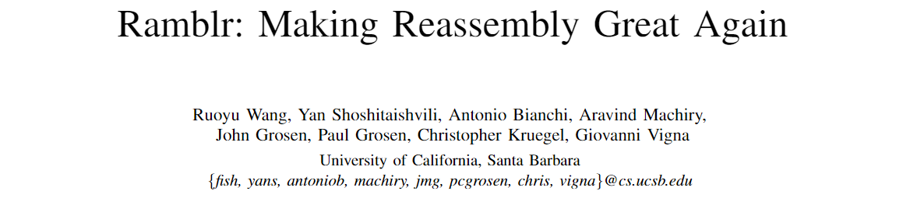
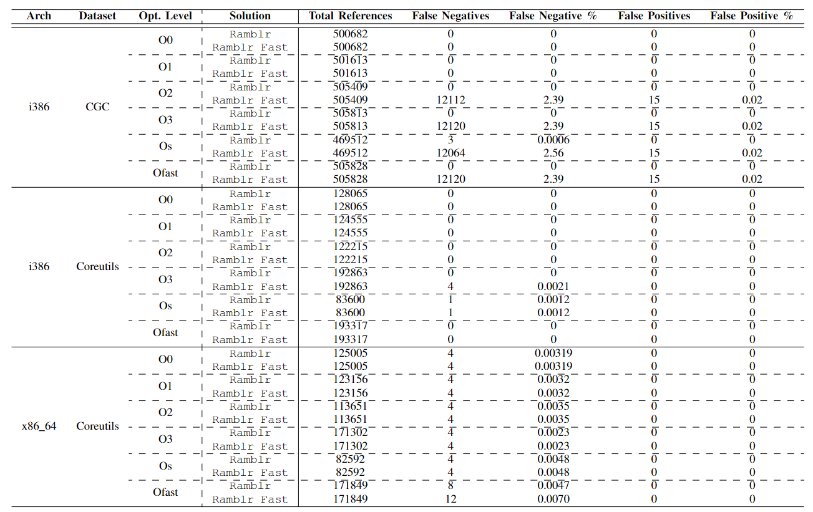
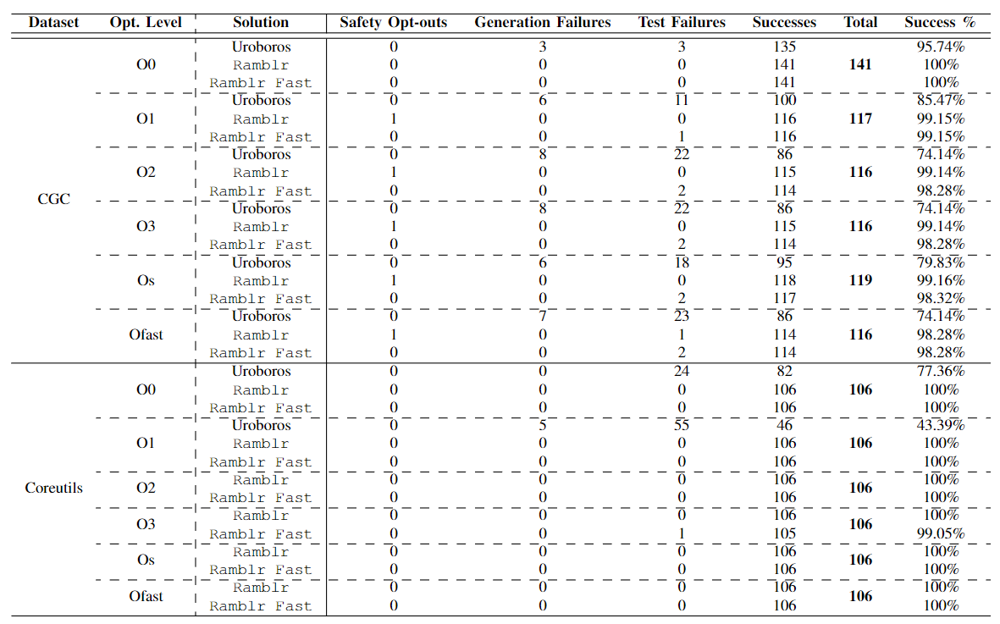

大家好，今天我带来的是来自 *NDSS 2017* 的《Ramblr: Making Reassembly Great Again》。

二进制重汇编会遇到包括不正确的立即数符号化、无法识别可符号化的常量、缺少指针安全检查等会导致重汇编的二进制损害的问题。作者们从 Uroboros 提出的可重汇编的反汇编基础上建立了 Ramblr。

Uroboros 将符号引用分为 4 类：c2c、c2d、d2c 和 d2d。其中 c 代表代码，d 代表数据。为了处理对数据指向的符号引用（c2d 和 d2d），Uroboros 进行了以下三个假设：

1. 所有指向数据区域的指针必须存储在与机器的位宽对齐的地址上。
2. 不需要对原始二进制进行任何转换（即任何基址的转换）。因此在重汇编后的二进制中，所有数据段的起始地址与原始二进制中对应的地址相同。
3. d2c 符号仅用作函数指针或跳转表。因此任何 d2c 符号引用要么指向一个函数的开头，要么是已标识的跳转表的一部分。

然而对于假设 1，自定义对齐会破坏这一假设；对于假设 2，对数据段的要求过于严格，可能无法满足；对于假设 3，现有的工作仍然难以识别优化后的函数起点。

Uroboros 无法解决以下两类问题。

- **符号化假阴性** 当立即数（最初被视为非符号化立即数）不属于任何已知的内存区域，而是用作二进制数中的指针的一部分时，就会导致符号化假阴性的误报。
- **符号化假阳性** 最初被视为可符号化的立即数的值有时是一个正常的数据片段，会导致符号化假阳性的错误。

在二进制中，编译优化、异常的二进制行为、值冲突都可能遇到这类问题。另外 Uroboros 反汇编的可读性比较差。

Ramblr 的工作流程如下：

1. **反汇编并恢复 CFG**
2. **内容分类** Ramblr 结合高级静态分析技术以及目标二进制中可用的元数据将目标二进制的内容分为代码、数组、指针等类型。
3. **符号化** Ramblr 使用上面两个步骤的结果标识二进制中的符号引用。这些引用表示的是内存位置的语义而不是地址的语法语义，用于在重汇编中维护它所指向的对象的关系。
4. **重汇编**

在内容分类中，作者们使用了两种基本分析。

- **函数内数据依赖分析** 在特定函数的基本块上进行抽象执行（blanket execution），从中恢复变量和常量之间的数据依赖关系。
- **局部值集分析** 根据数据依赖分析的结果构建与内存访问相关的程序切片，用于表示潜在的内容误分类的数据。在切片上进行局部值集分析会为我们提供有关最终内存访问所使用内容分类的足够信息。

通过上述的两种分析，作者们通过 Ramblr 成功分析了数据识别和类型识别并进行了数据块清理以及误识别的处理。

之后作者们通过符号化将硬编码的数据引用转换为符号来辅助重汇编。之后作者们还讨论了一些牺牲一些功能保证以快速重汇编的情况。

Ramblr 基于 angr 实现。作者们使用 Coreutils 和来自 DARPA 网络挑战赛的文件集合。作者们比较了 Ramblr 和 Ramblr Fast 中符号被误分类的比率。可以看出，在优化等级不高的时候 Ramblr 有不错的表现，但是开到最高级之后会出现一些假阴性的错误。

除此之外，作者们还与 UROBOROS 进行了比较，可以看出相对于 UROBOROS 来说，Ramblr 更有优势。

总的来说，Ramblr 的重汇编方法是一种经验解决方案，很容易被特定的攻击破坏，在一定程度上论证了静态内容分类的不可行性。但是他们的思路也可以用来解决一些特定的问题。

- PDF: <https://www.ndss-symposium.org/wp-content/uploads/2017/09/ndss2017_10-5_Wang_paper_0.pdf>
- video: <https://youtu.be/_BIamPJE8EQ>
- slide: <https://www.ndss-symposium.org/wp-content/uploads/2017/09/ndss2017_10-5-wang_slides.pdf>