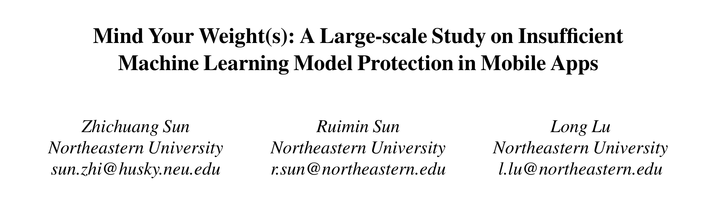
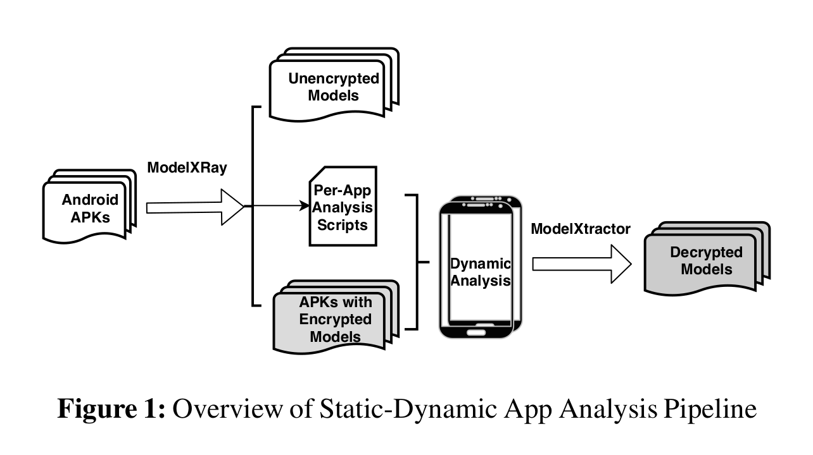
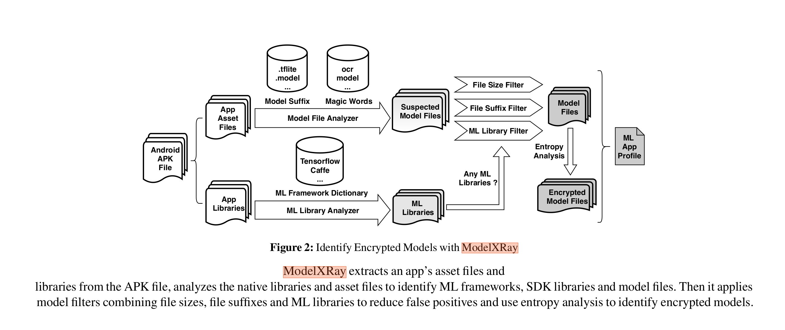
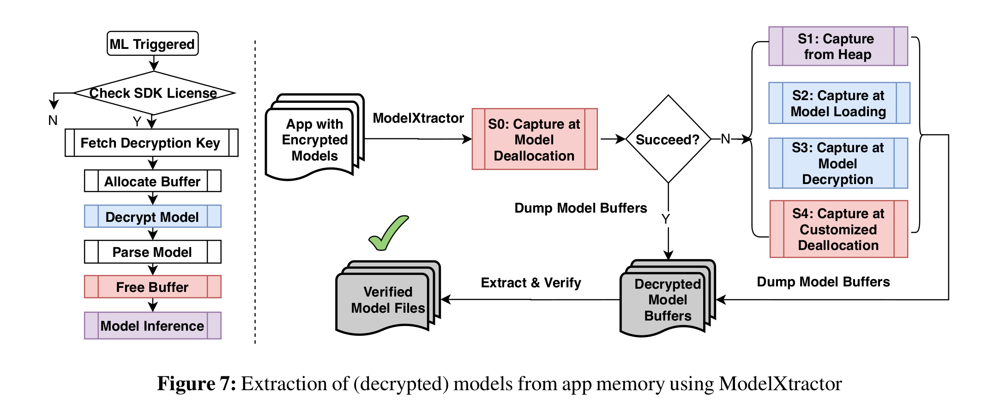
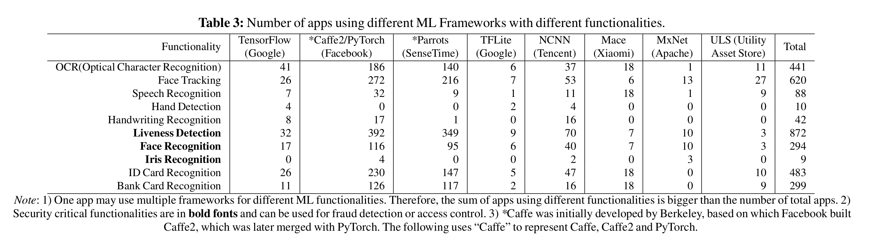
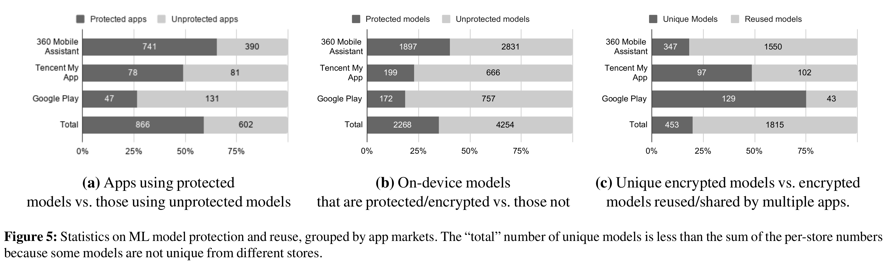
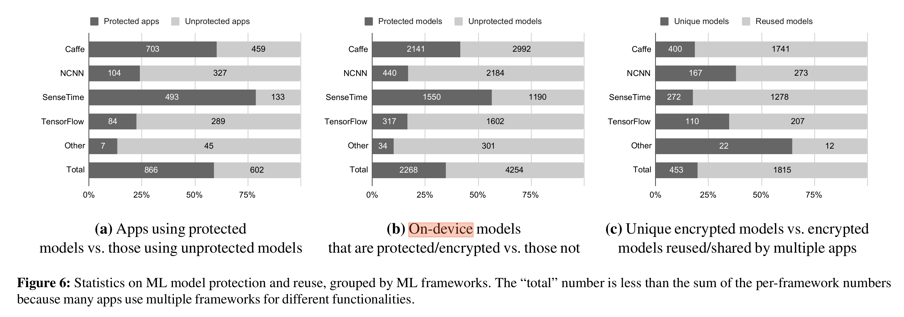
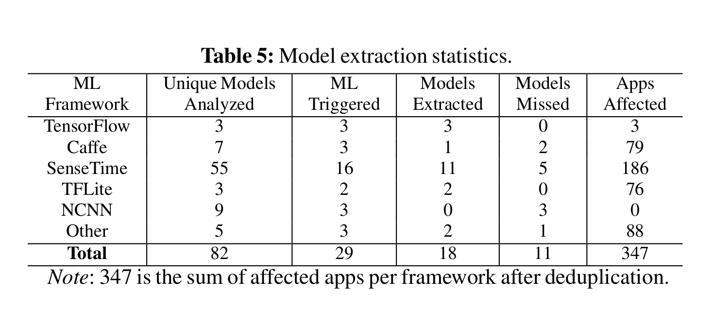
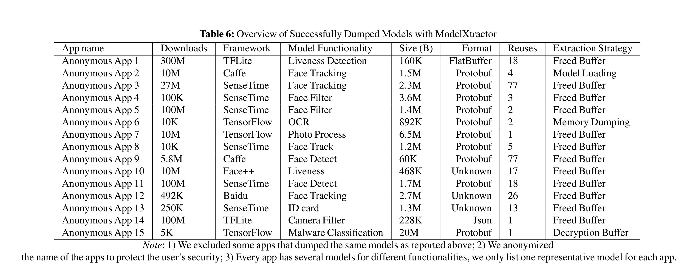

大家好，今天为大家带来了发表于 **arXiv:2002.07687** 的工作《Mind Your Weight(s): A Large-scale Study on Insufficient Machine Learning Model Protection in Mobile Apps》

这份工作对[WWW 2019 A First Look at Deep Learning Apps on Smartphones](https://arxiv.org/pdf/1812.05448.pdf)工作进行延伸，www仅使用了字符串匹配等静态手段来对app进行分析，这样一些app动态运行时下载的模型和加密的模型便无法获得。该文章使用静态分析和动态分析结合来分析app中的ML模型。

# 系统架构

​	首先使用静态分析器**ModelXRay**找到app中的ML模型然后再通过**ModelXtractor** 动态分析app并从中提取加密的ML模型。

## *ModelXRay*

​	**ModelXRay**通过分析ML Library和Model File来提取app中的模型。

对于ML Library，他们受到WWW的文章的启发，搜索app中所有.so文件中和ML相关的关键字来判断是否使用了某种深度学习框架。对于Model File，他们分析app的asset目录中的文件，并规定同时符合以下三个条件的为ML模型：

1. 文件大小必须的大于8KB；
2. 文件后缀不是常见ML文件的后缀，例如.model, .jpg；
3. 必须检测到ML的深度学习框架。

对于加密或者压缩的模型，他们使用目前常用的判断信息熵的方式判断文件是否加密。他们规定信息熵范围为[0,7]，当信息熵>7.99的时候该文件是一个经过加密的文件。然后再使用文件的magic number和文件类型来判断文件是否被压缩。

## ModelXtractor

​	**ModelXtractor**使用frida对app进行插桩并且它可以自己选择插桩的lib和函数。ModelXtractor使用了四种插桩策略，默认为策略1：

1. 从内存释放的地方提取。由于模型在内存中是连续存储的并且是经过解密的，因此仅需在app加载过ML模型之后hook住满足特定大小的free(x)函数即可。但是当ML类库未使用native ML lib(例如 javascript)、程序自己定义内存申请或者释放函数或者模型的buffer并未释放的时候该策略无法生效，需要换成其他策略。

2. 从堆内存中提取。当app并未释放内存、使用js库的时候可以app的将整个堆dump下来并寻找ML模型。

3. 在模型加载的时候获取。当ML lib没有被混淆的时候可以hook相应的load model的函数来获得ML模型。

4. 当模型解密的时候获取。当ML lib没有被混淆的时候，可以hook ML lib中对模型解密的api进而获得模型。

5. 在使用自定义内存释放函数的时候获取。他们定义了一些特殊名称例如"slab_free"，并hook这些名称类似的函数。

大部分的模型都是Protobuf格式的，因此他们采取"**上下文签名**"和"**编码签名**"定位ML在内存中的位置。

**上下文签名**通过模型中的layer名称的关键字(例如"conv1","relu")来大致虚招ML模型在内存中的位置。

**编码签名**是基于Protobuf编码规范，通过寻找Protobuf文件头部部定义的message信息来确定位其在内存的位置。Protobuf中的messages是由(field_number << 3)| wire_type表示，field_number指field的ID，wire_type指field类型。其中Protobuf第一个message就是Protobuf的第一个字节，并且第一个message的wire_type通常为2，field_number为0因此内存当中Protobuf的第一个字节通常为"0A"。

除此之外，对于TFLite的模型，其通常会有一个类似"TFL2" 或者 “TFL3"的版本号。对于一些位置ML框架的模型，他们推断app会开辟一个和加密过的ML文件的大小一致的内存空间来存放模型。

# 系统评估

静态分析的结果：

模型的用途：

通过Figure5a发现，有超过半数的app使用了加密的模型，但是Google play中的app仅有少数使用了被加密的模型。Figure5b中可以得出同一个app会使用多个ML模型，从模型的层面来看未加密的ML模型占多数。Figure5c可以看出同一个经过加密的模型会被多款app使用。

对于不同的ML框架，使用NCNN和TF的模型加密较少，并且在加密的模型中商汤的模型复用情况最少。

动态分析的结果：

在他们调查的82个软件中，尽管开发者会尽可能得保护模型，但是能被提取出的模型依旧占了大多数，具体情况如Table 5。

table 6 是使用不同手段提取出的模型的信息：

# 局限性

由于他们的目标是展示即使是简单的工具也可以大规模提取设备上的ML模型，因此ModelXRay和ModelXtractor受到关键字匹配的直接设计的限制。**通过利用程序切片和部分执行（partial execution）[34,44]以及Android应用程序解混淆[32,53]，可以进一步提高模型提取的规模。**此外，模型编码和内容特征仅限于具有可用文档和公开的ML-sdk。

- 论文:[https://arxiv.org/abs/2002.07687](https://arxiv.org/abs/2002.07687)