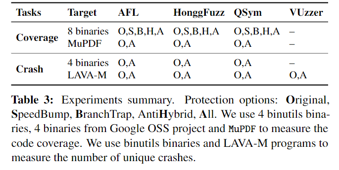
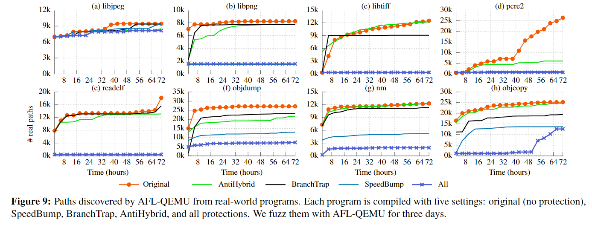

今天为大家带来的论文是来自 *USENIX Security 2019* 的论文《FUZZIFICATION: Anti-Fuzzing Techniques》。在 [G.O.S.S.I.P 学术论文推荐 2020-10-27](https://mp.weixin.qq.com/s?__biz=MzA5MzQ1MDI2MA==&amp;mid=2456042699&amp;idx=1&amp;sn=21170689ac5d2bef98f5636a9fe277fd&amp;chksm=87cd25b0b0baaca6acef9252250a93c95ffe9d5d39567f5aaa864a19fb399e88461157dfa6fd#rd) 的基础上做了一些补充。

> Fuzzing 作为一种有效的程序安全检测技术，既能被开发人员用来及时发现漏洞并修复，也能被攻击者用来构造exploit。
> 本文作者为了阻止攻击者利用 fuzzing 找到程序的漏洞，提出了三种 fuzzification 技术来实现 anti-fuzzing 的目标。

现有的保护技术要么会导致高开销（混淆/打包、错误注入），要么不适合 fuzzing（fuzzer 检测、模拟器漏洞），都不满足 fuzzification 的条件。

Fuzzification 的保护方式如下，对于受信者，它编译出正常的二进制文件可以正常 Fuzz，反之则让攻击者无法迅速找到漏洞。

它以程序源代码、一组常用测试用例和开销预算作为输入，如下图所示，通过四步完成混淆。

1. 编译生成正常的二进制，运行测试用例并收集基本块频率，找到很少正常执行用的基本块。
2. 在此基础上根据配置文件应用三种 fuzzifacation 技术，生成一个临时的受保护的二进制文件。
3. 循环运行测试样例，利用 2 中的方法让程序的运行开销尽可能地逼近预算。
4. 生成最终的二进制文件。

接下来作者介绍了他们用的 fuzzifacation 算法，分别是 SpeedBump、BranchTrap 和 AntiHybrid。

## SpeedBump

Speedbump 用来减缓 fuzz 的速度。其原理是将细粒度的延缓代码冷路径中，例如错误处理的模块和正常运行时很少执行的基本块。

Speedbump 主要分为两个步骤：通过测试集合对基本块的频率进行分析，然后循环注入延迟直到符合要求。作者们使用 CSmith 构造延迟原语的代码。最近的 fuzz 工具可以识别错误处理模块并跳过，因此作者们主要还是将延迟原语放入很少执行的基本块中。

## BranchTrap

> BranchTrap 通过构造许多对输入敏感的分支来诱使 coverage-based fuzzer 将集中在毫无结果的路径上。BranchTrap 会注入一个跳转表，并使用一些输入字节作为访问该表的索引。作者根据用户输入使每个注入的分支的返回地址多样化，比较类似 ROP 的想法，如下图所示。

这种方法的特点是让 fuzzer 专注于没有结果的输入。

作者们通过三步扭曲程序的控制流：

1. BranchTrap 从程序汇编中收集函数的结尾（在编译时生成）。
2. 将具有相同指令序列的函数结尾分组到一个跳转表中。
3. 重写汇编，使函数使用一些输入字节作为跳转表索引，从相应的跳转表中检索几个等效的结尾，以实现原始函数的返回。

上图的例子就是输入会不断修改 `index` 的值，导致 fuzz 工具重复分析。

BranchTrap 还通过使 fuzzing 状态饱和阻止 fuzzer 学习代码覆盖率的进度。这周方法的特点是阻止 fuzzer 找到真正有效的输入。

在这种方法中，BranchTrap 向程序中很少访问的基本块添加大量分支，快速填满 fuzzer 的覆盖表，让 fuzzer 专注于新的无效的分支而抛弃之前的分支。例如下图中就通过向 `readelf` 中添加大量分支代码让 AFL fuzzer 在有限时间内分析出的有效路径减少。

## AntiHybrid

> AntiHybrid 将显式数据流转换为隐式数据流，以防止通过污点分析进行数据流跟踪，并插入大量伪造符号以在符号执行过程中触发路径爆炸。

隐式数据流阻碍了跟踪直接数据传播的数据流分析，但是不能阻止通过差分分析进行的数据依赖关系推断。不过最近的工作要求输入中明确显示分支条件值，可以通过简单的数据修改绕过。

AntiHybrid 还通过注入多个代码块触发路径爆炸以阻止使用符号执行的 fuzzer。这里他们通过添加 CRC 校验函数以阻止符号执行。

**实验**

> 作者选择 LAVA-M 数据集和九个实际应用作为 fuzzing 目标，在四个主流的 fuzzer 上对 FUZZIFICATION 进行了评估。作者对这些二进制文件执行了两组实验，总结在下表中。

作者们评估了 fuzzification 阻止 fuzzer 探索程序代码路径和漏洞检测的有效性、保护现实中的大型程序的实用性以及对抗分析技术的鲁棒性。

总的来说，现有的缓解措施要么旨在避免程序错误（例如通过类型安全语言），要么旨在避免成功的利用。假设攻击者一定会发现错误，作者们的方法提供了一种最大化攻击开销的防护。

- Info: <https://www.usenix.org/conference/usenixsecurity19/presentation/jung>
