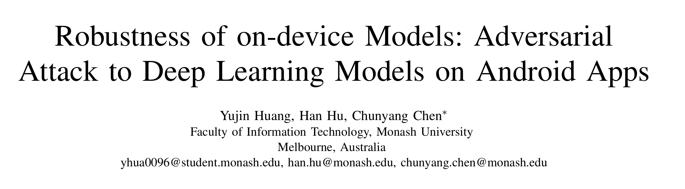
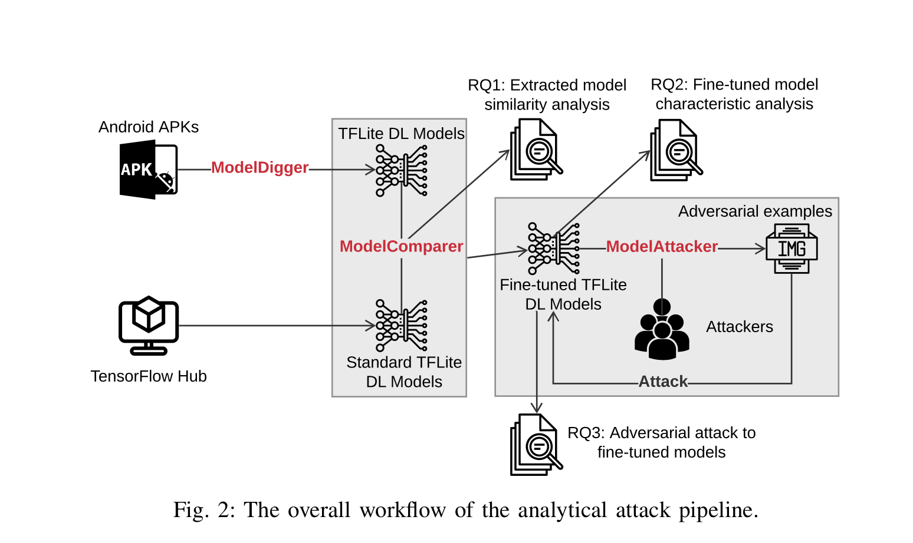
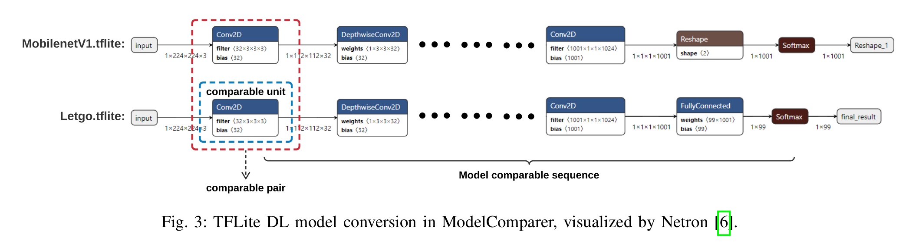
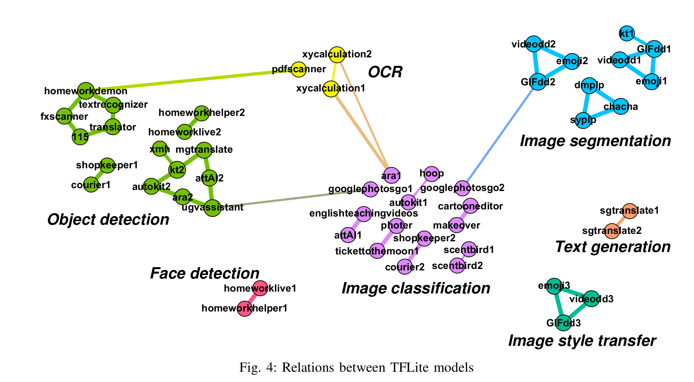
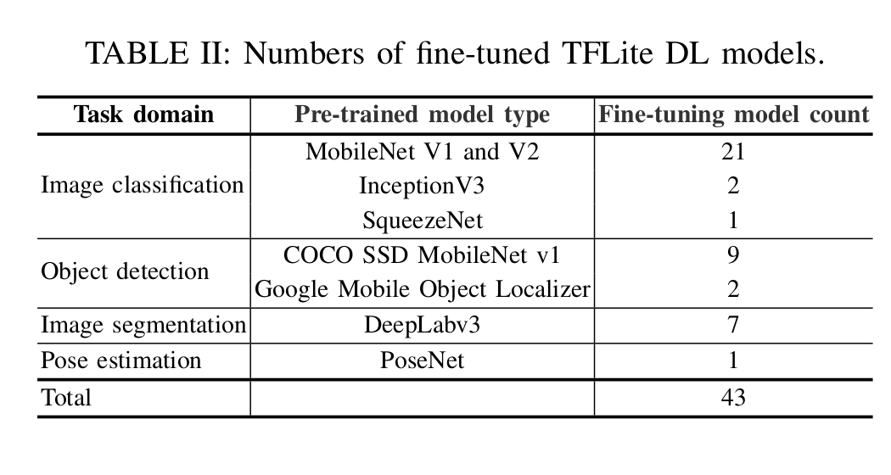
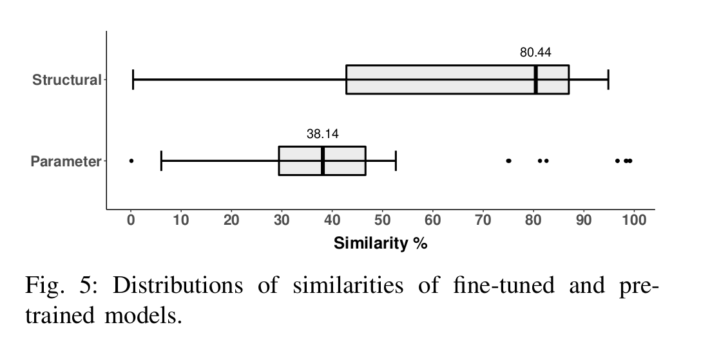
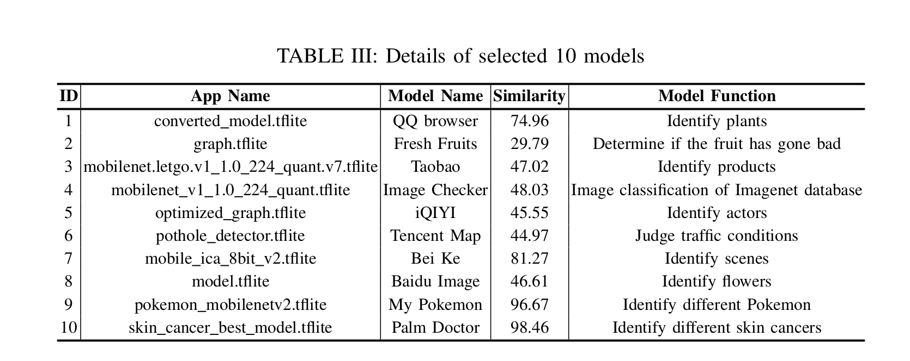
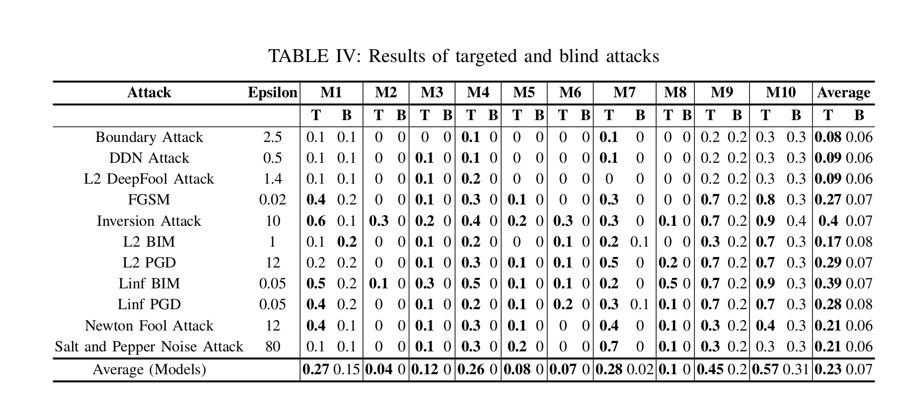
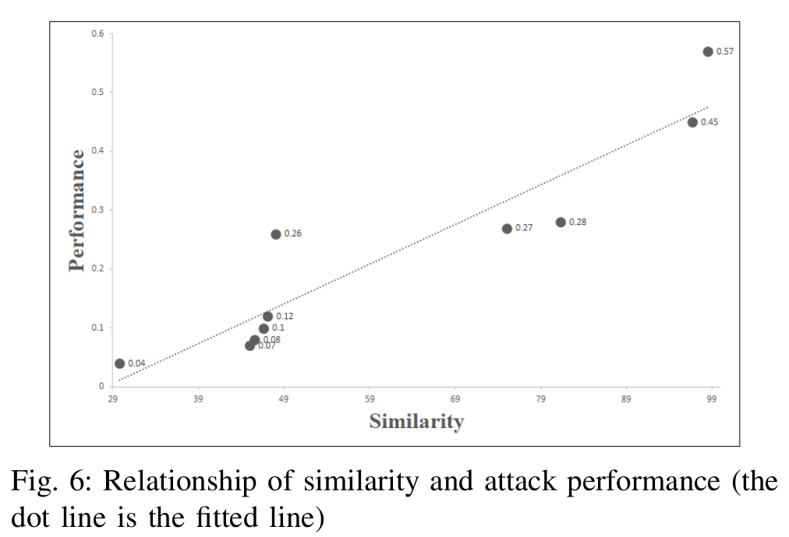

大家好，今天为大家带来了发表在 **ICSE 2021** 的工作《Robustness of on-device Models: Adversarial Attack to Deep Learning Models on Android Apps》，他们研究了移动设备中使用TFlite进行模型部署的模型安全情况，并调查了不同app中TFLite模型的关系、定位TFLite模型文件和评价模型对攻击样本的鲁棒性。

​	
# 系统构成

​	他们开发了ModelDigger、ModelComparer和ModelAttacker,。ModelDigger使用apktool对app进行逆向并使用[A Large-scale Study on Insufficient Machine Learning Model Protection in Mobile Apps](https://arxiv.org/abs/2002.07687)的方法分析app并提取微调的模型。ModelComparer通过寻找最长公共子序列的方法判断两个TFLite模型的相似度(app中的和TensorFlow Hub的预训练模型)。ModelAttacker,会针对获得到的TF模型使用不同的攻击算法对ML模型进行攻击。

## ModelComparer

​	ModelComparer用于判断两个模型的相似度，其中模型结构相似度的算法如下:
$$
similarity(M_1,M_2)= \frac{2*L_{match}}{L_{total}}
$$
​	其中$M_1,M_2$表示连个TFLite模型，$L_{match}$是两个模型的最长子序列，$L_{total}$是两个模型的所有layers的数量。
$$
similarity(M_1,M_2)= \frac{N_{True}}{N_{total}}
$$
$N_{True}$是两个模型相同参数的最长子序列，$N_{total}$是两个模型的所有参数数量。

## ModelAttacker

​	给定一个从移动应用程序反编译的ML模型，

1. 首先使用ModelComparer计算它与TensorHub中所有模型的相似度。
2. 根据相似度排序，从数据库中选择结构和参数值最相似的预训练模型。
3. 当相似度超过实验设定的80%阈值时，在预先训练好的模型上训练对抗攻击的参数。
4. 最后，应用对抗性攻击生成对抗性样本，以输入到目标深度学习模型中。

# 系统评估

不同TFLite模型的关系，线越粗关系越强

经过微调的TFLite模型数量

模型相似度

选择出的10个模型的信息以及模型的鲁棒性，T是目标攻击的结果，右侧B是blind攻击的结果。

模型的相似度和攻击效果的关系

- 论文：(https://arxiv.org/abs/2101.04401)[https://arxiv.org/abs/2101.04401]

- github [https://github.com/Jinxhy/AppAIsecurity](https://github.com/Jinxhy/AppAIsecurity)

